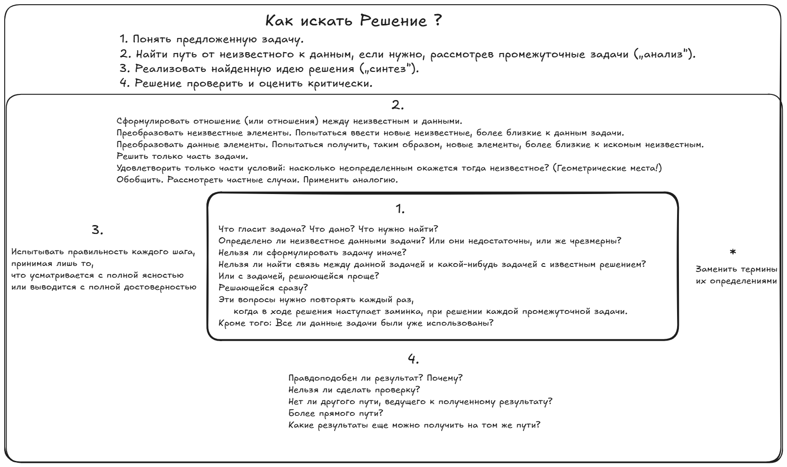

# Как Решать Задачи ?

Суть не в том, чтобы заучить список действий которые нужно выполнить для решения задачи. Суть в том, чтобы развить в себе любопытство и привычку _разбирать_ вещи на части, чтобы понять, как они работают. Это и есть настоящее искусство решения задач — и именно это делает процесс _чертовски увлекательным_! 

В книге математик [Дьёрдь Пойа](https://ru.wikipedia.org/wiki/Пойа,_Дьёрдь) [Как Решать Задачу](https://www.ozon.ru/product/kak-reshat-zadachu-metodicheskoe-posobie-schule-des-denkens-vom-lsen-mathematischer-probleme-1189197167/?_bctx=CAUQnNhE&at=6WtZjYvxNc6OgNmlIQr7POph2Awj0AfyDDl4cEExLQ8) предлагает следующую таблицу для решения задач:

Вся соль не в том, чтобы слепо следовать инструкции, а в том, чтобы _изобрести решение самостоятельно_. Вот как я вижу эту таблицу:

#### 1. Разберись, о чем эта штука вообще! **(Понять задачу)**

Первым делом, не тычься наугад. Остановись. Просто посмотри на задачу и скажи: «Ну и что тут происходит?» Обрисуй её в уме целиком, как картину. Не вдавайся в детали, просто пойми сюжет. Это нужно, чтобы твой мозг зацепился за проблему и начал рыться в архивах в поисках чего-то похожего.

### 2. Найди связь между тем, что тебе дано, и тем, что нужно найти **(Анализ)**

Ага, самое интересное начинается! Представь, что неизвестное — это какой-то диковинный прибор. Можно ли его разобрать на более простые и знакомые детали? Можно ли переформулировать данные так, чтобы они стали больше похожи на ответ? Или, черт возьми, решить сначала только кусочек задачи! Удовлетвори часть условий и посмотри, что получится. Поиграй с задачей! Упрости её, рассмотри частный случай, найди аналог — это почти всегда срабатывает.

### 3. Действуй, но проверяй каждый шаг! **(Синтез)**

Ладно, идея есть. Теперь воплощай! Но не будь ослом — не делай шаг, пока не понял его на все сто. Как говорил тот француз, Декарт, принимай только то, что видишь с полной ясностью. Если это сложный шаг, разбей его на такие мелкие шажочки, чтобы их правильность была очевидна. Это как собирать механизм: каждую шестерёнку нужно проверить, прежде чем ставить на место.

### 4. Оцени результат критически **(Проверка и осмысление)**  

Получил ответ? Отлично! А теперь самая важная часть — **не верь ему слепо!**

- Он вообще выглядит правдоподобно? Он не слишком велик? Не слишком мал? Соответствует ли он здравому смыслу?
- Можно ли проверить ответ другим способом? Это лучший способ убедиться, что ты не накосячил.
- Нет ли более изящного, красивого решения? Если ты прошёл через дебри, посмотри, нет ли прямой тропинки.
- Что ещё можно было узнать на этом пути? Часто решение одной задачи открывает дверь к целой куче других.
### Диалог

Вот как это звучит у меня в голове, когда я решаю задачу.

**Фаза 1: Знакомство («Что это за зверь?»)**

- **С чего начать?** Спроси: «Что тут происходит?» Сформулируй задачу своими словами. Вслух.
- **Что делать?** Взгляни на картину в целом. Не лезь пока в формулы.
- **Зачем?** Чтобы твой мозг «загрузил» проблему в оперативную память и начал искать связи.

**Фаза 2: Глубокое погружение («А что у него внутри?»)**

- **С чего начать?** Когда общая картина ясна, начинай ковыряться.
- **Что делать?** Разбери задачу на основные части: что дано, что найти, в чём условие. Смотри на эти части по отдельности, потом вместе, потом в разных комбинациях. Ищи узоры!
- **Зачем?** Чтобы заметить детали, которые потом окажутся ключевыми.

**Фаза 3: Озарение («Ага! Так вот в чём дело!»)**

- **С чего начать?** Оттолкнись от главных элементов, которые ты уже разобрал.
- **Что делать?** Крути задачу как калейдоскоп! Смотри на неё с разных сторон. Ищи, на что она похожа из того, что ты уже знаешь. Вспоминай, как ты решал _похожие_ штуки.
- **Что если идея пришла?** Отлично! Исследуй её. Куда она ведёт? Даже если идея половинчатая или туманная — это уже прогресс! Она меняет твоё восприятие задачи. Одна идея тянет за собой следующую.

**Фаза 4: Воплощение («Теперь соберём это вместе»)**

- **С чего начать?** Когда у тебя есть план, начинай его исполнять.
- **Что делать?** Делай всё аккуратно и педантично. Проверяй каждый шаг. Сложный шаг? Разбей его на подшаги. Сначала убедись, что крупные блоки верны, потом проверяй мелкие детали.
- **Зачем?** Чтобы быть на 100% уверенным, что твоё решение — не просто случайность, а железная логика.

**Фаза 5: Обзор («Что мы, собственно, открыли?»)**

- **С чего начать?** С готового, красивого решения.
- **Что делать?** Полюбуйся на него! Посмотри, нельзя ли его упростить или сделать изящнее. Пойми, _как_ оно работает и _почему_ оно работает. Запомни главный трюк, который привёл к успеху — он может пригодиться ещё сто раз. Подумай, куда ещё можно применить этот результат.
- **Зачем?** Это не про одну задачу. Это про то, чтобы стать умнее. Ты не просто «решил», ты _понял_. И теперь этот кусочек знания твой навсегда.

