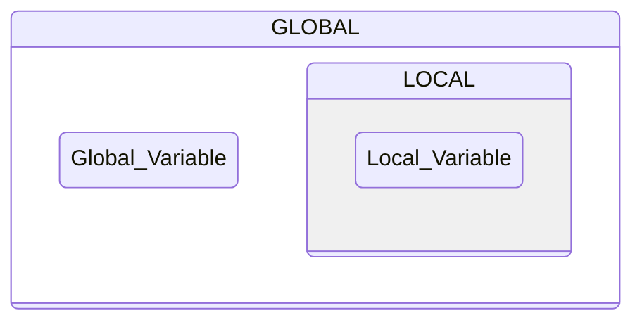
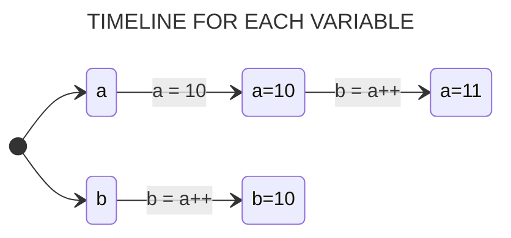
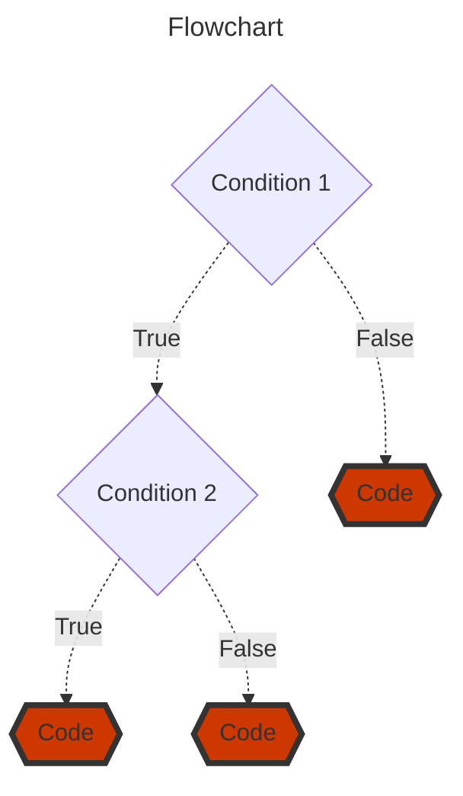
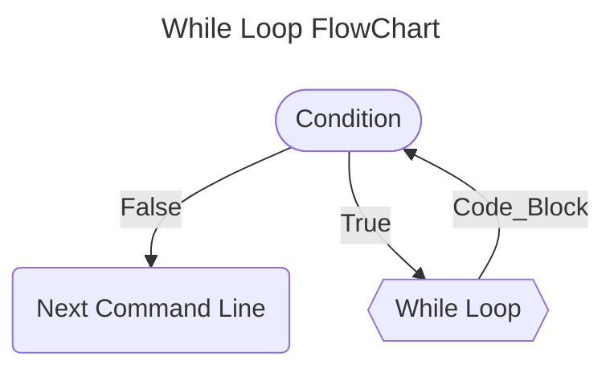
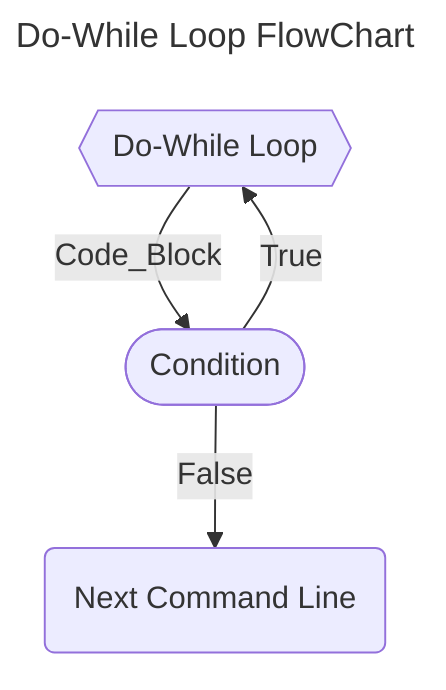
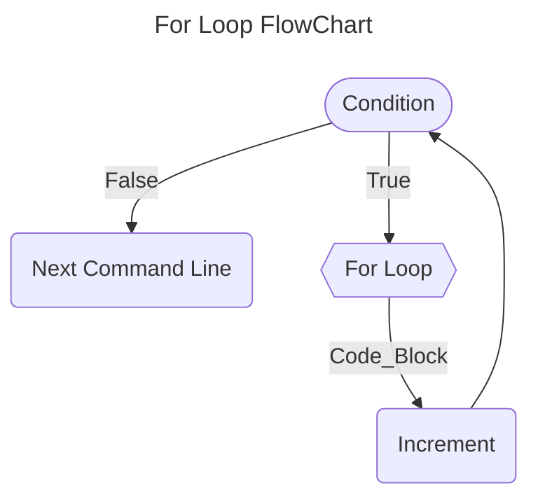

# С

В целом практический все принципы  языка программирования Си можно продемонстрировать этим примером кода 

```c
#include <stdio.h>
#include <stdlib.h>
#include <string.h>

char *a() {
    char *ret = malloc(6);
    strcpy(ret, "hello");
    return ret;
}

struct Data {
    char *message;
    int count;
};

void modify_data(struct Data **data_ptr) {
    *data_ptr = malloc(sizeof(struct Data));
    (*data_ptr)->message = malloc(12);
    strcpy((*data_ptr)->message, "new message");
    (*data_ptr)->count = 42;
}

int main() {
    int i = 0;
    while (1) {
        char *c = a();
        if (i % 10000 == 0) printf("%s\n", c);
        free(c);
        i++;
        
        if (i == 50000) {
            struct Data *my_data = NULL;
            modify_data(&my_data);
            printf("%s %d\n", my_data->message, my_data->count);
            free(my_data->message);
            free(my_data);
            break;
        }
    }
}
```

Вот и все можно считать, что вы выучили язык программирования Си

---


Давайте разберемся, что тут у нас.

Видите ли, выучить **Си — это не просто выучить какой-то язык. Это значит *понять*, как на самом деле работает программирование**. Си — это как золотая середина: вы не теряетесь в абстракциях, но и не копаетесь в микросхемах паяльником. Он позволяет вам почувствовать железо и в то же время писать мощные штуки. А уж если вы поняли Си, то все остальные языки вам покажутся сущей ерундой, честное слово!

В этом руководстве мы с вами, как настоящие исследователи, начнем с азов и доберемся до интересных вершин. Вы научитесь не просто писать код, а управлять памятью, как заправский инженер, и строить эффективные структуры данных. Здорово, правда?

### Директивы

Смотрите, когда вы пишете программу, вы можете давать компилятору особые инструкции — директивы. Их легко узнать: они обычно начинаются с решетки `#`.

Вот, например, очень важная директива — `include`. Она говорит компилятору: «Эй, friend, возьми-ка содержимое этого файла и вставь его прямо сюда, в мой код». Это как если бы вы писали большую статью и вставляли в нее целые главы из другой книги.

Есть два способа указать файл:

```c
#include <stdio.h>  // Поищет файл в стандартных папках компилятора (где хранятся все системные штуки)
#include "stdio.h"  // Сначала посмотрит в папке с твоим проектом
```

Самое забавное, что ваш исходный файл физически не меняется. Это просто инструкция для компилятора — волшебство происходит в его памяти!

Вот вам несколько самых полезных файлов, которые вы будете подключать часто:

| Файл                   | Для чего он?                                                     |
| :--------------------- | :--------------------------------------------------------------- |
| `#include <stdio.h>`   | Ввод и вывод — чтобы можно было печатать и читать с консоли!     |
| `#include <stdlib.h>`  | Разная полезная всячина: работа с памятью, преобразование типов. |
| `#include <math.h>`    | Математика! Синусы, косинусы, корни — всё тут.                   |
| `#include <string.h>`  | Для работы со строками — склеить, скопировать, найти.            |
| `#include <time.h>`    | Чтобы работать со временем и датами.                             |
| `#include <stdbool.h>` | Чтобы использовать `true` и `false` — очень удобно!              |

### Переменные

А теперь давайте поговорим о переменных. Это же одна из самых фундаментальных идей!

Представьте, что переменная — это такая *коробка* с наклеенной снаружи *биркой*. Внутри коробки лежит какое-то значение. Бирка — это уникальное имя переменной, чтобы мы могли найти нужную коробку среди тысяч других. А значение внутри — это то, с чем мы работаем.

#### Простой пример: сложение двух чисел

```c
#include <stdio.h>

int main() {
  int a, b, sum;  // Объявляем три коробки с бирками a, b и sum. Говорим, что в них будут целые числа (int)

  a = 10;         // Кладем в коробку `a` число 10
  b = 5;          // Кладем в коробку `b` число 5

  sum = a + b;    // Достаем значения из коробок `a` и `b`, складываем их и результат кладем в коробку `sum`
  return 0;
}
```

Вот и всё! Мы использовали три переменные, чтобы сохранить три значения и произвести над ними операцию.

### Объявление и Инициализация

Си — язык со *статической типизацией*. Это мудреное слово значит, что мы должны *заранее* сказать компилятору, какого типа данные мы будем хранить в каждой коробке. Почему это так важно?

А потому что от этого зависит, сколько именно *места в памяти* нужно зарезервировать под каждую коробку! Компилятор — он как рачительный кладовщик, он должен знать размер коробки, которую нужно поставить на полку.

*   **Объявить переменную** — значит сказать: «Эй, компилятор, я хочу коробку с биркой `age`, и в ней будут храниться целые числа (`int`)».
    ```c
    int age;
    ```

*   **Инициализировать переменную** — значит не только объявить коробку, но и *сразу положить в нее значение*.
    ```c
    int age = 30; // Объявили и положили в нее 30
    ```

Позже вы можете изменить значение в коробке, просто используя ее имя:
```c
age = 34; // Выкинули 30 и положили 34. Тип коробки менять нельзя!
```

> Важно! Если вы попытаетесь положить в коробку для целых чисел (`int`) что-то другое (например, текст), компилятор скажет: «Нет-нет-нет, friend, так не пойдет!» и выдаст ошибку.

### Как правильно называть свои переменные?

Вот несколько простых правил, чтобы не запутаться самим и не запутать других:

1.  **Система first.** Имена вроде `_value` или `count_` зарезервированы для системных нужд. Не используйте их. Лучше начать с буквы.
2.  **Константы — кричите!** Имена констант, объявленных через `#define`, пишите в ВЕРХНЕМ РЕГИСТРЕ. `#define MAX_SIZE 100`
3.  **Обычные имена — тихо.** Имена функций и переменных — в нижнем регистре. `calculate_sum`, `my_age`.
4.  **Избегайте путаницы.** Не называйте переменные `foo` и `Foo` или `foobar` и `foo_bar`. Это ужасно confusing!
5.  **Буква «l» — зло!** На многих мониторах буква «l» (эйч), цифра «1» (единица) и буква «I» (ай) выглядят одинаково. Представьте переменную с именем `l` — это же катастрофа!
6.  **Уникальность — наше всё.** Старайтесь, чтобы ваши имена не совпадали с именами из стандартных библиотек. Мало ли что!


| РЕКОМЕНДАЦИИ ПО ПРИСВОЕНИЮ ИМЕН ПЕРЕМЕННЫМ В C. | 
| --- | 
| Имена с начальным и конечным подчеркиваниями зарезервированы для системных целей и не должны использоваться для любых имен, созданных пользователем. Если вам нужны ваши собственные личные идентификаторы, начинайте их с одной или двух букв, обозначающих посылку, к которой они относятся. |
| #определяющие константы должны быть написаны заглавными буквами. |
| Константы перечисления пишутся с заглавной буквы или полностью заглавными буквами |
| Имена функций, typedef и переменных, а также имена тегов структур, объединений и перечислений должны быть в нижнем регистре. |
| Многие макросы «функций» пишутся полностью заглавными буквами. Некоторые макросы (например, getchar и putchar) пишутся в нижнем регистре, поскольку они могут существовать и как функции. |
| Избегайте имён, которые отличаются только регистром, например foo и Foo. Аналогичным образом избегайте foobar и foo_bar. Это может привести к путанице. |
| Аналогичным образом избегайте имён, похожих друг на друга. На многих терминалах и принтерах «l», «1» и «I» выглядят очень похоже. Имя переменной «l» особенно плохо, потому что оно очень похоже на константу «1». |
| В целом глобальные имена (включая перечисления) должны иметь общий префикс, указывающий на модуль, к которому они относятся. В качестве альтернативы глобальные переменные могут быть сгруппированы в глобальной структуре. К именам, объявленным с помощью typedef, часто добавляется суффикс "_t". |
| Избегайте имен, которые могут конфликтовать с именами различных стандартных библиотек. Некоторые системы содержат больше библиотечного кода, чем вам нужно. Кроме того, ваша программа может быть когда-нибудь расширена. |

Главный принцип — делайте так, чтобы ваш код было легко читать и понимать. Программы пишутся для людей, а не для машин! Машине всё равно, а человеку — нет.


### Область Видимости Переменных в Си

Давайте разберемся, где живут переменные! Это очень важно. Представьте, что переменная — это ваш питомец. Его «область видимости» — это ваш дом, двор, где он может гулять. За пределами этого места его уже нет, он не существует для окружающего мира.

В Си всё точно так же. Место, где вы объявляете переменную, определяет, где о ней можно вспомнить и использовать.

*   **Локальная область видимости (Local Scope):** Если переменная объявлена внутри фигурных скобок `{}` (например, внутри функции), то она живёт ТОЛЬКО внутри этих скобок. Это как домашний кот, который не может выйти за пределы квартиры. Попытаетесь обратиться к нему с улицы — получите ошибку! Компилятор просто не будет знать, о ком вы говорите.

    > Это может быть и полезно, и опасно. Полезно, чтобы не запутаться. Опасно, если вы случайно попытаетесь позвать кота, которого нет в комнате.

*   **Глобальная область видимости (Global Scope):** Если переменная объявлена снаружи, над всеми функциями (например, в самом начале программы), то она становится глобальной. Это как соседская собака, которая гуляет по всему району. Её видно отовсюду, и любая функция может её позвать и изменить.

    > Но это тоже опасно! Представьте, если десять человек будут одновременно командовать одной собакой: «Сидеть!», «Лежать!», «Голос!». Беспорядок гарантирован. Так и с глобальными переменными — уследить, кто и когда её меняет, очень сложно.





Вот смотрите, как это выглядит в коде:

```c
#include <stdio.h>

float mean, n1, n2;     // Вот они, наши глобальные "собаки". Видны всем!

int main() {
  n1 = 10;              // Главная функция спокойно им командует
  n2 = 8;

  mean = (n1 + n2) / 2;
  printf("Среднее: %f", mean);
  return 0;
}
```

### #DEFINE и CONST — Две Большие Разницы

А теперь давайте поговорим о константах — о неизменяемых величинах. В Си есть два способа их создать, и они работают СОВЕРШЕННО по-разному!

1.  **`#define` (Директива препроцессора):**
    Это не переменная. Это — указание для *препроцессора* (такой программы, которая готовит ваш код к компиляции). Он тупо ищет в вашем коде слово `NUMBER` и заменяет его на `10`, ДАЖЕ НЕ ЗАДУМЫВАЯСЬ о том, что это такое. Это просто текстововая замена, как в «Найди и замени» в ворде.

    ```c
    #define NUMBER 10 // Препроцессор везде заменит "NUMBER" на "10"
    ```

    *   **Плюс:** Не занимает память во время выполнения программы.
    *   **Минус:** Нет проверки типов. Если вы с ним напутаете, компилятор не поможет.

2.  **`const` (Константная переменная):**
    А вот это — НАСТОЯЩАЯ переменная. Просто очень строгая. Компилятор выделяет для неё место в памяти, знает её тип (целое число, дробное и т.д.), но строго-настрого запрещает вам её менять после того, как вы ей дали значение.

    ```c
    const int number = 10; // Настоящая переменная, но только для чтения
    ```

    *   **Плюс:** Есть проверка типов (компилятор следит, чтобы вы не делали ерунды). С ней можно делать всё то же, что и с обычной переменной, кроме изменения значения. Можно даже использовать указатели!
    *   **Минус:** Занимает память, как и любая переменная.

**Так что же лучше?** Обычно `const`. Это современнее, безопаснее и понятнее. Но `#define` незаменим для некоторых трюков, например, чтобы создать макрос с параметрами:

```c
#include <stdio.h>
#define MULTIPLY(a, b) a*b // Макрос, который "перемножает" два аргумента

int main() {
  printf("%d", MULTIPLY(2+3, 3+5)); // Внимание! Подстановка: 2+3 * 3+5 = 2 + 9 + 5 = 16!
  return 0;
}
```
> Видите? Он не вычисляет `(2+3)*(3+5) = 40`, а просто подставляет текст. Это частая причина ошибок!

И да, макрос можно «забыть», стереть командой `#undef`.

### Типы Данных

Си — это язык, который дружит с железом. Поэтому он заставляет вас думать о том, сколько же памяти нужно для ваших данных. Каждая переменная — это коробка. Разные коробки бывают разных размеров.

Когда вы говорите `int number;`, вы говорите компилятору: «Поставь мне коробку размером вот *вот столько*». Размер коробки зависит от процессора и компилятора! Стандарт ANSI говорит только о *минимальном* размере, чтобы гарантировать переносимость.

Вот вам табличка-шпаргалка (для типичного 16-битного компилятора, сейчас размеры часто больше):

| Тип | Размер (биты) | Для чего | Примерный диапазон |
| :--- | :---: | :--- | :--- |
| `char` | 8 | Символы или маленькие числа | -128 до 127 |
| `int` | 16 | Целые числа | -32 768 до 32 767 |
| `float` | 32 | Дробные числа | ±3.4E-38 до ±3.4E+38 |
| `double` | 64 | Дробные числа (точнее) | ±1.7E-308 до ±1.7E+308 |
| `void` | — | "Ничего" | — |

**Модификаторы типов:** Это такие приставки (`signed`, `unsigned`, `short`, `long`), которые меняют размер и свойства коробки.
*   `unsigned char` — та же коробка 8 бит, но только для положительных чисел (0 до 255).
*   `long int` — коробка побольше, например, 32 бита (от -2 миллиардов до +2 миллиардов).
*   `unsigned long int` — огромная коробка только для положительных чисел (0 до 4 миллиардов).

Ниже приведены допустимые типы данных и их максимальные и минимальные значения в типичном компиляторе для 16-битного оборудования. В этой таблице также указан формат, который следует использовать для чтения типов данных с помощью функции `scanf()`.

| &nbsp;&nbsp;&nbsp;&nbsp;&nbsp;&nbsp;&nbsp;&nbsp;&nbsp;&nbsp;&nbsp;&nbsp;&nbsp;&nbsp;&nbsp;&nbsp;&nbsp;**Тип**&nbsp;&nbsp;&nbsp;&nbsp;&nbsp;&nbsp;&nbsp;&nbsp;&nbsp;&nbsp;&nbsp;&nbsp;&nbsp;&nbsp;&nbsp;&nbsp; | **Количество Бит** | &nbsp;&nbsp;&nbsp;&nbsp; Формат **&nbsp;&nbsp;&nbsp;&nbsp; | &nbsp;&nbsp;&nbsp;&nbsp;&nbsp;&nbsp;&nbsp;&nbsp;&nbsp;&nbsp;&nbsp;&nbsp;&nbsp;&nbsp;&nbsp;&nbsp;&nbsp;&nbsp;&nbsp;&nbsp;**Старт**&nbsp;&nbsp;&nbsp;&nbsp;&nbsp;&nbsp;&nbsp;&nbsp;&nbsp;&nbsp;&nbsp;&nbsp;&nbsp;&nbsp;&nbsp;&nbsp;&nbsp;&nbsp;&nbsp;&nbsp; | &nbsp;&nbsp;&nbsp;&nbsp;&nbsp;&nbsp;&nbsp;&nbsp;&nbsp;&nbsp;&nbsp;&nbsp;&nbsp;&nbsp;&nbsp;&nbsp;&nbsp;&nbsp;&nbsp;&nbsp;**Стоп**&nbsp;&nbsp;&nbsp;&nbsp;&nbsp;&nbsp;&nbsp;&nbsp;&nbsp;&nbsp;&nbsp;&nbsp;&nbsp;&nbsp;&nbsp;&nbsp;&nbsp;&nbsp;&nbsp;&nbsp; |
| :-----------------------------------------------------------------------------------------------------------------------------------------------------------------------------------------------------------: | :----------------: | :--------------------------------------------------------: | :-------------------------------------------------------------------------------------------------------------------------------------------------------------------------------------------------------------------------------------------------------: | :------------------------------------------------------------------------------------------------------------------------------------------------------------------------------------------------------------------------------------------------------: |
|                                                                                                     char                                                                                                      |       **8**        |                            *%c*                            |                                                                                                                         **-128**                                                                                                                          |                                                                                                                         **127**                                                                                                                          |
|                                                                                                 unsigned char                                                                                                 |       **8**        |                            *%c*                            |                                                                                                                           **0**                                                                                                                           |                                                                                                                         **255**                                                                                                                          |
|                                                                                                      int                                                                                                      |       **16**       |                         *%i or %d*                         |                                                                                                                        **-32,768**                                                                                                                        |                                                                                                                        **32,767**                                                                                                                        |
|                                                                                                 unsigned int                                                                                                  |       **16**       |                            *%u*                            |                                                                                                                           **0**                                                                                                                           |                                                                                                                        **65,535**                                                                                                                        |
|                                                                                                   short int                                                                                                   |       **16**       |                        *%hi or %hd*                        |                                                                                                                        **-32,768**                                                                                                                        |                                                                                                                        **32,767**                                                                                                                        |
|                                                                                              unsigned short int                                                                                               |       **16**       |                           *%hu*                            |                                                                                                                           **0**                                                                                                                           |                                                                                                                        **65,535**                                                                                                                        |
|                                                                                                   long int                                                                                                    |       **32**       |                        *%li or %ld*                        |                                                                                                                    **-2,147,483,648**                                                                                                                     |                                                                                                                    **2,147,483,647**                                                                                                                     |
|                                                                                               unsigned long int                                                                                               |       **32**       |                           *%lu*                            |                                                                                                                           **0**                                                                                                                           |                                                                                                                    **4,294,967,295**                                                                                                                     |
|                                                                                                     float                                                                                                     |       **32**       |                      *%f, %e, or %g*                       |                                                                                                                        **3.4E-38**                                                                                                                        |                                                                                                                       **3.4E+38**                                                                                                                        |
|                                                                                                    double                                                                                                     |       **64**       |                     *%lf, %le, or %lg*                     |                                                                                                                       **1.7E-308**                                                                                                                        |                                                                                                                       **1.7E+308**                                                                                                                       |
|                                                                                                  long double                                                                                                  |       **80**       |                           *%Lf*                            |                                                                                                                       **3.4E-4932**                                                                                                                       |                                                                                                                      **3.4E+4932**                                                                                                                       |

Компилятору важно знать тип, чтобы правильно интерпретировать данные в памяти. Байты — они как буквы алфавита. Сами по себе они ничего не значат. Тип данных — это инструкция, как прочитать эти буквы: как одно целое слово, как дробное число или как символ.
### Операторы

Это просто инструменты для манипуляции данными. Самые простые — арифметические: `+`, `-`, `*`, `/`, `%` (остаток от деления).

**Важное правило!** Результат арифметического выражения всегда имеет тип самого «большого» участника. Если вы делите целое `int` на дробное `float`, результат будет дробным `float`. Если вы попытаетесь напечатать его как целое (`%d`), получите ерунду! Нужно печатать как дробное (`%f`).

#### Инкремент и Декремент (`++`, `--`)

Вот это — изящная и мощная особенность Си! Эти операторы увеличивают или уменьшают переменную на 1.

*   `a++` — **пост-инкремент:** «Сначала используй значение, потом прибавь единицу».
*   `++a` — **пре-инкремент:** «Сначала прибавь единицу, потом используй значение».

Давайте поиграем!

```c
int a, b;

a = 10;
b = a++; // Шаг 1: b получает текущее значение a (10). Шаг 2: a увеличивается на 1 (11).

// Результат: a = 11, b = 10
```

А теперь наоборот:

```c
int a, b;

a = 10;
b = ++a; // Шаг 1: a увеличивается на 1 (11). Шаг 2: b получает новое значение a (11).

// Результат: a = 11, b = 11
```

Понимание этой разницы — признак того, что вы действительно чувствуете, как программа работает шаг за шагом. Это прекрасно!

### Арифметические Операторы

Ну, это же просто! Обычная математика, которую вы знаете с первого класса, просто записанная на языке компьютера. Смотрите:

*   `+` — **Сложение.** Всё просто, как `2 + 2`.
*   `-` — **Вычитание.** Тоже ничего сложного.
*   `*` — **Умножение.** Звёздочка — потому что буква `x` уже могла быть занята переменной.
*   `/` — **Деление.** Вот тут есть один фокус!
*   `%` — **Деление по модулю (остаток от деления).** Это не проценты! Это оператор, который говорит вам: «Если я разделю одно число на другое, какой *остаток* я получу?». Например, `10 % 3` вернёт `1`, потому что 10 divided by 3 is 3 with a remainder of 1.

> **Внимание, фокус!** Язык Си очень щепетильно относится к типам данных. Результат арифметического выражения всегда будет иметь тип самого «старшего» и «большого» участника операции. Это как на кухне: если вы смешаете ложку соли (`int`) с литром воды (`float`), у вас получится солёная вода (`float`), а не соль!

Посмотрите на этот пример. В нём вся соль (простите за каламбур):

```c
#include <stdio.h>

int main() {
  int n1 = 2;    // Целое число
  float n2 = 3.3; // Дробное число

  // ПЛОХО: Мы пытаемся напечатать результат деления (который будет дробным) как целое число.
  // Это всё равно что пытаться прочитать стихи на неизвестном языке — получится бессмыслица!
  printf("%d", (n1 / n2) ); // %d ждёт целое число, а получает float. Результат - ошибка/мусор.

  // ХОРОШО: Мы печатаем дробный результат как дробное число. Всё сходится!
  printf("%f", (n1 / n2) ); // %f ждёт float. Всё работает идеально.
  return 0;
}
```
> Запомните: всегда следите за тем, чтобы тип данных, который вы выводите с помощью `printf`, совпадал с типом данных, который вы ему передаёте. Это золотое правило!

### Инкремент и Декремент (`++`, `--`)

О, это мои любимые операторы! Они элегантны и мощны. Они просто увеличивают или уменьшают значение переменной на 1. Но в них есть небольшой трюк, который всех запутывает.

Есть два способа их использовать:
*   **Префиксный** (`++x`): «Сначала сделай, потом используй». Сначала переменная меняется, а потом её новое значение идёт в дело.
*   **Постфиксный** (`x++`): «Сначала используй, потом сделай». Сначала текущее значение переменной идёт в дело, и только потом она меняется.

Давайте поиграем в бухгалтерию, чтобы это понять!

#### Пример 1: Постфиксный (`a++`)
```c
int a, b;
a = 10;     // У нас есть 10 рублей на счёте `a`.
b = a++;    // Бухгалтер говорит: "Сначала заплатим зарплату `b` из текущей суммы на `a` (10 рублей), а ПОТОМ начислим `a` премию в 1 рубль."

// КОНЕЧНЫЙ РЕЗУЛЬТАТ: 
// a = 11 (стало 10, потом +1)
// b = 10 (получило значение ДО того, как к `a` что-то добавили)
```





#### Пример 2: Префиксный (`++a`)
```c
int a, b;
a = 10;     // У нас снова 10 рублей на счёте `a`.
b = ++a;    // Бухгалтер говорит: "Сначала начислим на счёт `a` премию в 1 рубль (станет 11), а ПОТОМ из этой новой суммы выплатим зарплату `b`."

// КОНЕЧНЫЙ РЕЗУЛЬТАТ:
// a = 11 (стало 10, потом +1)
// b = 11 (получило значение ПОСЛЕ того, как к `a` добавили 1)
```


### Сокращённые Арифметические Операторы

Программисты — ленивые люди (в хорошем смысле!). Они ненавидят писать одно и то же дважды. Поэтому они придумали короткие способы записывать операции вида `x = x + 5`.

Вот их волшебный словарь:


| &nbsp;&nbsp;&nbsp;&nbsp;&nbsp;&nbsp;&nbsp;&nbsp;&nbsp;&nbsp;&nbsp;&nbsp;&nbsp;&nbsp;&nbsp;&nbsp;&nbsp;&nbsp;&nbsp;&nbsp;&nbsp;&nbsp;&nbsp;&nbsp;&nbsp;&nbsp;&nbsp;&nbsp;&nbsp;&nbsp;&nbsp;&nbsp;&nbsp;&nbsp;&nbsp;**REDUCED EXPRESSION**&nbsp;&nbsp;&nbsp;&nbsp;&nbsp;&nbsp;&nbsp;&nbsp;&nbsp;&nbsp;&nbsp;&nbsp;&nbsp;&nbsp;&nbsp;&nbsp;&nbsp;&nbsp;&nbsp;&nbsp;&nbsp;&nbsp;&nbsp;&nbsp;&nbsp;&nbsp;&nbsp;&nbsp;&nbsp;&nbsp;&nbsp;&nbsp;&nbsp;&nbsp;&nbsp; | &nbsp;&nbsp;&nbsp;&nbsp;&nbsp;&nbsp;&nbsp;&nbsp;&nbsp;&nbsp;&nbsp;&nbsp;&nbsp;&nbsp;&nbsp;&nbsp;&nbsp;&nbsp;&nbsp;&nbsp;&nbsp;&nbsp;&nbsp;&nbsp;&nbsp;&nbsp;&nbsp;&nbsp;&nbsp;&nbsp;&nbsp;&nbsp;&nbsp;&nbsp;&nbsp;**NORMAL EXPRESSION**&nbsp;&nbsp;&nbsp;&nbsp;&nbsp;&nbsp;&nbsp;&nbsp;&nbsp;&nbsp;&nbsp;&nbsp;&nbsp;&nbsp;&nbsp;&nbsp;&nbsp;&nbsp;&nbsp;&nbsp;&nbsp;&nbsp;&nbsp;&nbsp;&nbsp;&nbsp;&nbsp;&nbsp;&nbsp;&nbsp;&nbsp;&nbsp;&nbsp;&nbsp;&nbsp; |
| :--------------------------------------------------------------------------------------------------------------------------------------------------------------------------------------------------------------------------------------------------------------------------------------------------------------------------------------------------------------------------------------------------------------------------------------------------------: | :-------------------------------------------------------------------------------------------------------------------------------------------------------------------------------------------------------------------------------------------------------------------------------------------------------------------------------------------------------------------------------------------------------------------------------------------------------: |
|                                                                                                                                                                                                                         **A += 5**                                                                                                                                                                                                                         |                                                                                                                                                                                                                       **A = A + 5**                                                                                                                                                                                                                       |
|                                                                                                                                                                                                                        **B - = 2**                                                                                                                                                                                                                         |                                                                                                                                                                                                                       **B = B – 2**                                                                                                                                                                                                                       |
|                                                                                                                                                                                                                     **C** ***=** **2**                                                                                                                                                                                                                     |                                                                                                                                                                                                                       **C = C * 2**                                                                                                                                                                                                                       |
|                                                                                                                                                                                                                         **D /= 7**                                                                                                                                                                                                                         |                                                                                                                                                                                                                       **D = D / 7**                                                                                                                                                                                                                       |
|                                                                                                                                                                                                                         **E %= 3**                                                                                                                                                                                                                         |                                                                                                                                                                                                                       **E = E % 3**                                                                                                                                                                                                                       |

Это не только короче, но и помогает избежать ошибок, если имя переменной очень длинное. Компилятор видит эту запись и сам разворачивает её в полную.

### Операторы Сравнения и Логические Операторы

Это сердце любого принятия решений в программе! Они отвечают на вопросы «да» или «нет».

#### Операторы Сравнения
Они сравнивают два значения и возвращают `1` (правда) или `0` (ложь).

| &nbsp;&nbsp;&nbsp;&nbsp;&nbsp;&nbsp;&nbsp;&nbsp;&nbsp;&nbsp;&nbsp;&nbsp;&nbsp;&nbsp;&nbsp;&nbsp;&nbsp;&nbsp;&nbsp;&nbsp;&nbsp;&nbsp;&nbsp;&nbsp;&nbsp;&nbsp;&nbsp;&nbsp;&nbsp;&nbsp;&nbsp;&nbsp;&nbsp;&nbsp;&nbsp;&nbsp;&nbsp;&nbsp;&nbsp;&nbsp;&nbsp;&nbsp;&nbsp;&nbsp;&nbsp;&nbsp;**OPERATOR**&nbsp;&nbsp;&nbsp;&nbsp;&nbsp;&nbsp;&nbsp;&nbsp;&nbsp;&nbsp;&nbsp;&nbsp;&nbsp;&nbsp;&nbsp;&nbsp;&nbsp;&nbsp;&nbsp;&nbsp;&nbsp;&nbsp;&nbsp;&nbsp;&nbsp;&nbsp;&nbsp;&nbsp;&nbsp;&nbsp;&nbsp;&nbsp;&nbsp;&nbsp;&nbsp;&nbsp;&nbsp;&nbsp;&nbsp;&nbsp;&nbsp;&nbsp;&nbsp;&nbsp;&nbsp; | &nbsp;&nbsp;&nbsp;&nbsp;&nbsp;&nbsp;&nbsp;&nbsp;&nbsp;&nbsp;&nbsp;&nbsp;&nbsp;&nbsp;&nbsp;&nbsp;&nbsp;&nbsp;&nbsp;&nbsp;&nbsp;&nbsp;&nbsp;&nbsp;&nbsp;&nbsp;&nbsp;&nbsp;&nbsp;&nbsp;&nbsp;&nbsp;&nbsp;&nbsp;&nbsp;&nbsp;&nbsp;&nbsp;&nbsp;&nbsp;&nbsp;&nbsp;&nbsp;&nbsp;&nbsp;&nbsp;**MEANING**&nbsp;&nbsp;&nbsp;&nbsp;&nbsp;&nbsp;&nbsp;&nbsp;&nbsp;&nbsp;&nbsp;&nbsp;&nbsp;&nbsp;&nbsp;&nbsp;&nbsp;&nbsp;&nbsp;&nbsp;&nbsp;&nbsp;&nbsp;&nbsp;&nbsp;&nbsp;&nbsp;&nbsp;&nbsp;&nbsp;&nbsp;&nbsp;&nbsp;&nbsp;&nbsp;&nbsp;&nbsp;&nbsp;&nbsp;&nbsp;&nbsp;&nbsp;&nbsp;&nbsp;&nbsp; |
| :----------------------------------------------------------------------------------------------------------------------------------------------------------------------------------------------------------------------------------------------------------------------------------------------------------------------------------------------------------------------------------------------------------------------------------------------------------------------------------------------------------------------------------------------------------------------------: | :---------------------------------------------------------------------------------------------------------------------------------------------------------------------------------------------------------------------------------------------------------------------------------------------------------------------------------------------------------------------------------------------------------------------------------------------------------------------------------------------------------------------------------------------------------------------------: |
|                                                                                                                                                                                                                                                                                      `==`                                                                                                                                                                                                                                                                                      |                                                                                                                                                                                                                                                                                 **EQUAL TO**                                                                                                                                                                                                                                                                                  |
|                                                                                                                                                                                                                                                                                      `>`                                                                                                                                                                                                                                                                                       |                                                                                                                                                                                                                                                                               **GREATER THAN**                                                                                                                                                                                                                                                                                |
|                                                                                                                                                                                                                                                                                      `<`                                                                                                                                                                                                                                                                                       |                                                                                                                                                                                                                                                                                 **LESS THAN**                                                                                                                                                                                                                                                                                 |
|                                                                                                                                                                                                                                                                                      `>=`                                                                                                                                                                                                                                                                                      |                                                                                                                                                                                                                                                                         **GREATER THAN OR EQUAL TO**                                                                                                                                                                                                                                                                          |
|                                                                                                                                                                                                                                                                                      `<=`                                                                                                                                                                                                                                                                                      |                                                                                                                                                                                                                                                                           **LESS THAN OR EQUAL TO**                                                                                                                                                                                                                                                                           |
|                                                                                                                                                                                                                                                                                      `!=`                                                                                                                                                                                                                                                                                      |                                                                                                                                                                                                                                                                               **NOT EQUAL TO**                                                                                                                                                                                                                                                                                |

#### Логические Операторы
Они позволяют комбинировать несколько вопросов в один сложный.

*   `&&` (И): Требует, чтобы условия по **обе** стороны были правдой.
    *   «Хочу чай И с сахаром». Без сахара — не буду.
*   `||` (ИЛИ): Требует, чтобы правдой было **хотя бы одно** из условий.
    *   «Хочу чай ИЛИ кофе». Дайте что-то одно, и я буду счастлив.
*   `!` (НЕ): Инвертирует результат. Правду делает ложью, а ложь — правдой.
    *   «Я НЕ хочу спать». Если хочу спать (правда), то после `!` это становится ложью.

**Пример на диалог:**
```c
if ( (a > 0) && (a < 10) ) { // Если `a` больше 0 И `a` меньше 10...
    printf("Число между 0 и 10!");
}

if ( (a < 0) || (b < 0) ) { // Если `a` меньше 0 ИЛИ `b` меньше 0...
    printf("Хотя бы одно число отрицательное!");
}

if ( !(a % 2 != 0) ) { // Если НЕверно, что `a` нечётное... (проще сказать: если оно чётное)
    printf("Чётное!");
}
```

### Тернарный Оператор (`? :`)

Это самый изящный способ сделать моментальный выбор прямо внутри выражения. Его можно прочитать как вопросительное предложение:

`переменная = (условие) ? значение_если_да : значение_если_нет;`

**Вот как он работает:**
```c
int Z = (A > B) ? A : B;
```
Переводим на человеческий: «Переменная `Z` будет равна... *Скажи-ка, `A` больше `B`?* Если ДА, то возьми `A`. Если НЕТ, то возьми `B`.»

Это компактная замена целому блоку `if-else`. Он не всегда делает код понятнее, но для простых выборов — это очень красиво и эффективно.

Надеюсь, теперь вы чувствуете себя с этими операторами как рыба в воде! Они — основной инструмент для того, чтобы заставить программу думать.

### Преобразование Типов Данных (Casting)

Представьте, что у вас на кухне есть разные ингредиенты: соль (это как `char`), мука (как `int`) и жидкое тесто (как `float`). Чтобы испечь пирог (вычислить выражение), вам иногда нужно смешать их все вместе. Но компилятор, как очень педантичный повар, сначала проверяет, можно ли это вообще делать.

Если типы данных несовместимы (например, попытаться сложить число и строку), компилятор скажет: «Стоп! Так нельзя!» и остановится с ошибкой. Если же всё нормально, он сам, по своим внутренним правилам, приведёт всё к общему знаменателю:

1.  *Все мелкие ингредиенты (`char`, `short int`) сначала автоматически превращаются в `int`.*
2.  *Все `float` становятся `double` (это более точный `float`).*
3.  *Если в выражении есть типы разной «ёмкости» (например, `int` и `double`), то менее ёмкий тип (`int`) преобразуется в более ёмкий (`double`), чтобы не потерять точность.*

Но иногда вы, как главный повар, хотите взять дело в свои руки и сказать: «Так, я сам решу, во что это превратить!». Для этого нужно использовать **явное преобразование типа** (casting).

```c
variable = (тип_данных) выражение;
```

Это как если бы вы сказали: «Я хочу превратить это тесто (`float`) в муку (`int`), даже если там будут комочки!».

#### Пример: Сильное преобразование
```c
#include <stdio.h>

int main() {
  float number = 32.8;  // Дробное число

  int a = (int) number + 10; // Силаёмся: "Преврати number в int!" (отбрасывается дробная часть .8)

  printf("%d", a); // Напечатает 42 (32 + 10), а не 42.8
  return 0;
}
```

#### Пример: Компилятор умный, но лучше помочь
```c
#include <stdio.h>

int main() {
  char x;       // char - это тоже маленькое число (код символа)
  int number, total;

  x = 'A';      // Символ 'A' имеет код 65 в ASCII
  number = 10;
  total = (int) x + number; // Явно говорим: "Преобразуй символ x в int!"
  // total = x + number;    // Сработало бы и так (согласно правилу 1), но явное указание яснее!

  printf("%d", total); // Напечатает 75 (65 + 10)
  return 0;
}
```

> Всегда лучше явно указывать преобразование, если вы о нём знаете. Это делает ваши намерения понятными и для компилятора, и для других людей, которые будут читать ваш код.

### Приоритет Операторов

О! Это очень важно. Представьте, что арифметические операторы — это члены семьи за обеденным столом. У некоторых из них больше «авторитета», и их слушаются в первую очередь.

Например, операторы умножения (`*`) и деления (`/`) — это как строгие родители. Они всегда «едят первыми», то есть выполняются до сложения (`+`) и вычитания (`-`), которые как дети.

Так вот, **приоритет операторов** — это и есть правила этого «семейного ужина». Он определяет порядок, в котором операции выполняются в выражении, если нет скобок.

Вот упрощённая таблица «авторитета» (от высшего к низшему):


| &nbsp;&nbsp;&nbsp;&nbsp;&nbsp;&nbsp;&nbsp;&nbsp;&nbsp;&nbsp;&nbsp;&nbsp;&nbsp;&nbsp;&nbsp;&nbsp;**Category**&nbsp;&nbsp;&nbsp;&nbsp;&nbsp;&nbsp;&nbsp;&nbsp;&nbsp;&nbsp;&nbsp;&nbsp;&nbsp;&nbsp;&nbsp;&nbsp;|	  &nbsp;&nbsp;&nbsp;&nbsp;&nbsp;&nbsp;&nbsp;&nbsp;&nbsp;&nbsp;&nbsp;&nbsp;&nbsp;&nbsp;&nbsp;&nbsp;&nbsp;&nbsp;&nbsp;&nbsp;&nbsp;&nbsp;&nbsp;&nbsp;&nbsp;&nbsp;&nbsp;&nbsp;&nbsp;&nbsp;&nbsp;&nbsp;&nbsp;&nbsp;&nbsp;&nbsp;&nbsp;&nbsp;&nbsp;&nbsp;&nbsp;&nbsp;&nbsp;&nbsp;&nbsp;&nbsp;&nbsp;&nbsp;**Operator**&nbsp;&nbsp;&nbsp;&nbsp;&nbsp;&nbsp;&nbsp;&nbsp;&nbsp;&nbsp;&nbsp;&nbsp;&nbsp;&nbsp;&nbsp;&nbsp;&nbsp;&nbsp;&nbsp;&nbsp;&nbsp;&nbsp;&nbsp;&nbsp;&nbsp;&nbsp;&nbsp;&nbsp;&nbsp;&nbsp;&nbsp;&nbsp;&nbsp;&nbsp;&nbsp;&nbsp;&nbsp;&nbsp;&nbsp;&nbsp;&nbsp;&nbsp;&nbsp;&nbsp;&nbsp;&nbsp;&nbsp;&nbsp;                  | &nbsp;&nbsp;&nbsp;&nbsp;&nbsp;&nbsp;&nbsp;&nbsp;&nbsp;&nbsp;&nbsp;&nbsp;&nbsp;&nbsp;&nbsp;&nbsp;**Associativity**&nbsp;&nbsp;&nbsp;&nbsp;&nbsp;&nbsp;&nbsp;&nbsp;&nbsp;&nbsp;&nbsp;&nbsp;&nbsp;&nbsp;&nbsp;&nbsp;|
| :---:           |         :---:                         | :---:             |
| Postfix	        |   () [] -> . ++ - -                   | Left to right     |
| Unary	          |   + - ! ~ ++ - - (type)* & sizeof	    | Right to left     | 
| Multiplicative	|   * / %	                              | Left to right     | 
| Additive	      |   + -	                                | Left to right     | 
| Shift	          |   << >>	                              | Left to right     | 
| Relational	    |   < <= > >=                           | Left to right     | 
| Equality	      |    == !=	                            | Left to right     | 
| Logical AND	    |    &&	                                | Left to right     | 
| Logical OR	    |    \|\|	                              | Left to right     | 
| Conditional	    |   ?:	                                | Right to left     | 
| Assignment	    |   = += -= *= /= %=>>= <<= &= ^= \|=	  | Right to left     |

**Главное правило:** Операторы с более высоким приоритетом выполняются первыми. Если приоритет одинаковый — смотрят на ассоциативность (чаще всего слева направо).

Например, в выражении `5 + 3 * 2` сначала выполнится умножение (`3 * 2 = 6`), а потом сложение (`5 + 6 = 11`), потому что у `*` приоритет выше, чем у `+`.

Скобки `()` имеют самый высокий приоритет и могут переопределить любой порядок. Всегда используйте скобки, если сомневаетесь или хотите сделать порядок явным! `(5 + 3) * 2` даст совсем другой результат — `16`.

### Команды Ввода и Вывода

Это же самое интересное! Это как рот и уши вашей программы. Без этого она немая и глухая.

#### Вывод данных: `printf()`

Эта функция — ваш инструмент, чтобы программа могла с вами заговорить. Она печатает данные на экран.

```c
printf("Строка_форматирования", аргумент1, аргумент2, ...);
```

**Строка форматирования** — это как сценарий речи. В ней есть:
1.  **Обычный текст**, который будет напечатан как есть. `"Hello"`
2.  **Спецификаторы формата** (`%`), которые являются местами для вставки значений переменных. `%d` — для чисел, `%s` — для строк.
3.  **Управляющие символы** (`\n`, `\t`), которые управляют выводом (перевод строки, табуляция).

```c
int a = 2, b = 3, sum;
sum = a + b;
// Мы составляем фразу, вставляя значения переменных в нужных местах:
printf("Сумма чисел %d и %d равна %d", a, b, sum);
// Напечатает: "Сумма чисел 2 и 3 равна 5"
```

| &nbsp;&nbsp;&nbsp;&nbsp;&nbsp;&nbsp;&nbsp;&nbsp;&nbsp;**Specifier** &nbsp;&nbsp;&nbsp;&nbsp;&nbsp;&nbsp;&nbsp;&nbsp;&nbsp; | &nbsp;&nbsp;&nbsp;&nbsp;&nbsp;&nbsp;&nbsp;&nbsp;&nbsp;&nbsp;&nbsp;&nbsp;&nbsp;&nbsp;&nbsp;&nbsp;**Type**&nbsp;&nbsp;&nbsp;&nbsp;&nbsp;&nbsp;&nbsp;&nbsp;&nbsp;&nbsp;&nbsp;&nbsp;&nbsp;&nbsp;&nbsp;&nbsp; | &nbsp;&nbsp;&nbsp;&nbsp;&nbsp;&nbsp;&nbsp;&nbsp;&nbsp;&nbsp;&nbsp;&nbsp;&nbsp;&nbsp;&nbsp;&nbsp;&nbsp;&nbsp;&nbsp;&nbsp;&nbsp;&nbsp;&nbsp;&nbsp;&nbsp;&nbsp;&nbsp;&nbsp;&nbsp;&nbsp;&nbsp;&nbsp;&nbsp;&nbsp;&nbsp;**Example**&nbsp;&nbsp;&nbsp;&nbsp;&nbsp;&nbsp;&nbsp;&nbsp;&nbsp;&nbsp;&nbsp;&nbsp;&nbsp;&nbsp;&nbsp;&nbsp;&nbsp;&nbsp;&nbsp;&nbsp;&nbsp;&nbsp;&nbsp;&nbsp;&nbsp;&nbsp;&nbsp;&nbsp;&nbsp;&nbsp;&nbsp;&nbsp;&nbsp;&nbsp;&nbsp; | &nbsp;&nbsp;&nbsp;&nbsp;&nbsp;&nbsp;&nbsp;&nbsp;&nbsp;&nbsp;&nbsp;&nbsp;&nbsp;&nbsp;&nbsp;&nbsp;&nbsp;&nbsp;**Output**&nbsp;&nbsp;&nbsp;&nbsp;&nbsp;&nbsp;&nbsp;&nbsp;&nbsp;&nbsp;&nbsp;&nbsp;&nbsp;&nbsp;&nbsp;&nbsp;&nbsp;&nbsp; |
| :------------------------------------------------------------------------------------------------------------------------: | :------------------------------------------------------------------------------------------------------------------------------------------------------------------------------------------------------: | :---------------------------------------------------------------------------------------------------------------------------------------------------------------------------------------------------------------------------------------------------------------------------------------------------------------------------------------------------------------------------------------------------------------------------------------------: | :--------------------------------------------------------------------------------------------------------------------------------------------------------------------------------------------------------------------------------: |
|                                                          **`%c`**                                                          |                                                                                             ***Character***                                                                                              |                                                                                                                                                                                                            **`printf("%c", 'A');`**                                                                                                                                                                                                             |                                                                                                               **A**                                                                                                                |
|                                                          **`%d`**                                                          |                                                                                              ***Integer***                                                                                               |                                                                                                                                                                                                             **`printf("%d", 42);`**                                                                                                                                                                                                             |                                                                                                               **42**                                                                                                               |
|                                                          **`%f`**                                                          |                                                                                           ***Floating Point***                                                                                           |                                                                                                                                                                                                            **`printf("%f", 3.14);`**                                                                                                                                                                                                            |                                                                                                            **3.140000**                                                                                                            |
|                                                         **`%lf`**                                                          |                                                                                               ***Double***                                                                                               |                                                                                                                                                                                                           **`printf("%lf", 1.618);`**                                                                                                                                                                                                           |                                                                                                            **1.618000**                                                                                                            |
|                                                          **`%o`**                                                          |                                                                                               ***Octal***                                                                                                |                                                                                                                                                                                                             **`printf("%o", 8);`**                                                                                                                                                                                                              |                                                                                                               **10**                                                                                                               |
|                                                          **`%p`**                                                          |                                                                                              ***Pointer***                                                                                               |                                                                                                                                                                                                     **`int var = 5; printf("%p", &var);`**                                                                                                                                                                                                      |                                                                                                         **Memory address**                                                                                                         |
|                                                          **`%s`**                                                          |                                                                                               ***String***                                                                                               |                                                                                                                                                                                                          **`printf("%s", "Hello");`**                                                                                                                                                                                                           |                                                                                                             **Hello**                                                                                                              |
|                                                          **`%u`**                                                          |                                                                                          ***Unsigned Integer***                                                                                          |                                                                                                                                                                                                            **`printf("%u", -42);`**                                                                                                                                                                                                             |                                                                                                      **Unpredictable value**                                                                                                       |
|                                                       **`%x or %X`**                                                       |                                                                                            ***Hexadecimal***                                                                                             |                                                                                                                                                                                                            **`printf("%x", 255);`**                                                                                                                                                                                                             |                                                                                                               **ff**                                                                                                               |
|                                                          **`%%`**                                                          |                                                                                           ***Percent Symbol***                                                                                           |                                                                                                                                                                                                               **`printf("%%");`**                                                                                                                                                                                                               |                                                                                                               **%**                                                                                                                |

#### Ввод данных: `scanf()`

Эта функция — уши программы. Она читает то, что вы вводите с клавиатуры.

```c
scanf("Строка_форматирования", &переменная1, &переменная2, ...);
```

Самое главное тут — не забыть знак **амперсанда** `&` перед именем переменной (кроме массивов). Этот оператор берёт **адрес в памяти**, по которому лежит переменная, и говорит `scanf()`: «Вот адрес, по которому нужно положить то, что человек сейчас введёт». Без этого `scanf()` не поймёт, куда записывать данные, и программа может сломаться.

```c
int number;
printf("Введите число: ");
scanf("%d", &number); // Читаем целое число и кладём его по адресу переменной `number`
printf("Вы ввели: %d", number);
```

**Важно:** Спецификаторы формата для `scanf()` и `printf()` часто совпадают (`%d`, `%f`), но есть нюансы. Например, для `double` в `printf()` используется `%f`, а в `scanf()` — `%lf`.

| &nbsp;&nbsp;&nbsp;&nbsp;&nbsp;&nbsp;&nbsp;&nbsp;&nbsp;&nbsp;&nbsp;&nbsp;**Specifier**&nbsp;&nbsp;&nbsp;&nbsp;&nbsp;&nbsp;&nbsp;&nbsp;&nbsp;&nbsp;&nbsp;&nbsp; | &nbsp;&nbsp;&nbsp;&nbsp;&nbsp;&nbsp;&nbsp;&nbsp;&nbsp;&nbsp;&nbsp;&nbsp;&nbsp;&nbsp;&nbsp;&nbsp;&nbsp;&nbsp;&nbsp;&nbsp;&nbsp;&nbsp;&nbsp;&nbsp;&nbsp;&nbsp;&nbsp;&nbsp;&nbsp;&nbsp;&nbsp;&nbsp;&nbsp;&nbsp;&nbsp;&nbsp;&nbsp;&nbsp;&nbsp;&nbsp;&nbsp;&nbsp;&nbsp;&nbsp;**Description**&nbsp;&nbsp;&nbsp;&nbsp;&nbsp;&nbsp;&nbsp;&nbsp;&nbsp;&nbsp;&nbsp;&nbsp;&nbsp;&nbsp;&nbsp;&nbsp;&nbsp;&nbsp;&nbsp;&nbsp;&nbsp;&nbsp;&nbsp;&nbsp;&nbsp;&nbsp;&nbsp;&nbsp;&nbsp;&nbsp;&nbsp;&nbsp;&nbsp;&nbsp;&nbsp;&nbsp;&nbsp;&nbsp;&nbsp;&nbsp;&nbsp;&nbsp;&nbsp;&nbsp;                          |  &nbsp;&nbsp;&nbsp;&nbsp;&nbsp;&nbsp;&nbsp;&nbsp;&nbsp;&nbsp;&nbsp;&nbsp;&nbsp;&nbsp;&nbsp;&nbsp;&nbsp;&nbsp;&nbsp;&nbsp;&nbsp;&nbsp;&nbsp;&nbsp;&nbsp;&nbsp;&nbsp;**Example**&nbsp;&nbsp;&nbsp;&nbsp;&nbsp;&nbsp;&nbsp;&nbsp;&nbsp;&nbsp;&nbsp;&nbsp;&nbsp;&nbsp;&nbsp;&nbsp;&nbsp;&nbsp;&nbsp;&nbsp;&nbsp;&nbsp;&nbsp;&nbsp;&nbsp; |
|:-----------------:|:-------------------:|:---------------------------------:|
| **`%d`**        | ***Read an integer***                        | **`scanf("%d", &num);`**            |
| **`%f`**        | ***Read a floating-point number***            | **`scanf("%f", &floatValue);`**     |
| **`%c`**        | ***Read a character***                       | **`scanf("%c", &letter);`**         |
| **`%s`**        | ***Read a string***                          | **`scanf("%s", stringVar);`**       |
| **`%lf`**       | ***Read a double (long float)***             | **`scanf("%lf", &doubleValue);`**   |
| **`%x`**        | ***Read a hexadecimal integer***            | **`scanf("%x", &hexValue);`**       |
| **`%o`**        | ***Read an octal integer***                  | **`scanf("%o", &octValue);`**       |
| **`%u`**        | ***Read an unsigned integer***               | **`scanf("%u", &unsignedValue);`**  |

### Условные Операторы

Это же самое интересное! Именно здесь программа начинает «думать» и принимать решения. Это как мозг вашего кода. Она смотрит на условие и говорит: «Если это правда, я сделаю вот это, а если нет — то вот то».

В основе всего лежит простое понятие: в компьютере есть только **правда** (любое число, кроме нуля) и **ложь** (ноль). Всё остальное — производные.


#### Инструкция IF (ЕСЛИ)

Самая простая форма принятия решения. Если условие в скобках — правда, то блок кода внутри `if` выполняется. Если нет — программа его просто пропускает.

```c
if (условие) {
    // Этот код выполнится, только если условие - ПРАВДА
}
```

**Простой пример:**
```c
int number = 10;
if (number > 0) {
    printf("Это положительное число!");
}
```
Компилятор смотрит: «10 > 0? Да, это правда!». Значит, нужно выполнить команду `printf`.

#### Инструкция ELSE (ИНАЧЕ)

Что делать, если условие не выполнилось? На этот случай у нас есть `else`. Это как запасной аэродром.

```c
if (условие) {
    // Выполнится, если условие - ПРАВДА
} else {
    // Выполнится, если условие - ЛОЖЬ
}
```

**Пример: Чётное или нечётное?**
```c
int number;
scanf("%d", &number);

if (number % 2 == 0) { // Если остаток от деления на 2 равен нулю...
    printf("Чётное");
} else {
    printf("Нечётное");
}
```

> Обратите внимание на отступы! Они не обязательны для компилятора, но ОЧЕНЬ важны для нас, людей. Они показывают, какой код к какому блоку относится. Всегда делайте их!

#### Инструкция ELSE IF (ИНАЧЕ ЕСЛИ)

А что, если у нас не два, а много вариантов? Мы можем выстроить целую цепочку вопросов.

```c
if (условие_1) {
    // Вариант 1
} else if (условие_2) {
    // Вариант 2
} else if (условие_3) {
    // Вариант 3
} else {
    // Если ни один из вариантов не подошёл
}
```

Компьютер будет проверять условия по порядку. Как только он найдет первое истинное условие — выполнит соответствующий блок и *выйдет из всей цепочки*, не проверяя остальные.

**Пример: Оценка температуры**
```c
if (temp > 30) {
    printf("Жарко!");
} else if (temp > 20) {
    printf("Тепло!");
} else if (temp > 10) {
    printf("Прохладно!");
} else {
    printf("Холодно!");
}
```

#### Вложенные IF (Nested IF)




Иногда одного условия недостаточно. Внутри одного «если» может быть другое «если». Это как матрёшка.

```c
if (возраст < 18) {
    printf("Вы несовершеннолетний. Нельзя работать.");
} else {
    // Внешнее условие прошло (возраст >= 18). Теперь проверим внутреннее.
    if (возраст <= 60) {
        printf("Добро пожаловать на работу!");
    } else {
        printf("Вам пора на пенсию!");
    }
}
```

Это мощный инструмент, но с ним нужно быть аккуратным, чтобы не запутаться в собственных условиях. Всегда используйте отступы!

#### Инструкция SWITCH (ВЫБОР)

Представьте, что вы выбираете блюдо из меню. Вы смотрите на значение переменной (например, `char choice`) и ищете пункт (`case`), который ему соответствует. `switch` — это и есть такое меню.

```c
switch (переменная) {
    case значение_1:
        // код для значение_1
        break; // Обязательно остановитесь здесь!
    case значение_2:
        // код для значение_2
        break;
    ...
    default:
        // код, если ни один case не подошёл (как "всё остальное")
}
```

**ОЧЕНЬ ВАЖНО:** Команда `break` критична. Если её забыть, программа «провалится» и начнет выполнять код из следующего `case`, и так до первого `break` или до конца `switch`. Иногда это используют специально, но чаще это приводит к ошибкам.

**Пример: Калькулятор**
```c
char operator;
int x, y;
scanf("%c %d %d", &operator, &x, &y);

switch (operator) {
    case '+':
        printf("%d", x + y);
        break;
    case '-':
        printf("%d", x - y);
        break;
    case '*':
        printf("%d", x * y);
        break;
    case '/':
        printf("%d", x / y);
        break;
    default:
        printf("Я не знаю такого оператора!");
}
```

`switch` идеален, когда нужно сравнить одну переменную с множеством конкретных значений. Он чище и читаемее, чем длинная цепочка `if-else if`.


### Логические Операторы и Таблицы Истинности

Чтобы условия были сложнее и интереснее, мы используем логические операторы `&&` (И), `||` (ИЛИ), `!` (НЕ). Их работа описывается таблицами истинности. Это просто свод правил, как они работают.
**Для И (`&&`):** Всё должно быть идеально. Всё должно быть правдой.
**Для ИЛИ (`||`):** Достаточно хотя бы одного. Хоть что-то должно быть правдой.
**Для НЕ (`!`):** Просто выверните всё наизнанку. Правда становится ложью, ложь — правдой.

**Пример использования:**
```c
// Если число положительное И чётное
if ((number > 0) && (number % 2 == 0)) {
    printf("Положительное и чётное!");
}

// Если число отрицательное ИЛИ равно нулю
if ((number < 0) || (number == 0)) {
    printf("Отрицательное или ноль!");
}

// Если НЕ равно нулю (то же самое, что number != 0)
if (!(number == 0)) {
    printf("Не ноль!");
}
```

### Циклы

О, это же самое мощное и прекрасное в программировании! Циклы позволяют компьютеру делать то, что он делает лучше всего — повторять одно и то же действие миллионы раз без устали и скуки. Это как заставить машину работать на вас.

В Си есть три главных способа устроить повторение: `while`, `do-while` и `for`. 

#### 1. Цикл WHILE (ПОКА)

Самый простой и прямой цикл. Его логика: «ПОКА условие истинно, продолжать делать вот это».




```c
while (условие) {
    // Блок кода, который будет повторяться
}
```

**Как это работает?**
1.  Проверяется условие в скобках.
2.  Если оно **ИСТИННО** (не ноль), выполняется блок кода внутри цикла.
3.  После этого программа **возвращается обратно к шагу 1** и проверяет условие снова.
4.  Если условие стало **ЛОЖНЫМ** (ноль), цикл прерывается, и программа идёт дальше.

**Важно:** Условие проверяется *ПЕРЕД* каждой итерацией. Если условие изначально ложно, блок кода не выполнится ни разу.

**Пример:**
```c
int i = 0, sum = 0;
while (i <= 10) { // Пока i меньше или равно 10...
    i++;
    sum += i;     // ...увеличивать сумму
}
printf("Сумма: %d\n", sum); // Напечатает сумму чисел от 1 до 11
```

> Представьте робота, который перед каждым шагом спрашивает: «Мне ещё идти?». И если вы говорите «да», он делает шаг. И так снова и снова.

#### 2. Цикл DO-WHILE (ДЕЛАТЬ-ПОКА)




Этот цикл очень похож на `while`, но с одной ключевой разницей: он сначала делает, а потом спрашивает. Это цикл с условием на выходе.

```c
do {
    // Блок кода, который будет повторяться
} while (условие);
```

**Как это работает?**
1.  Сначала **выполняется блок кода**.
2.  *Затем* проверяется условие в скобках.
3.  Если оно **ИСТИННО**, программа возвращается к началу блока кода.
4.  Если **ЛОЖНО** — цикл завершается.

**Важно:** Блок кода выполнится **как минимум один раз**, даже если условие изначально ложно!

**Пример:**
```c
double number, sum = 0;
do {
    printf("Введите число: ");
    scanf("%lf", &number); // Сначала ДЕЛАЕМ — читаем число
    sum += number;
} while (number != 0.0); // ПОТОМ спрашиваем: «Ноль? Если нет, продолжаем».
printf("Сумма = %.2f", sum);
```

> Этот робот сначала делает шаг, а потом спрашивает: «Мне продолжать?». Он гарантированно сделает хотя бы один шаг.

#### 3. Цикл FOR (ДЛЯ)




Это самый структурированный и часто используемый цикл. Он идеален, когда вы заранее знаете, сколько раз нужно что-то повторить. Он собирает всё управление циклом в одном месте.

```c
for (инициализация; условие; шаг) {
    // Блок кода, который будет повторяться
}
```

**Из чего он состоит:**
*   **Инициализация:** Выполняется один раз перед стартом цикла. Здесь обычно задают начальное значение счётчика.
*   **Условие:** Проверяется *перед* каждой итерацией. Если истина — цикл выполняется.
*   **Шаг:** Выполняется *после* каждой итерации. Здесь обычно меняют счётчик.

**Пример:**
```c
int sum = 0;
for (int i = 0; i < 10; ++i) { // i=0 один раз. Пока i<10. После каждого шага i увеличивается на 1.
    sum += i;
}
printf("%d\n", sum); // Напечатает сумму чисел от 0 до 9
```

Этот код можно прочитать как: «**ДЛЯ** целого `i`, начинающегося с 0, пока `i` меньше 10, увеличивая `i` на 1 после каждого шага, выполнять сложение».

> Цикл `for` — это как будильник с кнопкой повтора. Вы один раз заводите его (инициализация), он звонит каждое утро (проверка условия), а вы после этого жмёте «повтор» (шаг), чтобы он снова позвонил через некоторое время.

#### Вариации и хитрости

Красота цикла `for` в его гибкости. Все три части можно менять как угодно!

*   **Можно убрать инициализацию и шаг**, оставив только условие. Тогда он превращается в аналог `while`.
    ```c
    int n = 0;
    for (; n != 123;) { // Нет инициализации и шага в заголовке
        scanf("%d", &n); // Шаг происходит внутри тела цикла
    }
    ```

*   **Можно сделать бесконечный цикл**, убрав все условия. Выход из него делается командой `break` (о ней позже).
    ```c
    for (;;) { // Бесконечный цикл!
        scanf("%d", &n);
        if (n == 1) break; // Выход из цикла, если ввели 1
    }
    ```

*   **Можно управлять несколькими переменными сразу** через запятую.
    ```c
    for (a = 0, b = 20; a < b; ++a, --b) {
        printf("a = %d, b = %d\n", a, b);
    }
    // Цикл будет работать, пока a не станет больше или равно b. На каждой итерации a растёт, b уменьшается.
    ```

**Главное правило:** Используйте `for`, когда знаете количество итераций (или можете его вычислить). Используйте `while` или `do-while`, когда количество итераций заранее неизвестно и зависит от условия, которое проверяется в процессе работы.

Циклы — это сердце алгоритмов. Теперь ваши программы могут не просто принимать решения, но и упорно трудиться! Это прекрасно!

### Массивы

Представьте, что вам нужно хранить не одну переменную, а много, например, оценки 100 студентов. Объявлять 100 переменных `int score1, score2, ..., score100` — это ужасно неудобно.

Вот для этого и придумали **массивы**. Массив — это просто **пронумерованная очередь переменных одного типа**. Как ряд почтовых ящиков в подъезде, у каждого есть свой номер (индекс).

**Объявление массива:**
```c
тип_данных имя_массива[размер];
```
Например:
```c
int scores[5]; // Массив из 5 целых чисел с именем "scores"
```

**Важные моменты:**
1.  **Нумерация с нуля:** Первый элемент имеет индекс `0`, последний — `размер - 1`. В нашем случае это `scores[0]`, `scores[1]`, `scores[2]`, `scores[3]`, `scores[4]`.
2.  **Память выделяется сразу:** Компилятор резервирует под массив `scores[5]` непрерывный блок памяти размером `5 * sizeof(int)`. Если `int` занимает 4 байта, то весь массив займёт 20 байт.
3.  **Неинициализированные массивы содержат "мусор":** Как и обычные переменные, если вы не задали значения явно, в элементах массива будет случайный "мусор" из памяти.

**Как с ним работать?**
```c
// Можно заполнять по одному
scores[0] = 10;
scores[1] = 20;

// А можно сразу при объявлении (инициализация)
int scores[5] = {10, 20, 30, 40, 50}; // Явно указали размер
int scores[] = {10, 20, 30}; // Размер (3) компилятор посчитает сам

// Чаще всего заполняют в цикле
for (int i = 0; i < 5; i++) {
    printf("Введите оценку %d: ", i+1);
    scanf("%d", &scores[i]); // Не забываем знак & для каждого элемента!
}

// И так же обрабатывают в цикле
int sum = 0;
for (int i = 0; i < 5; i++) {
    sum += scores[i];
}
double average = (double)sum / 5;
```

> **Внимание!** Компилятор *не проверяет* выход за границы массива. Если вы обратитесь к `scores[100]` в массиве из 5 элементов, программа попытается прочитать или записать память, которая ей не принадлежит. Это приведёт к непредсказуемому поведению или сбою. Это ваша ответственность — следить за индексами.

### Матрицы (Многомерные массивы)

А теперь представьте, что ваши студенты сдали не один экзамен, а три. Хранить таблицу 100x3 удобно в **матрице** (двумерном массиве).

Матрица — это просто **массив массивов**. Как этажерка с ящиками: у каждого ящика есть номер этажа (первый индекс) и номер ящика на этаже (второй индекс).

**Объявление матрицы:**
```c
тип_данных имя_матрицы[строк][столбцов];
```
Например:
```c
int grades[100][3]; // Таблица из 100 строк и 3 столбцов для оценок
// (100 студентов, 3 экзамена у каждого)
```

**Память:** Под эту матрицу компилятор выделит один непрерывный блок размером `100 * 3 * sizeof(int) = 1200 байт`.

**Как с ней работать?**
```c
// Инициализация небольшой матрицы
int small_matrix[2][3] = {
    {1, 2, 3}, // Первая строка
    {4, 5, 6}  // Вторая строка
};

// Чтение данных в матрицу (используем ВЛОЖЕННЫЕ циклы)
for (int student = 0; student < 100; student++) { // Цикл по строкам (студентам)
    for (int exam = 0; exam < 3; exam++) { // Цикл по столбцам (экзаменам)
        printf("Студент %d, Экзамен %d: ", student+1, exam+1);
        scanf("%d", &grades[student][exam]);
    }
}

// Обработка: например, средний балл по каждому экзамену
for (int exam = 0; exam < 3; exam++) {
    int sum = 0;
    for (int student = 0; student < 100; student++) {
        sum += grades[student][exam];
    }
    double average = (double)sum / 100;
    printf("Средний балл экзамена %d: %.2f\n", exam+1, average);
}
```

**Трёхмерные и более массивы** работают по тому же принципу. Например, `int tensor[2][3][4]` можно представить как 2 коробки, в каждой из которых лежит по 3 матрицы размером 4x4. Но на практике больше двух измерений используется редко.

**Главная идея:** Массивы и матрицы позволяют работать с большими наборами однотипных данных структурированно и эффективно, используя циклы для обработки. Это фундаментальный инструмент для организации данных в программе.

### Составные структуры данных (Structs)

До сих пор мы работали с разрозненными переменными. Но реальный мир состоит из объектов, у которых есть несколько свойств. Например, человек имеет имя, возраст и рост. Можно завести три отдельные переменные, но это неудобно. Они логически связаны, а в коде — разбросаны.

**Структура (struct)** — это способ создать свой собственный **составной тип данных**, который объединяет несколько переменных разных типов под одним именем. Это как создать новую коробку, в которую вы кладёте связанные данные.

#### Объявление структуры

Объявляется структура с помощью ключевого слова `struct`.

```c
// Описываем шаблон, "чертёж" структуры. Память пока НЕ выделяется!
struct Person {
    char name[50];  // Строка для имени
    int age;        // Целое число для возраста
    float height;   // Дробное число для роста
};
```

Теперь у нас есть новый тип данных — `struct Person`.

#### Использование структуры

Чтобы использовать структуру, мы объявляем переменную этого типа. Теперь под эту переменную выделяется память, достаточная для хранения всех её полей (в данном случае: 50 байт + 4 байта + 4 байта ≈ 58 байт).

```c
int main() {
    // Объявляем переменную person1 типа struct Person
    struct Person person1;

    // Обращаемся к полям структуры через точку (.)
    strcpy(person1.name, "Анна"); // Для строк используем strcpy
    person1.age = 30;             // Для чисел просто присваиваем
    person1.height = 1.75f;

    // Читаем значения тоже через точку
    printf("Имя: %s\n", person1.name);
    printf("Возраст: %d\n", person1.age);
    printf("Рост: %.2f\n", person1.height);

    return 0;
}
```

Представьте, что `person1` — это анкета. Оператор точка `.` — это как сказать: «Возьми анкету `person1` и посмотри/запиши в поле `age`».

#### Вложенные структуры

Структуры можно вкладывать друг в друга, чтобы моделировать более сложные объекты. Например, точка на плоскости и прямоугольник, заданный двумя точками.

```c
// Сначала объявляем структуру для точки
struct Point {
    int x;
    int y;
};

// Затем используем её внутри структуры для прямоугольника
struct Rectangle {
    struct Point topLeft;     // Верхняя левая точка (вложенная структура)
    struct Point bottomRight; // Нижняя правая точка (вложенная структура)
};
```

Обращение к вложенным полям происходит через несколько точек:

```c
int main() {
    struct Rectangle rect;

    rect.topLeft.x = 10;      // "rect: возьми topLeft, у неё возьми x"
    rect.topLeft.y = 20;
    rect.bottomRight.x = 50;
    rect.bottomRight.y = 30;

    printf("Точка topLeft: (%d, %d)\n", rect.topLeft.x, rect.topLeft.y);
    return 0;
}
```

Это как адрес: Страна -> Город -> Улица -> Дом. Мы последовательно уточняем путь.

### Команда Typedef

Теперь давайте разберёмся с `typedef`. Всё просто: это способ дать существующему типу данных **новое имя (псевдоним)**.

Зачем это нужно? Две главные причины:
1.  **Сокращение и упрощение длинных названий.** Особенно для структур.
2.  **Повышение читаемости и ясности кода.** Имя типа может говорить о его назначении, а не о внутреннем устройстве.

#### Базовый пример

```c
typedef int Age; // Теперь "Age" — это просто псевдоним для "int"

int main() {
    Age personAge = 25; // То же самое, что int personAge = 25;
    printf("Возраст: %d\n", personAge);
    return 0;
}
```

Сам по себе этот пример не очень полезен. Но главная сила `typedef` раскрывается при работе со структурами.

#### Typedef + Struct = Любовь навеки

Вспомним наш пример с человеком. Чтобы объявить переменную, нам приходилось писать `struct Person person1;`. Ключевое слово `struct` приходится повторять каждый раз.

`typedef` позволяет от этого избавиться!

**Способ 1: Классический**
```c
// 1. Объявляем структуру как обычно
struct Person {
    char name[50];
    int age;
};

// 2. Создаём для неё псевдоним
typedef struct Person Person; // Теперь "Person" == "struct Person"

int main() {
    Person person1; // Можно писать так вместо "struct Person person1"!
    person1.age = 30;
    return 0;
}
```

**Способ 2: Продвинутый (и самый популярный)**
Можно совместить объявление структуры и создание псевдонима в одном выражении.

```c
// Создаём структуру И сразу даём ей псевдоним "Person"
typedef struct {
    char name[50];
    int age;
} Person; // Обратите внимание: "Person" здесь — это имя нового типа, а не переменная!

int main() {
    Person person1; // Используем новый короткий тип
    person1.age = 30;
    return 0;
}
```

Теперь мы можем создавать переменные просто как `Person person1;`, без лишнего `struct`. Это чище, короче и понятнее.

#### Зачем это всё?

*   **Читаемость:** `Person person1` читается и понимается легче, чем `struct Person person1`. Код говорит о том, *что* это (Person), а не *как* это реализовано (struct).
*   **Упрощение сложных типов:** `typedef` абсолютно необходим для работы с сложными типами, например, указателями на функции. Он прячет сложность.
*   **Переносимость:** Если вы вдруг решите, что возраст нужно хранить как `short int`, вам нужно будет изменить только одно место в коде — в объявлении `typedef`'а. Остальной код, использующий `Age`, останется неизменным.

**Главная идея:** `Struct` позволяет создавать новые типы данных, объединяющие несколько значений. `Typedef` позволяет давать этим типам (и любым другим) удобные и понятные имена. Вместе они — мощнейший инструмент для создания читаемого и поддерживаемого кода.


***

### Строки в Си

Вот что самое важное, что нужно понять о строках в Си: **в Си нет отдельного типа "строка"**. 

Вместо этого строка — это просто **массив символов (`char`), который обязательно должен заканчиваться специальным байтом-терминатором — нулевым символом `'\0'`** (числовой ноль). Это не правило языка, а конвенция, которой придерживаются все стандартные функции. Если этого символа нет, функции будут читать память за границей вашего массива, пока не найдут случайный ноль или не вызовут ошибку.

#### Объявление и инициализация

Создать строку можно несколькими способами:

**1. Как массив с явным размером (будет дополнен нулями):**
```c
char str1[20] = "Hello"; // В массиве 20 байт: 'H','e','l','l','o','\0', и ещё 14 нулей
```

**2. Как массив без указания размера (компилятор посчитает сам, включая `\0`):**
```c
char str2[] = "World"; // Массив из 6 элементов: 'W','o','r','l','d','\0'
```

**3. Как указатель на строковый литерал (строка только для чтения!):**
```c
char *str3 = "Constant"; // "Constant" хранится в памяти только для чтения
// str3[0] = 'c'; // Так делать НЕЛЬЗЯ! Вызовет ошибку.
```

**4. Пустой массив для ввода (здесь можно будет писать):**
```c
char input[100]; // Просто зарезервировали 100 байт. Что внутри — неизвестно!
// Нужно либо сразу заполнить, либо ввести данные аккуратно.
```

---

### Ввод строки: `fgets` — ваш лучший друг

Почему мы не используем `scanf("%s", str)`? Потому что он опасен! Он читает until the first space or newline и не следит за границами массива.

**`fgets` — это безопасный способ ввода.** Он читает целую строку (включая пробелы) и гарантированно не выйдет за границы массива.

```c
char name[50];
printf("Как вас зовут? ");
fgets(name, sizeof(name), stdin); // stdin = стандартный ввод (клавиатура)

// fgets читает ВМЕСТЕ с символом новой строки '\n' (когда вы нажимаете Enter)
// Часто его нужно удалить:
size_t len = strlen(name);
if (len > 0 && name[len-1] == '\n') {
    name[len-1] = '\0'; // Заменяем '\n' на терминатор '\0'
}

printf("Привет, %s!\n", name);
```

**Параметры `fgets`:**
1.  `name` — указатель на массив, куда записать данные.
2.  `sizeof(name)` — размер *массива* (не строки!). `fgets` прочитает максимум на 1 символ меньше, чтобы оставить место для `'\0'`.
3.  `stdin` — откуда читать (в данном случае — клавиатура).

---

### Базовые функции для работы со строками (`string.h`)

Чтобы использовать эти функции, нужно подключить заголовочный файл: `#include <string.h>`

#### 1. `strcpy` — копирование строк

**Проблема:** Нельзя просто написать `str1 = str2;` для копирования строк.
**Решение:** `strcpy` копирует содержимое одной строки в другую, включая `'\0'`.

```c
char source[] = "Пример";
char destination[20];

strcpy(destination, source); // destination теперь содержит "Пример"
// Убедитесь, что destination достаточно велик!
```

#### 2. `strcat` — конкатенация (склеивание) строк

Добавляет содержимое одной строки в конец другой.

```c
char greeting[50] = "Привет, "; // Убедитесь, что массив достаточно большой!
char name[] = "Мир!";

strcat(greeting, name); // greeting теперь содержит "Привет, Мир!"
```

#### 3. `strlen` — длина строки

Возвращает количество символов в строке **до первого `'\0'`** (нулевой терминатор не входит в длину).

```c
char str[] = "Hello";
int length = strlen(str); // length = 5, а не 6!
```

#### 4. `strcmp` — сравнение строк

**Проблема:** Нельзя просто написать `if (str1 == str2)` для сравнения строк. Это сравнит адреса массивов, а не их содержимое.
**Решение:** `strcmp` сравнивает строки посимвольно.

```c
char pass[] = "secret";
char input[50];
fgets(input, 50, stdin);

// Удаляем символ новой строки от fgets
input[strcspn(input, "\n")] = 0;

if (strcmp(pass, input) == 0) { // Если строки РАВНЫ, функция вернёт 0
    printf("Пароль верный!\n");
} else {
    printf("Неверный пароль.\n");
}
```

**Возвращаемые значения `strcmp`:**
*   `0` — строки идентичны.
*   `< 0` — первая строка меньше второй (по алфавиту).
*   `> 0` — первая строка больше второй.

---

### Преобразование строк в числа: `atoi`, `atof`

Если вы ввели строку `"123"`, а хотите получить число `123`, вам нужны эти функции. Они находятся в `#include <stdlib.h>`.

*   `atoi` (ASCII to Integer) — преобразует строку в целое число (`int`).
    ```c
    char str_num[] = "42";
    int number = atoi(str_num); // number = 42
    ```

*   `atof` (ASCII to Float) — преобразует строку в дробное число (`double`).
    ```c
    char str_pi[] = "3.14159";
    double pi = atof(str_pi); // pi = 3.14159
    ```

**Важно:** Эти функции молча игнорируют нечисловые символы в конце. Если преобразовать `"123abc"`, получится `123`. Если строка вообще не начинается с цифры, они вернут `0`. Для более строгого контроля используйте `strtol` и `strtod`.


**Главное правило:** Всегда следите за размером вашего массива-получателя и помните что строка заканчивается символом `'\0'`. Именно так и происходят все ошибки переполнения буфера — когда данных больше, чем места, и `'\0'` теряется. `fgets` и функции `strn`-версии (вроде `strncpy`) — ваши лучшие союзники в борьбе с этим.

### Функции

Представьте, что вы строите дом. Вместо того чтобы таскать одни и те же кирпичи каждый раз заново, вы создаёте станок, который делает кирпичи. Вы один раз настраиваете станок, а потом просто говорите: «Станок, сделай кирпич!». Он делает и отдаёт вам готовый кирпич.

**Функция в программировании — это и есть такой станок.** Это блок кода, который:
1.  Вы **определяете один раз** (настраиваете станок).
2.  Можете **вызывать много раз** из разных мест программы (говорите «сделай кирпич»).
3.  Может **принимать данные** для работы (например, размер кирпича).
4.  Может **возвращать результат** (отдавать готовый кирпич).

Это основа **модульности** и **повторного использования кода**. Вы не пишете один гигантский список команд, а разбиваете задачу на маленькие, понятные, независимые блоки.

#### Синтаксис функции

```c
возвращаемый_тип имя_функции(параметры) {
    // Тело функции — код, который выполняется при вызове
    return значение; // Необязательно, если тип void
}
```

**Пример 1: Простая функция (станок без параметров, который просто печатает)**
```c
// Определение функции (создание станка)
void printWelcome() {
    printf("Добро пожаловать!\n");
}

// Где-то в main или другой функции:
printWelcome(); // Вызов функции (использование станка)
```

**Пример 2: Функция с возвращаемым значением (станок, который делает кирпич и отдаёт его)**
```c
// Функция принимает один параметр (num) и возвращает int
int square(int num) {
    int result = num * num; // Вычисляем квадрат
    return result;          // Возвращаем результат
}

// Использование:
int number = 5;
int squaredNumber = square(number); // Вызываем функцию, передаём 5, получаем 25
printf("Квадрат %d это %d\n", number, squaredNumber);
```

**Пример 3: Функция с несколькими return (принимает решение)**
```c
char* checkNumber(int num) {
    if (num > 0) {
        return "Положительное"; // Возврат и ВЫХОД из функции
    } else if (num < 0) {
        return "Отрицательное"; // Возврат и ВЫХОД из функции
    } else {
        return "Ноль";          // Возврат и ВЫХОД из функции
    }
    // Сюда выполнение никогда не дойдёт
}
```

> Ключевое слово `return` делает две вещи: 1) определяет, что вернёт функция; 2) немедленно завершает её выполнение.

---

### Передача параметров: по значению и по ссылке

Это ОЧЕНЬ важная концепция. От этого зависит, может ли функция менять внешние переменные.

#### 1. Передача по значению (По умолчанию в C)

**Что происходит:** Функция получает *копии* значений. Она работает с этими копиями. Оригинальные переменные остаются неизменными.

```c
void tryToSwap(int a, int b) { // a и b — КОПИИ x и y
    int temp = a;
    a = b;
    b = temp;
    // Здесь поменялись местами копии a и b
}

int main() {
    int x = 5, y = 10;
    tryToSwap(x, y); // Передаём КОПИИ значений (5 и 10)
    printf("x = %d, y = %d\n", x, y); // x=5, y=10. Ничего не изменилось!
}
```
> Это как дать другу *фотографию* вашей картины. Он может что-то нарисовать на фотографии, но ваша оригинальная картина не изменится.

#### 2. Передача по ссылке (Через указатели)

**Что происходит:** Мы передаем функции не сами значения, а *адреса в памяти*, где лежат эти значения. Функция, используя эти адреса, может напрямую изменить оригинальные переменные.

```c
void realSwap(int *a, int *b) { // a и b — УКАЗАТЕЛИ (адреса) на x и y
    int temp = *a; // *a — значит "взять значение по адресу a" (т.е. x)
    *a = *b;       // Положить значение по адресу b в ячейку по адресу a
    *b = temp;     // Положить temp в ячейку по адресу b
}

int main() {
    int x = 5, y = 10;
    realSwap(&x, &y); // Передаём АДРЕСА переменных x и y
    printf("x = %d, y = %d\n", x, y); // x=10, y=5. Получилось!
}
```
> Это как дать другу *адрес вашего дома* и сказать: «Вот тебе ключ, иди и переставь мебель внутри». Он меняет сам оригинал.

**Запомните:** Если вы хотите, чтобы функция изменила переданную в неё переменную, вы должны передать ей указатель на эту переменную (`&variable`), а сама функция должна принимать параметр как указатель (`*param`) и работать с ним через `*`.

---

### Рекурсия

Рекурсия — это когда функция вызывает саму себя. Это как матрёшка: чтобы открыть большую матрёшку, нужно открыть матрёшку поменьше внутри неё.

Классический пример — вычисление факториала (`n! = 1 * 2 * 3 * ... * n`). Его можно выразить через факториал меньшего числа: `n! = n * (n-1)!`.

```c
int factorial(int n) {
    // Базовый случай: условие выхода из рекурсии
    if (n == 0 || n == 1) {
        return 1; // Факториал 0 и 1 равен 1
    } else {
        // Рекурсивный случай: функция вызывает саму себя
        return n * factorial(n - 1);
    }
}

// Как это работает для n=3:
// factorial(3) = 3 * factorial(2)
// factorial(2) = 2 * factorial(1)
// factorial(1) = 1 -> Базовый случай! Возвращаем 1.
// Теперь "раскручиваем" цепочку назад:
// factorial(2) = 2 * 1 = 2
// factorial(3) = 3 * 2 = 6
```

**Важно:** Всегда должен быть **базовый случай** (условие выхода), иначе функция будет вызывать себя бесконечно, что приведёт к переполнению стека.

Рекурсия — элегантный инструмент для обхода древовидных структур (например, файловой системы) и решения задач, которые естественно разделяются на подзадачи той же природы.

---

### Параметры main: argc и argv

Иногда программе нужно что-то сообщить при её запуске из командной строки. Для этого используются параметры `argc` и `argv`.

*   `argc` (argument count) — целое число, количество переданных аргументов.
*   `argv` (argument vector) — массив строк (указателей на `char`), которые хранят сами аргументы.

**Важно:** Первый аргумент (`argv[0]`) — это всегда имя самой программы.

```c
#include <stdio.h>

int main(int argc, char *argv[]) {
    printf("Программа '%s' запущена с %d аргументом(ами):\n", argv[0], argc - 1);
    for (int i = 1; i < argc; i++) { // i=1, т.к. argv[0] — это имя программы
        printf("%d: %s\n", i, argv[i]);
    }
    return 0;
}
```

Если скомпилировать эту программу в `my_program` и запустить так:
```bash
$ ./my_program hello world 123
```
То она напечатает:
```
Программа './my_program' запущена с 3 аргументом(ами):
1: hello
2: world
3: 123
```

Это основа для создания консольных утилит, которые принимают ключи, имена файлов и другие параметры.

> Функции — это фундаментальные строительные блоки. Понимание передачи параметров и рекурсии отделяет новичка от уверенного программиста. Практикуйтесь в их использовании!

### Указатели


Представьте, что память компьютера — это огромный город, а каждая переменная — это дом в этом городе. У каждого дома есть уникальный адрес.

**Указатель — это просто бумажка, на которой записан адрес дома (переменной), а не сам дом.**

Зачем это нужно? Чтобы:
1.  **Находить дома (переменные)** по их адресу.
2.  **Менять дома (переменные)**, даже не зная их имени, только адрес.
3.  **Эффективно «общаться» между функциями**, передавая не целый дом (большие данные), а лишь его адрес (маленький указатель).

#### Объявление и инициализация указателя

Объявить указатель — значит сказать компилятору, на какой тип «домов» он будет указывать.

```c
тип_данных *имя_указателя;
```

Например:
```c
int *p;     // Указатель на целое число (int*)
char *c;    // Указатель на символ (char*)
float *f;   // Указатель на дробное число (float*)
```

Звёздочка `*` — это часть *типа* переменной. Она говорит: «это не само значение, а адрес, по которому можно найти значение».

**Инициализация:** Самое важное — *никогда не используйте неинициализированный указатель!* Это как дать таксисту пустой листок вместо адреса. Он повезёт вас в случайное место, и последствия будут плохими.

Как получить адрес переменной? С помощью оператора `&` (амперсанд).

```c
int number = 10;   // Построили дом с именем "number" и положили в него 10
int *p;            // Завели бумажку "p" для записи адресов целочисленных домов
p = &number;       // Записали на бумажку p адрес дома number
```

Теперь указатель `p` содержит адрес переменной `number`.

#### Разыменование: что внутри?

Чтобы посмотреть или изменить значение по адресу, записанному в указателе, используется оператор `*` (звёздочка) перед именем указателя. Это называется **разыменование**.

```c
printf("Адрес: %p\n", p);   // Напечатает адрес (например, 0x7ffd42a)
printf("Значение: %d\n", *p); // Напечатает 10. *p значит "зайди по адресу из p и возьми значение"

*p = 20; // Идём по адресу из p и кладём туда 20
printf("Новое значение number: %d\n", number); // Напечатает 20!
```

Мы изменили `number`, не используя его имя, только указатель на него!

---

### Указательная арифметика

Указатели — это не просто адреса. Поскольку компилятор знает тип данных, на который указывает указатель, он умеет правильно его перемещать.

**Правило:** `p + N` сдвигает указатель на `N * sizeof(тип)` байт.

```c
int arr[5] = {10, 20, 30, 40, 50}; // Массив из 5 int'ов
int *p = arr; // p указывает на первый элемент (arr[0])

printf("%d\n", *p);     // 10 (первый элемент)
printf("%d\n", *(p+1)); // 20 (второй элемент). p+1 сдвинулся на sizeof(int)=4 байта
printf("%d\n", *(p+2)); // 30 (третий элемент)
```

Обратите внимание: запись `arr[i]` абсолютно эквивалентна `*(arr + i)`. Квадратные скобки — это просто синтаксический сахар для удобства.

**Важно:** Указатели можно вычитать друг из друга (чтобы узнать, на сколько элементов они разнесены), но нельзя складывать. Можно сравнивать (>, <, `==`) обычно чтобы проверить, не вышел ли указатель за границы массива.


### Указатель на указатель

Иногда нужно хранить адрес не переменной, а другого указателя. Это **указатель на указатель**. Для этого используются две звёздочки `**`.

Зачем это нужно? Чаще всего — для изменения самого указателя внутри функции.

```c
#include <stdio.h>

int main() {
    int number = 10;
    int *p = &number;   // p хранит адрес number
    int **pp = &p;      // pp хранит адрес указателя p

    printf("Значение number: %d\n", number); // 10
    printf("Значение через p: %d\n", *p);    // 10
    printf("Значение через pp: %d\n", **pp); // 10. Нужно два раза разыменовать!

    **pp = 20; // Меняем value через pp
    printf("Новое значение number: %d\n", number); // 20
    return 0;
}
```

Представьте себе цепочку:
*   `pp` — это бумажка с адресом другой бумажки (`p`).
*   `p` — это бумажка с адресом дома (`number`).
*   Чтобы добраться до дома, нужно сначала по адресу из `pp` найти бумажку `p`, а затем по адресу из `p` найти дом `number`.

### Указатели и массивы

Имя массива — это **константный указатель** на его первый элемент. Именно поэтому мы можем делать так:
```c
int arr[3] = {1, 2, 3};
int *p = arr; // Эквивалентно int *p = &arr[0];
```

**Ключевое отличие:** Указатель — это переменная, в которой можно менять хранимый адрес. Имя массива — это константа, его адрес изменить нельзя.

```c
p++;       // Можно! Теперь p указывает на arr[1]
arr++;     // Ошибка! Нельзя изменить значение константы arr.
```

### Указатели и функции (самая важная роль)

Это главная причина, почему указатели так важны в C. Они позволяют функциям изменять переданные аргументы.

**Проблема:**
```c
void increment(int a) {
    a = a + 1; // Меняется копия, оригинал не трогается
}
int main() {
    int x = 5;
    increment(x);
    printf("%d\n", x); // Все ещё 5!
}
```

**Решение: Передаём указатель на переменную.**
```c
void realIncrement(int *a) { // Функция ждёт адрес (указатель)
    *a = *a + 1;             // Идём по адресу и меняем значение там
}
int main() {
    int x = 5;
    realIncrement(&x); // Передаём АДРЕС переменной x
    printf("%d\n", x); // 6! Получилось.
}
```

Так работают все функции, которые должны изменить свои аргументы, например, `scanf()`.

> Указатели — это мост между именем переменной и её местом в памяти. Понимание указателей — это ключ к пониманию того, как C работает с памятью, и к написанию эффективного и мощного кода. Практикуйтесь, играйте с адресами и разыменованиями, и скоро это станет вашей второй натурой!

### Динамическое выделение памяти

До сих пор, когда мы создавали массивы, мы должны были знать их размер заранее, на этапе компиляции: `int arr[100];`. Но что, если размер нам станет известен только во время работы программы? Например, пользователь введёт число `N`, и нам нужно создать массив из `N` элементов.

Для этого и существует **динамическое выделение памяти**. Мы можем попросить операционную систему выделить нам нужный кусок памяти *во время выполнения программы*.

Память программы делится на области:
*   **Стек (Stack):** Здесь хранятся локальные переменные функций. Размер ограничен.
*   **Куча (Heap):** Здесь выделяется динамическая память. Размер намного больше. Именно здесь работают `malloc`, `calloc`, `realloc` и `free`.

#### 1. MALLOC (Memory Allocation)

`malloc` — это базовая функция. Вы говорите ей, сколько байт памяти вам нужно, а она возвращает указатель на начало выделенного блока.

```c
void* malloc(size_t size);
```

**Как использовать:**
1.  Вычисляем, сколько памяти нужно. Например, для 10 целых чисел: `10 * sizeof(int)`.
2.  Вызываем `malloc`, передаём этот размер.
3.  **Обязательно проверяем, не вернулся ли `NULL`!** Это значит, что память выделить не удалось.
4.  Приводим тип возвращаемого `void*` к нужному нам (например, `int*`).
5.  Используем память.
6.  **Не забываем освободить память с помощью `free`, когда она не нужна!**

```c
#include <stdio.h>
#include <stdlib.h> // Для malloc и free

int main() {
    int n;
    printf("Введите размер массива: ");
    scanf("%d", &n);

    // 1. Выделяем память
    int *arr = (int*)malloc(n * sizeof(int));

    // 2. Проверяем на ошибку
    if (arr == NULL) {
        printf("Ошибка выделения памяти!\n");
        return 1; // Выходим с кодом ошибки
    }

    // 3. Используем массив
    for (int i = 0; i < n; i++) {
        arr[i] = i * i; // Заполняем массив квадратами индексов
    }

    for (int i = 0; i < n; i++) {
        printf("%d ", arr[i]);
    }
    printf("\n");

    // 4. ОСВОБОЖДАЕМ ПАМЯТЬ!
    free(arr);
    // После free указатель arr становится "висячим". Для надёжности лучше сделать:
    arr = NULL;

    return 0;
}
```

#### 2. CALLOC (Contiguous Allocation)

`calloc` делает то же самое, что и `malloc`, но с двумя отличиями:
1.  Синтаксис другой: нужно указать *количество элементов* и *размер одного элемента*.
2.  Она **обнуляет** выделенную память. Все байты будут установлены в 0.

```c
void* calloc(size_t num, size_t size);
```

```c
// Выделяем память для n целых чисел, инициализированных нулём
int *arr = (int*)calloc(n, sizeof(int));

// Это эквивалентно:
int *arr = (int*)malloc(n * sizeof(int));
if (arr != NULL) {
    memset(arr, 0, n * sizeof(int)); // Заполняем память нулями
}
```

`calloc` удобно использовать для создания массивов, которые должны начинаться с нулевых значений.

#### 3. REALLOC (Reallocate)

`realloc` — это волшебная функция. Она **изменяет размер** ранее выделенного блока памяти. Можно как увеличить, так и уменьшить его.

```c
void* realloc(void* ptr, size_t new_size);
```

*   `ptr` — указатель на старый блок памяти (тот, который вы получили от `malloc`/`calloc`).
*   `new_size` — новый желаемый размер в байтах.

**Как это работает:**
1.  **Идеальный случай:** Память после вашего блока свободна. Система просто расширяет ваш блок на месте.
2.  **Частый случай:** Расширить на месте нельзя. Тогда `realloc`:
    *   Находит новый блок памяти нужного размера.
    *   **Копирует туда всё содержимое старого блока.**
    *   **Освобождает старый блок.**
    *   Возвращает указатель на *новый* блок.


---

```c
// Допустим, у нас уже есть массив arr из n элементов
int new_size = n * 2; // Решили увеличить в два раза

// Перевыделяем память
int *new_arr = (int*)realloc(arr, new_size * sizeof(int));

// ВАЖНО: Используем new_arr, а не старый arr!
if (new_arr == NULL) {
    printf("Ошибка перевыделения памяти! Старый блок остаётся.\n");
    // В этом случае старый блок arr всё ещё корректен и его нужно будет освободить
} else {
    arr = new_arr; // Теперь arr указывает на новый блок
    n = new_size;  // Обновляем размер
    // Можем использовать новые элементы arr[n] ... arr[new_size-1]
}

// ... и в конце всё равно освобождаем одним free(arr);
```


> **Важно:** Всегда используйте возвращаемое значение `realloc`. Старый указатель (`arr`) после успешного вызова `realloc` становится невалидным.

#### 4. FREE (Освобождение)

**Это самое важное правило динамической памяти:** всё, что вы выделили через `malloc`, `calloc` или `realloc`, должно быть освобождено через `free`!

```c
void free(void* ptr);
```

*   `ptr` — указатель, который вы ранее получили от функций выделения.

**Что происходит:** Вы говорите системе: «Этот кусок памяти мне больше не нужен, забирай его обратно». Система помечает эту память как свободную для последующих выделений.

**Если не освобождать память:** Возникает **утечка памяти (Memory Leak)**. Программа будет потреблять всё больше и больше памяти, пока не исчерпает все ресурсы системы и не завершится аварийно.

**Правила:**
1.  Освобождайте память, когда она вам больше не нужна.
2.  После `free` указатель становится «висячим». Не используйте его. Лучше сразу присвойте `NULL`.
  ```c
    free(arr);
    arr = NULL; // Теперь попытка использовать arr вызовет ошибку, а не неопределённое поведение
    ```
3.  **Не освобождайте память дважды. Это вызовет крах программы.**
4.  **Не освобождайте память, которую вы не выделяли динамически**.
