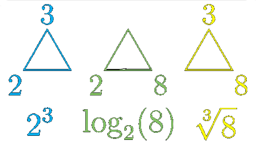

# Три стороны экспоненциальной зависимости**

Данное изображение служит отличным наглядным пособием для объяснения концепции логарифма, которая является центральной для понимания эффективности алгоритмов (нотация  **O** б**О**льшое).

**Основная взаимосвязь:** Изображение показывает, что выражения $2^3 = 8$, $\sqrt[3]{8} = 2$ и $\log_2(8) = 3$ являются тремя формами записи одной и той же фундаментальной зависимости.

**Роль логарифма:** Выражение $\log_2(8)$ задаёт ключевой вопрос: «Сколько раз нам нужно умножить основание (2) само на себя, чтобы получить результат (8)?» Ответ — 3.
*   **Основание (2):** Это базовая величина, особенно актуальная в информатике из-за двоичных (основание 2) систем.
*   **Показатель степени (3):** Он представляет «степень» или количество умножений.
*   **Результат (8):** Это итоговое значение или «размер задачи».
*   **Три операции:**
    1.  $2^3$: «Каков результат роста числа 2 за 3 умножения?» (Ответ: 8)
    2.  $\sqrt[3]{8}$: «Какое число, умноженное само на себя 3 раза, даёт 8?» (Ответ: 2)
    3.  $\log_2(8)$: «Сколько раз мы должны разделить 8 на 2, чтобы получить 1?» или «В какую степень нужно возвести 2, чтобы получить 8?» (Ответ: 3)

# Задание 

1. $2^x = 64$
2. $(2^2)^x = 64$
3. $4^x = 4$
4. $2^x = 1$
5. $2^x + 2^x = 32$
6. $(2^x) * (2^x) = 64$
