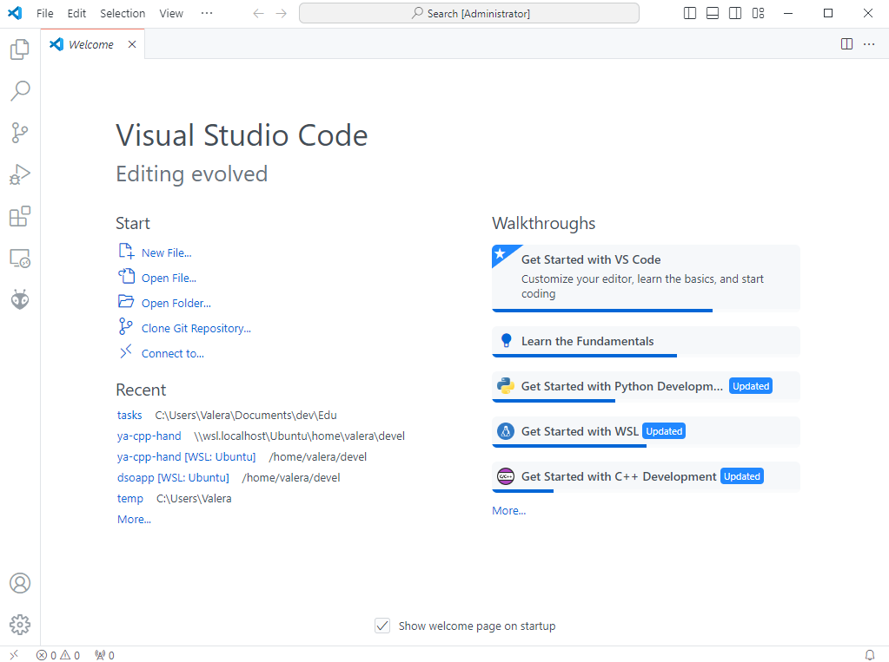

# VSCode


Качать [тут](https://code.visualstudio.com/)



# Python

Качать [тут](https://www.python.org/)

---

# C : GCC & MSYS2

GCC - это очень хорошая коллекция компиляторов, являющаяся полностью бесплатной и свободно распространяемой. Однако существует множество дистрибутивов Windows, распространенных в интернете, но только некоторые из них имеют высокое качество, поэтому я сделал всё, чтобы вам не пришлось пользоваться некачественными дистрибутивами.

Мы будем использовать порт MinGW-w64, упакованный с MSYS2. Это также позволяет нам использовать системы сборки *nix для создания других библиотек, а также использовать предварительно скомпилированные библиотеки, предоставляемые [MSYS2](https://www.msys2.org/). Обратите внимание, что MSYS2 предоставляет компиляторы MinGW-w64. Бинарные файлы с этими компиляторами будут автономными и не потребуют `cygwin.dll` или аналогичный файл.

#### Я предполагаю, что на вашем компьютере установлена 64-разрядная операционная система, и Вы хотите, чтобы ваш компилятор был 64-разрядный по умолчанию.

<b>Если у вас 32-разрядная операционная система, изменить каждый путь (из статьи) `C:\dev\msys64` на `C:\dev\msys32`</b>
1. Скачайте [msys2-x86_64-latest.exe](http://repo.msys2.org/distrib/msys2-x86_64-latest.exe) и запустите. Если у вас 32-разрядная операционная система, скачайте [msys2-i686-latest](http://repo.msys2.org/distrib/msys2-i686-latest.exe). Также убедитесь, что в качестве установочного каталога указан `C:\dev\msys64` (`C:\dev\msys32` для 32-битных).
2. В MSYS2 консоли выполните команду ниже. Подсказка, если Вы нажмете правой кнопкой мыши на строке заголовка, перейдите в меню `Options` -> `Keys` и поставьте галочку `CTRL + SHIFT + letter shortcuts` и вы сможете использовать `CTRL + SHIFT + V` для вставки в консоль MSYS.
  ```bash
  pacman -Syuu
  ```
3. Закройте MSYS2 консоль, как только у вас об этом попросят. Сейчас установлено 3 подсистемы MSYS: MSYS2, MinGW32 и MinGW64. Они соответсвенно могут быть запущены: `C:\dev\msys64\msys2.exe`, `C:\dev\msys64\mingw32.exe` и `C:\dev\msys32\mingw64.exe` Если установщик создал какие-либо ярлыки для открытия консолей для этих подсистем, вы можете обновить их в этих местах, чтобы получить красивые иконки. Каждая подсистема предоставляет среду для создания приложений Windows. Среда MSYS2 предназначена для создания POSIX-совместимого программного обеспечения в Windows. Подсистема MinGW32/64 предназначены для создания собственных приложений Windows с использованием инстраментария linux (gcc, bash и т.д.), ориентированнного соответственно на 32-разрядные и 64-разрадные Windows. Мы установим наш `PATH` таким образом, чтобы эти инструменты можно было вызывать из обычного `cmd.exe`, и нам нужно использовать тольк подсистему MinGW для установки/обновления пакетов MSYS2 или если наша установка требует оболочки \*nix. Подсказка: после запуска MSYS2 в консоле будет указано, какую версию Вы запустили.
4. Снова откройте MSYS2 (не имеет значения, какая версия, т.к. мы прогсто устанавливаем пакеты). <b>Повторяйте</b> следующую команду до тех пор, пока в консоль вам не выведет сообщение о том, что обновлений больше нет. Возможно вам придётся ещё раз перезапустить оболочку.
   ```bash
   pacman -Syuu
   ```
5. Теперь, когда MSYS2 полностью обновлён, мы установим GCC и общие инструменты для сборки. Когда вам будет предложено выбрать пакеты и подтвердить установку, просто нажмите `Enter`.
```bash
pacman -S --needed base-devel mingw-w64-i686-toolchain mingw-w64-x86_64-toolchain mingw-w64-i686-cmake mingw-w64-x86_64-cmake
```
1. Добавите в `PATH` `C:\dev\msys64\mingw64\bin` и `C:\dev\msys64\mingw32\bin` в таком порядке. Обратите внимание, что MSYS2 также помещает в этот каталог множество других инструментов, в первую очередь Python. Поэтому поместите эти записи ниже любоых других инструментов, которые Вы могли бы установить в вашем `PATH`.
2. Добавьте в переменные среды
Вам нужно добавить это значение в переменную среды PATH: `C:\dev\msys64\mingw64\bin`
			
## Инструкция по добавлению значения в PATH:
<span class="bodytext">
<h5 class="sub">Windows 10 и Windows 8</h5>
<ol>
<li>В строке "Поиск" выполните поиск: Система (Панель управления)</li>
<li>Нажмите на ссылку <strong>Дополнительные параметры системы</strong>.</li>
<li>Нажмите <strong>Переменные среды</strong>. В разделе <strong>Переменные среды</strong> выберите переменную среды <code>PATH</code>. Нажмите <strong>Изменить</strong>. Если переменной <code>PATH</code> не существует, нажмите <code>Создать</code>.</li>
<li>В окне <strong>Изменение системной переменной</strong> (или <strong>Новая системная переменная</strong>) укажите значение переменной среды <code>PATH</code>. Нажмите <strong>ОК</strong>. Закройте остальные открытые окна, нажимая <strong>ОК</strong>.</li>
<li>Откройте окно командной строки (WIN + R -> cmd.exe) и выполните gcc --version</li></ol>
</span>

<span class="bodytext">
<h5 class="sub">Windows 7</h5>
<ol>
<li>На рабочем столе правой кнопкой нажмите на значок <strong>Компьютер</strong>.</li>
<li>В контекстном меню выберите <strong>Свойства</strong>.</li>
<li>Нажмите на ссылку <strong>Дополнительные параметры системы</strong>.</li>
<li>Нажмите <strong>Переменные среды</strong>. В разделе <strong>Переменные среды</strong> выберите переменную среды <code>PATH</code>. Нажмите <strong>Изменить</strong>. Если переменной <code>PATH</code> не существует, нажмите <code>Создать</code>.</li>
<li>В окне <strong>Изменение системной переменной</strong> (или <strong>Новая системная переменная</strong>) укажите значение переменной среды <code>PATH</code>. Нажмите <strong>ОК</strong>. Закройте остальные открытые окна, нажимая <strong>ОК</strong>.</li>
<li>Откройте окно командной строки (WIN + R -> cmd.exe) и выполните gcc --version</li></ol>
</span>

## Инструкция ниже - это пример установки библиотеки
Прежде всего я предлагаю проверить пакетный менеджер MSYS2. В нём находится очень много готовых библиотечных пакетов. Вы можете найти найти пакетный репозиторий, используя `pacman -Ss ваша_библиоткека`, например:
```bash
$ pacman -Ss boost
mingw32/mingw-w64-i686-boost 1.73.0-4
    Free peer-reviewed portable C++ source libraries (mingw-w64)
mingw64/mingw-w64-x86_64-boost 1.73.0-4
    Free peer-reviewed portable C++ source libraries (mingw-w64)
```
Если имя пакета начинается с mingw, это библиотека. Установите её с помощью `pacman -Sy имя_пакета`. Например:
```bash
$ pacman -Sy mingw-w64-i686-boost mingw-w64-x86_64-boost
:: Обновление баз данных пакетов...
 mingw32 не устарел
 mingw64 не устарел
 msys не устарел
разрешение зависимостей...
проверка конфликтов...

Пакеты (4) mingw-w64-i686-icu-67.1-1  mingw-w64-x86_64-icu-67.1-1
           mingw-w64-i686-boost-1.73.0-4  mingw-w64-x86_64-boost-1.73.0-4

Будет загружено:   79,66 MiB
Будет установлено:  827,37 MiB

:: Приступить к установке? [Y/n] Y
:: Получение пакетов...
 mingw-w64-i686-i...    20,5 MiB  5,99 MiB/s 00:03 [#####################] 100%
 mingw-w64-i686-b...    18,2 MiB  5,91 MiB/s 00:03 [#####################] 100%
 mingw-w64-x86_64...    20,9 MiB  5,13 MiB/s 00:04 [#####################] 100%
 mingw-w64-x86_64...    20,0 MiB  5,50 MiB/s 00:04 [#####################] 100%
(4/4) проверка ключей                              [#####################] 100%
(4/4) проверка целостности пакета                  [#####################] 100%
(4/4) загрузка файлов пакетов                      [#####################] 100%
(4/4) проверка конфликтов файлов                   [#####################] 100%
(4/4) проверка доступного места                    [#####################] 100%
:: Обработка изменений пакета...
(1/4) установка mingw-w64-i686-icu                 [#####################] 100%
(2/4) установка mingw-w64-i686-boost               [#####################] 100%
(3/4) установка mingw-w64-x86_64-icu               [#####################] 100%
(4/4) установка mingw-w64-x86_64-boost             [#####################] 100%
```

К сожалению, шаблонного символа нет, но Вы можете использовать `pacman -Sy pacman -Ssq boost`, чтобы установить  всё, что возвращается поиском.

Если вашей библиотеки нет в менеджере пакетов, Вы должны скомпилировать её самостоятельно. В качестве примера мы попробуем построить 64-битную библиотеку `zlib`.
1. Откройте `mingw64.exe`.
2. Скачайте и распакуйте zlib: 

```bash
	wget http://zlib.net/zlib-1.2.8.tar.gz
	tar xf zlib-1.2.8.tar.gz
	cd zlib-1.2.8
```

3. Конфигурация, компиляция и установка:
```bash
	make -f win32/Makefile.gcc install BINARY_PATH=/mingw64/bin \
	INCLUDE_PATH=/mingw64/include LIBRARY_PATH=/mingw64/lib
	cd ..
```

Оригинальная статья: https://github.com/orlp/dev-on-windows/wiki/Installing-GCC--&-MSYS2

# Полезные ссылки

[Огромный гайд по настройке рабочего окружения: Linux, VScode, Python](https://habr.com/ru/companies/timeweb/articles/916040/)
[С/С++ на Linux в Visual Studio Code для начинающих](https://habr.com/ru/companies/microsoft/articles/333680/)
[Linux для начинающих: WSL — это читерство. Как Microsoft дал нам Linux без головной боли](https://habr.com/ru/companies/ntechlab/articles/908450/)
[Как настроить Visual Studio Code для C, C++, Java, Python](https://nuancesprog.ru/p/8119/)
