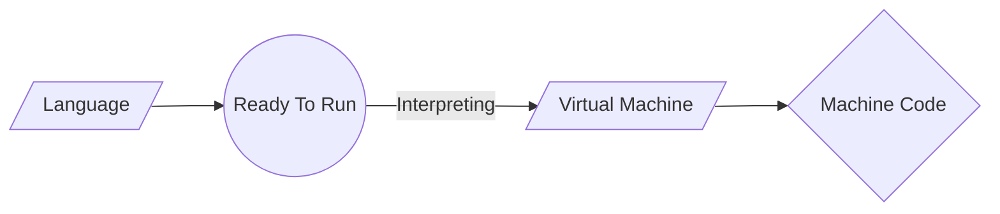
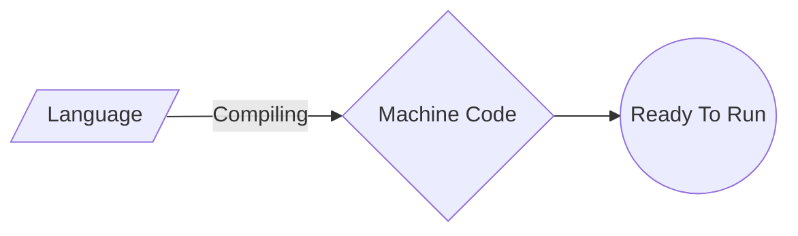
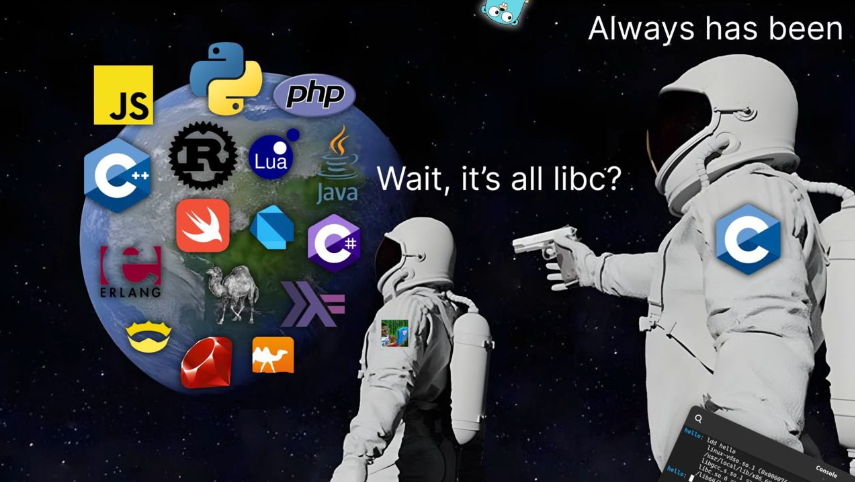

# Введение

Темы которым занимается информатика представлены на данной [карте](images/map_of_cs) 


## Вычислительное мышление
По сути, компьютерное программирование - это получение входных данных и создание выходных, то есть решение проблемы. То, что происходит между входом и выходом, то, что мы можем назвать "черным ящиком", и является основной темой данного курса.


Например, нам необходимо вести учет посещаемости занятий. Для подсчета мы можем использовать систему, называемую унарной, по одному пальцу за раз. Сегодня компьютеры считают с помощью системы, называемой двоичной. Именно от термина "двоичная цифра" мы получили знакомое нам понятие "бит". Бит - это ноль или единица.
Компьютеры говорят только в терминах нулей и единиц. Нули обозначают выключение. Единицы означают включение. Компьютер - это миллионы, а может быть, и миллиарды транзисторов, которые включаются и выключаются.
Если представить себе лампочку, то одна лампочка может считать только от нуля до единицы.
Однако если у вас будет три лампочки, то возможностей станет больше!
При использовании трех лампочек нуль может быть представлен следующим образом:
```
0 0 0
```
Аналогичным образом, единица будет представлена следующим образом:
```
  0 0 1
  ```
По этой логике можно предположить, что следующее число равно двум:
```
  0 1 0
  ```
Расширяя эту логику, можно предположить, что следующее число равно трем:
```
  0 1 1
  ```
Четыре будет выглядеть следующим образом:
```
  1 0 0
  ```
Фактически, используя только три лампочки, мы можем насчитать целых семь!
```
  1 1 1
  ```
В качестве эвристики мы можем представить, что следующие значения представляют собой каждое возможное место в нашей двоичной цифре:
```
  4 2 1
  ```
В компьютерах для счета используется "основание-2". Это можно представить следующим образом:
```
  2^2 2^1 2^0
  4 2 1
  ```
Поэтому можно сказать, что для представления числа, равного семи, требуется три бита (место четверки, место двойки и место единицы).

В компьютерах для представления числа обычно используется восемь разрядов. Например, `00000101` - это число 5 в _двоичном_ виде.
    
**Система счисления**  — символический метод записи чисел, представление чисел с помощью письменных знаков.

-   Число — некоторая абстрактная сущность, мера для описания количества чего-либо.
-   Цифры — знаки, используемые для записи чисел.

Цифры бывают разные: самыми распространёнными являются арабские цифры, представляемые знаками от нуля (0) до девяти (9); менее распространены римские цифры, их можно встретить на циферблате часов или в обозначении века (XIX век).

Поскольку чисел гораздо больше чем цифр, то для записи числа обычно используется набор (комбинация) цифр. Только для небольшого количества чисел — для самых малых по величине целых чисел — бывает достаточно одной цифры. Существует много способов записи чисел с помощью цифр, называемых  **системой счисления**. Величина числа может зависеть от порядка цифр в записи, а может и не зависеть. Это свойство определяется системой счисления и служит основанием для простейшей классификации таких систем, что позволяет все системы счисления разделить на четыре класса (группы):
-   позиционные;
-   непозиционные;
-   смешанные.
-   унарные.
**Позиционные**  системы счисления подробно рассмотрены ниже, после краткого обзора  **смешанных**  и  **непозиционных**  систем.

Денежные знаки — это пример  **смешанной**  системы счисления.

Сейчас в России используются монеты и купюры следующих номиналов: по 5, 10, 50 копеек и по 1, 2, 5, 10, 50, 100, 200, 500, 1000, 2000, 5000 рублей. Чтобы получить некоторую сумму в рублях, нужно использовать некоторое количество денежных знаков различного достоинства.

Предположим, что пылесос стоит 6379 рублей. Для покупки можно использовать шесть купюр по тысяче рублей, три купюры по сто рублей, одну пятидесятирублёвую купюру, две десятки, одну пятирублёвую монету и две монеты по два рубля. Если записать количество купюр или монет начиная с 1000 руб. и заканчивая пятью копейками, заменяя нулями неиспользуемые номиналы, то получится число 600312120000.

Если перемешать цифры в числе 600312120000, оно представит ложную цену пылесоса. Следовательно, такая запись относится к  **позиционным**  системам.

В непозиционных системах счисления величина числа не зависит от положения цифр в записи. Если к каждой цифре приписать знак номинала, то такие составные знаки (цифра + номинал) уже можно перемешивать, то есть такая запись является  **непозиционной**.

Примером «рафинированной» непозиционной системы счисления является  [римская система](https://ru.wikibooks.org/wiki/%D0%A0%D0%B8%D0%BC%D1%81%D0%BA%D0%B0%D1%8F_%D1%81%D0%B8%D1%81%D1%82%D0%B5%D0%BC%D0%B0_%D1%81%D1%87%D0%B8%D1%81%D0%BB%D0%B5%D0%BD%D0%B8%D1%8F "Римская система счисления").

### Позиционные системы счисления
Позиционные системы счисления — это системы счисления, в которых значение цифры напрямую зависит от её положения в числе.  
Например, число 01 обозначает единицу, 10 — десять.

Позиционные системы счисления позволяют легко производить арифметические расчёты.

Представление чисел с помощью арабских цифр — самая распространённая позиционная система счисления, она называется «десятичной системой счисления». Десятичной системой она называется потому, что использует десять цифр: 0, 1, 2, 3, 4, 5, 6, 7, 8 и 9. Заметьте: максимальная цифра (9) на единицу меньше количества цифр (10).

Для составления машинных кодов удобно использовать не десятичную, а двоичную систему счисления, содержащую только две цифры, 0 и 1. Обратите внимание, что в двоичной системе максимальная цифра 1.

Программисты для вычислений также пользуются ещё восьмеричной и шестнадцатеричной системами счисления.

Количество цифр, используемых в системе счисления, называется её «основанием». В десятичной системе основание равно десяти, в двоичной системе — двум, ну а в восьмеричной и шестнадцатеричной — соответственно, восьми и шестнадцати. То есть в ручной системе счисления количество цифр равно р и используются цифры от 0 до р-1.

В общем случае в позиционной системе счисления числа представляются следующим образом: $a_{n-1} .... a_{1}a_{-_{f}}$  , где  — $a_0,a_1.....a_{n-1}$цифры, а   $f$— основание системы счисления. Если используется десятичная система, то  $f$  — можно опустить.
Примеры чисел:
1. $25_{10}$ число в десятичной системе счисления, $a_{0}=5, a_{1}=2$ 
2. $31_{8}$ это же в восьмеричной системе счисления $a_0=1, a_1=3$
3. $221_3$ это же число в несимметричной троичной системе счисления,$a_0=1, a_1=2,a_2=2$
4. $11001_2$это же число в двоичной системе счисления, $a_0=1, a_1=0, a_3=1, a_4=1$
### Преобразование чисел
Такое представление чисел обозначает вот такое число: $$a_{n-1}f^{n-1} 
+...+a_1 f^1 + a_0 f^0$$,  где  — $a_0,a_1.....a_{n-1}$цифры, а   $f$— основание системы счисления.
Следовательно мы можем разложить числа из выше преведенного примера:
1. $25_{10} \rightarrow 2 * 10^1 + 5 * 10^0 = 2 * 10 + 5 * 1 = 25_{10}$
2. $31_8 \rightarrow 3 * 8 ^ 1 + 1 * 8^0 = 3 * 8 + 1 * 1 =25_{10}$ 
3. $221_3 \rightarrow 2 * 3^2 + 2 * 3^1 + 1 * 3^0 = 2 * 9 + 2 * 3 + 1 * 1 = 25_{10}$
4. $11001_2 \rightarrow 1 * 2^4 + 1 * 2^3 + 0 * 2^2 + 0 * 2^1 + 1 * 2^0 = 1 * 16 + 1 * 8 + 0 *4 + 0 * 2 + 1 * 1 = 25_{10}$

Мы разобрали, как узнать, чему равно число в любой системе счисления. Но как нам получить это число? Представим что у нас есть некоторое число 
$A$, и мы хотим получить его представление в системе по основанию 
$f$. Как нам это сделать?
Мы знаем, что число $A$ A можно представить в виде: $a_{n-1} .... a_{1}a_{-_{f}}$ будем из этого исходить. Что будет, если мы поделим это число на $f$ 
Получим:
$$\frac{a_{n-1} f^{n-1} + ... a_2f^2 + a_1f^1 + a_0f^0}{f} = a_{n-1}f^{n-2} + ... + a_2f^1 + a_1 f^0$$
и остаток от деления $a_0$ Почему a_0 ? Все члены суммы делятся на $f$ без остатка, а последний член $a_0$ в результате деления даёт $0$ и$a_0$ в остатке, так как максимальное значение цифры всегда на единичку меньше основания системы. Итак мы получили самую правую цифру $a_0$
$a_{n-1}a_{n-2}...a_{1f}$, как результат деления числа $A$ на $f$. Если мы так будем продолжать делить, то получим все цифры $a_{1},a_{2}...a_{n-1}$.
Возьмём для примера полюбившееся нам число $25$  и получим представление этого числа в двоичной системе счисления:
 - $25/2 = 12$, остаток $1$
- $12/2 = 6$, остаток $0$
- $6/2 = 3$, остаток $0$
- $3/2 = 1$, остаток $1$
- $1/2 = 0$, остаток $1$
И получим число $11001_2$
Представим число $25$  в троичной системе счисления:
 - $25/3 = 8$, остаток $1$
- $8/3 = 2$, остаток $2$
- $2/3 = 0$, остаток $2$
И получим число $221_3$
Представим число $25$  в восьмеричной системе счисления:
 - $25/8 =3$, остаток $1$
- $3/8 = 0$, остаток $3$
И получим число $31_8$
Представим число $25$  в десятчиной системе счисления:
- $25/10 = 2$, остаток $5$
- $2/10 = 0$, остаток $2$

## Текст 
 
Подобно тому, как числа представляют собой двоичную схему из единиц и нулей, буквы также представляются с помощью единиц и нулей!
Поскольку единицы и нули, обозначающие цифры и буквы, совпадают, был создан стандарт ASCII, позволяющий сопоставлять определенные буквы с определенными цифрами.
Например, букве A было решено сопоставить число 65.
Если вы получили текстовое сообщение, то в двоичном виде оно может представлять собой числа `72`, `73` и `33`. Если перевести их в ASCII, то сообщение будет выглядеть следующим образом:
```
  H I !
  72 73 33
  ```
Слава Богу, что есть такие стандарты, как `ASCII`, которые позволяют нам договориться об этих значениях!
Вот расширенная карта значений `ASCII`:
-   
    
-   [ASCII](https://en.wikipedia.org/wiki/ASCII).

## Emojis

-   С течением времени появляется все больше способов общения с помощью текста.
- Поскольку в двоичной системе не хватало цифр для представления всех разнообразных символов, которые могли быть представлены человеком, стандарт _Unicode_ расширил количество битов, которые могут быть переданы и поняты компьютером.
- Существуют эмодзи, которые вы, вероятно, используете каждый день. Следующие могут показаться вам знакомыми:
    
    
    
-  Информатики столкнулись с проблемой, когда захотели присвоить каждому эмодзи различные оттенки кожи, чтобы сделать общение более персонализированным. В этом случае создатели и авторы эмодзи решили, что начальными битами будет структура самого эмодзи, а затем оттенок кожи.
- В стандарт Unicode добавляются все новые и новые возможности для представления дополнительных символов и эмодзи.
- При желании вы можете узнать больше о [Unicode](https://en.wikipedia.org/wiki/Unicode).
- При желании можно узнать больше о [emojis](https://en.wikipedia.org/wiki/Emoji).

## RGB

-   Красный, зеленый и синий цвета (так называемый `RGB`) - это комбинация трех чисел.
      
    
-   Используемые нами ранее значения 72, 73 и 33, обозначающие в тексте `HI!`, будут интерпретированы читателями изображений как светлый оттенок желтого. Красное значение будет равно 72, зеленое - 73, а синее - 33.
    
    
    

## Images, Video and Sound

- Изображения - это просто наборы RGB-значений.
- Видеоролики представляют собой последовательности из множества изображений, которые хранятся вместе, подобно перекидному альбому.
- Музыка может быть представлена в виде MIDI-данных.

## Алгоритмы

- Решение задач занимает центральное место в информатике и  программировании.
- Представьте себе базовую задачу - найти в телефонном справочнике одно имя.
- Как можно решить эту задачу?
- Один из подходов заключается в том, чтобы просто читать с первой страницы на следующую и далее, пока не доберетесь до последней страницы.
- Другой подход заключается в поиске на двух страницах одновременно.
- Последний и, возможно, более эффективный подход заключается в том, чтобы дойти до середины телефонного справочника и спросить: "Имя, которое я ищу, находится слева или справа?". Затем повторить этот процесс, разрезая проблему пополам и еще раз пополам.
- Каждый из этих подходов можно назвать алгоритмами. Скорость работы каждого из этих алгоритмов можно представить следующим образом в так называемой нотации "большого О":
    
      Обратите внимание, что в первом алгоритме, выделенном красным цветом, большая О равна `n`, поскольку если в телефонной книге 100 имен, то поиск нужного имени может занять до 100 попыток. Второй алгоритм, в котором поиск ведется на двух страницах одновременно, имеет большую О, равную `n/2`, поскольку поиск по страницам ведется в два раза быстрее. Последний алгоритм имеет отношение big-O равное log2n, так как удвоение задачи приведет к увеличению числа шагов для ее решения.
    

## Псевдокод и основные структурные элементы программирования

- Умение создавать _псевдокод_ является ключевым для успеха как в этом классе, так и в программировании.
- Псевдокод - это человекочитаемая версия вашего кода. Например, рассматривая третий алгоритм, приведенный выше, мы можем составить псевдокод следующим образом:
    
    ```
      1  Pick up phone book
      2  Open to middle of phone book
      3  Look at page
      4  If person is on page
      5      Call person
      6  Else if person is earlier in book
      7      Open to middle of left half of book
      8      Go back to line 3
      9  Else if person is later in book
      10     Open to middle of right half of book
      11     Go back to line 3
      12 Else
      13     Quit
    
    ```
-   Псевдокодирование - очень важный навык, по крайней мере, по двум причинам. Во-первых, псевдокодирование перед созданием формального кода позволяет заранее продумать логику решения задачи. Во-вторых, при псевдокодировании можно впоследствии предоставить эту информацию другим людям, которые хотят понять, какие решения вы принимаете при кодировании и как работает ваш код.
- Обратите внимание, что язык нашего псевдокода имеет некоторые уникальные особенности. Во-первых, некоторые строки начинаются с глаголов типа _взять,_ _открыть,_ _посмотреть._ В дальнейшем мы будем называть их _функциями_.
- Во-вторых, обратите внимание, что некоторые строки содержат выражения типа `if` или `else if`. Они называются _условиями_.
- В-третьих, обратите внимание на то, что есть выражения, которые могут быть выражены как _истина_ или _ложь_, например, "человек находится раньше в книге". Мы называем их _булевыми выражениями_.
- Наконец, обратите внимание на высказывания типа "вернуться к строке 3". Мы называем их _петлями_.
- В контексте программы _Scratch_, которая рассматривается ниже, мы будем использовать каждый из перечисленных выше основных структурных элементов программирования.

## Системы счисления
### Шестидесятеричная система счисления
о, как мы представляем время на часах, это пример шестидесятеричной позиционной системы счисления. В представлении времени используется три позиции: для часов, минут и секунд; так как для каждой позиции приходится использовать 60 цифр, а у нас только десять цифр, то для каждой шестидесятиричной позиции используется две десятичные цифры (00, 01, 02, …, 59), а позиции разделяются двоеточием.
```
h:m:s
```
Чтобы получить время в секундах мы должны посчитать вот по такой формуле:
$$h60^2 + m60^1 + s60^0 = h3600 + m60 + s$$
### Двоичная система счисления
В компьютерной технике очень часто используется двоичная система счисления. Такую систему очень легко реализовать в электронике (полупроводниковые транзисторы и микросхемы), так как для неё требуется всего два устойчивых состояния (0 и 1).

Двоичная система счисления может быть непозиционной и позиционной системой. В ней используется две цифры: 0 и 1. В реальном устройстве это может быть реализовано присутствием какого-либо физического явления или его отсутствием. Например: есть электрический заряд или его нет, есть напряжение или нет, есть ток или нет, есть сопротивление или нет, отражает свет или нет, намагничено или не намагничено, есть отверстие или нет и т.п.

Мы уже знаем, как переводить числа в различные системы счисления. Посмотрим, как это происходит с двоичной системой счисления. Переведём число из двоичной системы счисления в десятичную.
$$10101010_2 = 1 * 2 ^ 7 + 0 * 2 ^ 6 + 1 * 2 ^ 5 + 0 * 2 ^ 4 + 1 *  1 * 2 ^ 3 + 0 *  2 ^ 2   + 1 * 2 ^ 1  + 0 * 2 ^ 0 = 128 + 32 + 8 + 2 = 170$$

Сложение:
```
 1001
 +
 1010
 ----
10011
```

Вычитание:
```
1110
-
0101
----
1001
```
Умножение:
```
   1110
*
   0101
   ----
   1110
  0000
 1110
0000 
-------
1000110
```
Деление:
```
1000110 | 101
 101   -----
----   0001110 
  111
  101
  ---
   101
   101
   ---
     00
  ```
  ### Восьмеричная и шестнадцатеричная системы счислений
Компьютерам очень удобно оперировать двоичными числами, но люди не привыкли работать с большим количеством цифр. Например, чтобы представить в двоичном виде число 1234 потребуется больше 10 двоичных цифр (`10011010010`). Поэтому были придуманы восьмеричная и шестнадцатеричная системы счислений. Они удобны как и десятичные числа тем, что для представления числа требуется меньшее количество разрядов. А по сравнению с десятичными числами, перевод в двоичное представление очень простой. Это как будто мы двоичное число разбили на группы по три или четыре разряда и каждой двоичной комбинации придумали значок. Вот таблица для восьмеричных цифр:

| Двоичная комбинация | Символ |
|-|-|
|000|0|
|001|1|
|010|2|
|011|3|
|100|4|
|101|5|
|110|6|
|111|7|
А вот таблица для шестнадцатеричных цифр:

| Двоичная комбинация | Символ |
|-|-|
|0000|0|
|0001|1|
|0010|2|
|0011|3|
|0100|4|
|0101|5|
|0110|6|
|0111|7|
|1000|8|
|1001|9|
|1010|A|
|1011|B|
|1100|C|
|1101|D|
|1110|E|
|1111|F|

Перевод произвести очень просто, посмотрим на примере числа `010011010010`.

Разбиваем его на группы (октавы) по три цифры: `010 011 010 010`. И по таблице переводим:  $2322_8$
Чтобы перевести число в шестнадцатеричное представление разбиваем двоичное число на группы по четыре цифры: `0100 1101 0010`. И по таблице переводим: $4D2_{16}$. С помощью калькулятора Windows мы можем убедиться, что всё проделано верно.

В программистских кругах шестнадцатеричные числа принято предварять значком `0x`(например, `0x4D2`), такое написание пошло от языка программирования C, либо значком `$` (например, `$4D2`), такая нотация произошла от языка программирования `Pascal`. Иногда в литературе используют буквы «h» (от англ. hexadecimal) и «b» (от англ. binary) для обозначения соответственно шестнадцатеричных и двоичных чисел (например, `FFh` или `1011b`).


# 1.0 Какие языки мы будем использовать ?


За время существования вычислительной техники было придумано множество языков программирования. По данным [Википедии](https://timeweb.com/go?url=https%3A%2F%2Fen.wikipedia.org%2Fwiki%2FList_of_programming_languages&hash=0bcd310bfdf9a8fea9926162194eeb706093816b), официально зарегистрировано **700** языков, согласно другим тематическим источникам, их количество достигает **9000**. В этом материале рассмотрим, что такое языки программирования, и разберем разные варианты их классификации. 

Смотрите, какая интересная штука! Люди придумали просто уйму способов, чтобы **поговорить** с компьютером. Некоторые говорят, что языков программирования всего семь сотен, а другие насчитали аж девять тысяч! Но чтобы понять, в чем тут соль, нужно сначала разобраться, что это вообще такое.

Представьте, что вы хотите объяснить кому-то, **как приготовить бутерброд**. Вы используете **слова, жесты — ваш общий язык**. Так вот, **язык программирования — это такой же набор правил, только для общения с железной коробкой, полной транзисторов**. Это ваш ключ к тому, чтобы заставить эту коробку делать то, что вам нужно: от простейших вычислений до создания целых виртуальных миров.

И, конечно, как и любые другие инструменты, эти языки можно рассортировать по разным полочкам. И это не просто скучная классификация, это помогает понять саму суть дела!

## Во-первых, давайте посмотрим, насколько близко мы говорим с самой машиной.

Есть языки, которые болтают с процессором почти на его родном языке — шепчут ему прямо на ушко. Это «низкоуровневые» языки.

*   **Машинный код** — это вообще чистая магия. Это самые базовые инструкции, которые процессор жует без всяких раздумий. Это как давать ему команды единичками и ноликами.
*   **Ассемблер** — это уже немного попроще. Он использует мнемоники, короткие словечки, которые соответствуют этим командам. Специальная программка-переводчик (ассемблер) берет этот код и превращает обратно в единички и нолики для процессора.

Чтобы использовать такие языки, нужно действительно понимать, как работает процессор изнутри. Это мощно, но сложно. Так делают, например, операционные системы или драйверы.

А есть языки «высокоуровневые». Они гораздо больше похожи на человеческий язык, часто на английский. Они говорят не с процессором, а с *программистом*. Вы говорите: «напечатай это» или «посчитай то», а уж компилятор или интерпретатор сам разберется, как именно объяснить это процессору. `C`, `C++`, `Python`, `Java` — все они из этой компании. Они как бы создают новый, более удобный слой абстракции между вами и железом.

## Дальше интереснее: как компьютер на самом деле выполняет то, что вы написали?

Тут два главных пути:

1.  **Интерпретация.** Представьте, что у вас есть умный друг-переводчик. Вы читаете ему фразу на непонятном языке, а он тут же ее переводит и выполняет. Потом следующую, и так далее. Это и есть интерпретация. `Python`, `Ruby` — вот такие. Это гибко, можно быстро что-то поменять и сразу посмотреть, что вышло.





2.  **Компиляция.** Тут вы сначала отдаете весь свой текст профессиональному переводчику (компилятору), он уходит в кабинет, немного подумает и выдает вам готовую книжку на машинном языке. И потом вы просто даете кому угодно эту книжку, и он ее читает. `C++`, `Go` — компилируемые. Такие программы обычно работают шустрее, потому что вся работа по переводу уже сделана заранее. Но чтобы исправить опечатку, придется снова идти к переводчику и переводить всю книгу заново.




> **C, C++, C#, CLEO, COBOL**

Раньше разница в скорости была очень заметна, но сейчас умные ребята придумали хитрые штуки вроде `JIT`-компиляции, которая старается получить лучшее от обоих подходов.

## А теперь давайте о типах! Нет-нет, не о тех, что ходят в бар, а о типах данных.

Как язык следит за тем, чтобы вы не пытались сложить число и слово «бутерброд»?

*   **Статическая типизация** (как в `Java`, `C#`). Это как строгий бухгалтер. Вы приходите и говорите: «Это у меня переменная «а», и она всегда будет целым числом!». И потом, если вы вдруг попытаетесь записать в нее тот самый «бутерброд», бухгалтер возмутится еще до того, как программа запустится. Это помогает ловить глупые ошибки на самом раннем этапе.
*   **Динамическая типизация** (как в `Python`, `JavaScript`). Тут попроще. Вы можете сказать: «сегодня это число», а завтра — «а теперь это строка». Язык разберется с этим уже во время выполнения. Это дает кучу свободы, но иногда можно так запутаться, что сам черт ногу сломит!

## А еще есть языки, которые придуманы не для работы, а чисто для веселья и чтобы почесать мозги!

Их называют эзотерическими. Это жесть! Например, `Brainfuck`, где всего 8 команд. Или **Whitespace**, где весь код состоит из пробелов, табуляций и переносов строки — представьте, как выглядит программа! Или `LOLCODE`, который пародирует интернет-мемы про котов: «HAI», «KTHXBYE». Это полноценные языки, но попробуйте-ка написать на них что-то серьезное!

Есть и специальные языки для очень конкретных задач. Например, для написания музыки или описания ДНК. Они как специальные инструменты: попробуйте забить гвоздь микроскопом!

## Ну и напоследок: как мы вообще пишем эти программы?

*   **Текстовые языки** — это классика. Вы открываете редактор и пишете символы, слова, конструкции. Почти все, что мы знаем, относится сюда.
*   **Визуальные языки** — это уже интереснее! Вы не пишете код, а собираете его из кубиков, как Lego, или рисуете схемы и диаграммы. Scratch для детей или LabVIEW для инженеров — отличные примеры. Вы перетаскиваете блоки, соединяете их линиями, и программа готова!

Вот видите? Это же не просто скучный список. Это целый зоопарк идей о том, как мы можем общаться с машинами! И самое прекрасное, что нет одного правильного способа. Есть просто разные инструменты для разных задач и для разных людей. И это чертовски интересно!

## Так какой же язык мне выбрать 

Авторы индекса TIOBE [опубликовали](https://www.tiobe.com/tiobe-index/) августовский рейтинг популярных языков программирования. 
И что же видно из этого рейтинга, что самыми популярными языками являются [Python](https://www.python.org/), [C](https://en.wikipedia.org/wiki/C_(programming_language)) и [С++](https://cplusplus.com/).  Если с `Python` и `С++` можно понять почему они являются популярными.  `Python` ([22.6 миллиона](https://github.com/search?q=language%3APython&type=repositories&s=stars&o=desc)) - этот язык может быть чем угодно, захотите можете писать на нем что угодно, а также он достаточно прост в освоении. И на нем написано просто безумное количество различных [модулей](https://pypi.org/) . `С++` ([5.9 миллиона ](https://github.com/search?q=language%3AC%2B%2B+&type=repositories)) - является золотым стандартом в программировании также очень популярен в большом количестве компаний и программ. Но откуда в рейтинге взялся старичок `C` ([3.6 миллиона](https://github.com/search?q=language%3AC+&type=repositories&s=stars&o=desc)). **Как вы думаете почему он всегда держится в топе** ?

А все дело в том, что `C` является самым простым языком программирования и с его помощью создано подавляющийся большинство языков программирования :




В рамках этого курса мы будем использовать и писать программы на **двух языках** как вы думаете каких ?

