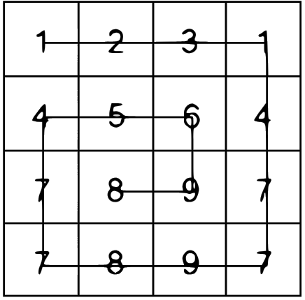

# 1. Тетрация

Тетрация (tetration) определяется как следующий гипероператор (гипероператор-4) после возведения в степень. Таким образом, операцию $x × n$ можно записать в виде суммы $x + x + x + … + x$ с $n$ слагаемыми, операцию $xn$ – в виде произведения n сомножителей x + x + x + … + x, а выражение, записанное в форме nx, равнозначно повторяющемуся возведению в степень, включающему n вхождений $x$:
$${^{n}x}=x^{x^{.^{x}}}$$
Например, ${^{4}2}=2^{2^{2^{2}}}=2^{2^{4}}=2^{16}=65536$
Следует отметить, что степенная башня вычисляется сверху вниз. Написать рекурсивную функцию для вычисления nx и протестировать ее (для небольших положительных действительных значений x и неотрицательных целых $n$, потому что тетрация генерирует очень большие числа). Из скольких цифр состоят числа ${^{3}5}$ и ${^{5}2}$?

# 2. Резистор

5 (резисторов) определяются по четырем цветовым полоскам: первые две обозначают первые две значимые цифры электрического сопротивления в омах, третья полоска обозначает десятичный множитель (число нулей), а четвертая – допустимое отклонение от номинала. Цвета и их значения для каждой полоски перечислены в таблице.

| Цвет      | Сокращенное обозначение | Значимые цифры | Множитель | Допустимое отклонение |
| --------- | ----------------------- | -------------- | --------- | --------------------- |
| Черный | bk                      | 0              | $1$    | -                     |
| Коричневый | br                      | 1              | $10$    | $\pm1$                     |
| Красный | rd                      | 2              | $10^2$    | $\pm2$                     |
| Оранжевый | or                      | 3              | $10^2$    | -                     |
| Желтый          | yl                         | 4                | $10^4$           | $\pm5$% |
| Зеленый          | gr                         | 5                | $10^5$           | $\pm0.5$% |
| Синий          | bl                         | 6                | $10^6$           | $\pm0.25$% |
| Фиолетовый          | vi                         | 7                | $10^7$           | $\pm0.1$% |
| Серый          | gy                         | 8                | $10^8$           | $\pm0.05$% |
| Белый          | wh                         | 9                | $10^9$           | - |
| Золотой          | au                         | -                |  -        | $\pm5$% |
| Серебряный          | ag                         | -                | -           | $\pm10$% |
| Нет          | -                         | -                |  -          | $\pm20$% |

Например, для резистора с полосками следующих цветов: фиолетовая, желтая, красная, зеленая – значение сопротивления равно $74 × 102 = 7400$ Ω, а допустимое отклонение от номинала составляет $±0.5$ %.
Написать программу, в которой определяется функция преобразования списка из четырех сокращенных обозначений цветов (полосок) в значение сопротивления и допустимое отклонение. Например:
```python
# In
print(get_resistor_value(['br', 'bk', 'yl', 'ag']))
print(get_resistor_value(['yl', 'vi', 'rd', 'au']))
print(get_resistor_value(['vi', 'yl', 'rd', 'gr']))
print(get_resistor_value(['ws', 'yl', 'rd', 'rd']))
print(get_resistor_value(['vi', 'yl', 'rd']))
```
```python
# Out
(100000, 10)
(4700, 5)
(7400, 0.5)
Unidentified or invalid band colour in bands: ['ws', 'yl', 'rd', 'rd']
(None, None)
Fewer than four colours provided in bands: ['vi', 'yl', 'rd']
(None, None)
```

# 3. Морзе

Использовать словарь кодов азбуки Морзе из `data/morse.py`, чтобы написать программу преобразования текстового сообщения в код Морзе и обратно. Использовать пробелы для разделения отдельных «букв» кода Морзе, а символ слеш (/) – для разделения слов. Например, 'PYTHON 3' преобразовывается в ``'.-. -.- - .... - -. / ...-'.

# 4. Baby Shark

Файл `data/shark-species.txt`, содержит список существующих видов акул, организованный в иерархической форме: семейство, род и вид (вид представлен в форме «биологическое название: общее название»). Выполнить считывание содержимого этого файла в структуру данных, состоящую из вложенных словарей, доступ к которым можно осуществлять следующим образом:
```python
>>> sharks['Lamniformes']['Lamnidae']['Carcharodon']['C. carcharias']
Great white shark
```
# 5. Поиск степени делителя факториала

Даны два числа $n$ и $k$. Найдите наибольшую степень $x$ такого, что $n!$ делится на $k^x$.

**Простой $k$**

Рассмотрим случай, когда $k$ является простым числом. Явное выражение для факториала:

$$n! = 1 \cdot 2 \cdot 3 \ldots (n-1) \cdot n$$

Обратите внимание, что каждый $k$-й элемент произведения делится на $k$, т.е. добавляет $+1$ к ответу; количество таких элементов равно $\Bigl\lfloor\dfrac{n}{k}\Bigr\rfloor$.

Далее, каждый $k^2$-й элемент делится на $k^2$, т.е. добавляет еще $+1$ к ответу (первая степень $k$ уже была учтена в предыдущем абзаце). Количество таких элементов равно $\Bigl\lfloor\dfrac{n}{k^2}\Bigr\rfloor$.

И так далее, для каждого $i$ каждый $k^i$-й элемент добавляет еще $+1$ к ответу, и таких элементов $\Bigl\lfloor\dfrac{n}{k^i}\Bigr\rfloor$.

Окончательный ответ:

$$\Bigl\lfloor\dfrac{n}{k}\Bigr\rfloor + \Bigl\lfloor\dfrac{n}{k^2}\Bigr\rfloor + \ldots + \Bigl\lfloor\dfrac{n}{k^i}\Bigr\rfloor + \ldots$$

Этот результат также известен как [Формула Лежандра](https://en.wikipedia.org/wiki/Legendre%27s_formula). Сумма, конечно, конечна, так как только примерно первые $\log_k n$ элементов не равны нулю. Таким образом, время работы этого алгоритма составляет $O(\log_k n)$.


- $n = 10$: Мы ищем степень делителя факториала $10!$.
- $k = 2$: Мы ищем наибольшую степень $x$ такую, что $10!$ делится на $2^x$.

Наибольшая степень $x$, такая что $10!$ делится на $2^x$.

Для $n = 10$ и $k = 2$ мы вычисляем:

- $\left\lfloor \frac{10}{2} \right\rfloor = 5$
- $\left\lfloor \frac{10}{4} \right\rfloor = 2$
- $\left\lfloor \frac{10}{8} \right\rfloor = 1$

Суммируем все значения:

$$5 + 2 + 1 = 8$$

Таким образом, $10!$ делится на $2^8$.

# 6. Поиск наименьшего положительного целого числа

Даны два последовательных целых числа $k_1$ и $k_2$, где $k_2 = k_1 + 1$.

Необходимо вычислить наименьшее строго положительное целое число $n$, такое что значения $n \cdot k_1$ и $n \cdot k_2$ содержат одни и те же цифры, но в различном порядке.


**Пример 1:**

- $k_1 = 100$
- $k_2 = 101$
- $n = 8919$

Поскольку:

- $8919 \cdot 100 = 891900$ 
- $8919 \cdot 101 = 900819$

**Пример 2:**

- $k_1 = 325$
- $k_2 = 326$
- $n = 477$

Поскольку:

- $477 \cdot 325 = 155025$
- $477 \cdot 326 = 155502$

Ваша задача — подготовить функцию, которая будет принимать значение $k_1$ и выводить значение $n$.

Примеры использования функции:

```python
find_lowest_int(100)  # должно вернуть 8919
find_lowest_int(325)   # должно вернуть 477
```

# 7. IBAN

Файл `data/iban_lengths.txt`, содержит два столбца данных: двухбуквенный код страны и длину международного номера банковского счета IBAN (International Bank Account Number):
```
AL 28
AD 24
...
GB 22
```

Реализовать парсинг этого файла для преобразования его содержимого в словарь длин, а ключом является код страны.
- Использовать лямбда-функцию и генератор списка для получения того же
результата: 
	- в двух строках кода; 
	- в одной строке кода.

# 8. Разделение приза в игре

Пьер и Блез играют в игру, состоящую из нескольких раундов. Каждый из них вложил $100 в общий фонд, и тот, кто первым выиграет 3 раунда, забирает фонд. Победитель каждого раунда определяется случайным образом, и вероятность победы у обоих игроков равна. После 3 раундов Блез выиграл два раунда, а Пьер — один. Пьер собирается забрать свои $100, но Блез говорит: "Подожди! У меня лучше шансы на победу, поэтому я должен получить большую часть фонда. Возьми $50 и оставь остальное мне, и мы разойдемся."

Пьер начинает перечислять все возможные исходы игры и обнаруживает, что в 3 из 4 случаев победит Блез. В итоге он соглашается с Блезом и забирает свои $50.

Предположим, что есть $n$ игроков, каждый из которых вложил одинаковую сумму в фонд. Первый, кто выиграет `rounds_to_win` раундов, забирает фонд. Прежде чем завершить игру, игроки решают остановиться и честно разделить фонд между собой. Количество выигранных раундов каждым игроком задано в списке `wins = [w_0, w_1, ...]`, длиной $n$, где `wins[i]` — количество раундов, выигранных игроком $i$.

Напишите функцию `divide_pot`, которая принимает `rounds_to_win` и `wins` в качестве аргументов и возвращает список целых чисел `f = [f_0, f_1, ...]`, такой что `Fraction(f[i], sum(f))` является точной долей фонда, которую игрок $i$ должен получить. Элементы списка `f` не должны иметь общего делителя, большего 1.

**Ограничения входных данных**

- $2 \leq n \leq 10$
- $3 \leq rounds2win \leq 100$
- $0 \leq wins[i] < rounds2win$ для всех $0 \leq i < n$

```python
divide_pot(3, [2, 1])  # должно вернуть [3, 2]
divide_pot(5, [1, 1, 2])  # должно вернуть [3, 3, 4]
```

# 9.Модификация массива по запросам

Дан массив, состоящий из $n$ целых чисел: $a[1], a[2], \ldots, a[n]$. Также заданы $m$ запросов, каждый из которых характеризуется тремя числами $l_i, r_i, k_i$. Запрос $l_i, r_i, k_i$ означает, что нужно добавить к каждому элементу $a[j]$, где $l_i \leq j \leq r_i$, число $C^{k_i}_{j - l_i + k_i}$, где $C^{x}_{y}$ — это биномиальный коэффициент, или количество сочетаний из $y$ элементов по $x$ элементам.

Ваша задача — последовательно выполнить все запросы и вывести, чему будут равны элементы массива в итоге после всех запросов.

 **Входные данные**

- В первой строке заданы целые числа $n, m$ ($1 \leq n, m \leq 10^5$).
- Во второй строке задано $n$ целых чисел $a[1], a[2], \ldots, a[n]$ ($0 \leq a[i] \leq 10^9$) — начальное состояние массива.
- В следующих $m$ строках заданы запросы в формате $l_i, r_i, k_i$ — прибавить всем элементам отрезка $l_i \ldots r_i$ число $C^{k_i}_{j - l_i + k_i}$ ($1 \leq l_i \leq r_i \leq n$; $0 \leq k_i \leq 100$).

**Выходные данные**

Выведите $n$ целых чисел: $i$-е число — это значение элемента $a[i]$ после всех запросов. Так как значения могут быть достаточно большими, выводите их по модулю $1000000007$ ($10^9 + 7$).

**In**

```
5 1
0 0 0 0 0
1 5 0
```

**Out**

```
1 1 1 1 1
```

**In**

```
10 2
1 2 3 4 5 0 0 0 0 0
1 6 1
6 10 2
```

**Out**

```
2 4 6 8 10 7 3 6 10 15
```

# 10. Количество путей на координатной плоскости

Иван изучает комбинаторику в своем университете. Он находит очень интересным искать количество способов построить путь до точки $(c,d)$ от $(a,b)$ на координатной плоскости. Разрешено двигаться только горизонтально и вертикально, и нельзя посещать одну и ту же точку дважды. То есть необходимо достигнуть точки $(c, d)$ от $(a,b)$, используя только ходы длины $|a-c| + |b-d|$.

Даны два множества точек:

- Множество $A$ состоит из точек, которые имеют $X$-координату равную $0$ и $Y$-координату, меняющуюся от $1$ до $N$ (включительно).
- Множество $B$ состоит из точек, которые имеют $X$-координату равную $K$ и $Y$-координату, меняющуюся от $1$ до $N$ (включительно).

Количество точек в множествах $X$ и $Y$ равно $N$. Иван хочет найти сумму количеств способов пройти от каждой точки из множества $A$ до каждой точки из множества $B$. Так как ответ может быть очень большим, выводите его по модулю $7 + 10^9$.

**Формат ввода**

Первая строка содержит целое число $T$ – количество тестовых случаев. Далее следует описание тестов в следующем формате:

- Первая (и единственная) строка каждого теста содержит пару целых чисел $N$ и $K$.

**Формат вывода**

Для каждого тестового случая выведите в отдельную строке ответ на поставленную задачу.

**Ограничения**

- Подзадача 1 : $1 \leq T \leq 20$, $1 \leq N, K \leq 1000$
- Подзадача 2 : $1 \leq T \leq 20$, $1 \leq N, K \leq 10^6$
- Подзадача 3 : $1 \leq T \leq 10^4$, $1 \leq N, K \leq 10^6$

**In**
```
2
2 2
4 5
```
 
 **Out**

```
8
236
```

 **Пояснение** 

```
Количество путей [(0,1)->(2,1)]= 1

Количество путей [(0,2)->(2,2)]= 1

Количество путей [(0,1)->(2,2)]= 3

Количество путей [(0,2)->(2,1)]= 3
```


# 11. Вычисление факториала

В математике факториал целого числа `n` записывается как `n!`. Он равен произведению всех целых чисел от `1` до `n` включительно. Например:
`5! = 1 × 2 × 3 × 4 × 5 = 120`

Ваша задача проста: напишите функцию, которая принимает целое число `n` и возвращает значение `n!` в виде строки.

**Гарантируется, что аргумент является целым числом.**
*   Для любых значений вне диапазона неотрицательных чисел функция должна вернуть `null` (или `None`, `nil`, в C и C++ — пустую строку `""`).
*   Для неотрицательных чисел ожидается возврат числа в полной форме. Например, `factorial(25)` должен вернуть строку `"15511210043330985984000000"`.

**Примеры:**
```python
factorial(5)  # "120"
factorial(0)  # "1"
factorial(-1) # None
```

# 12. Сортировка "Улиткой" (Snail Sort)

Дан массив размером `n x n`. Верните элементы массива, расположенные в порядке обхода от крайних элементов к центральному, двигаясь по часовой стрелке.

**ПРИМЕЧАНИЕ:** Идея не в том, чтобы отсортировать элементы от наименьшего к наибольшему, а в том, чтобы обойти двумерный массив по спирали.

**ПРИМЕЧАНИЕ 2:** Массив `0x0` (пустая матрица) представляется как пустой массив внутри массива: `[[]]`.





**Пример 1:**
```python
array = [[1, 2, 3],
         [4, 5, 6],
         [7, 8, 9]]

snail(array)  # => [1, 2, 3, 6, 9, 8, 7, 4, 5]
```

**Пример 2 (для лучшего понимания):**
```python
array = [[1, 2, 3],
         [8, 9, 4],
         [7, 6, 5]]

snail(array)  # => [1, 2, 3, 4, 5, 6, 7, 8, 9]
```


# 13. Сокращение маршрута

Однажды, в диких старых горных землях на западе...
...один человек получил указания, как пройти из одной точки в другую. Указания были: "NORTH" (север), "SOUTH" (юг), "WEST" (запад), "EAST" (восток). Очевидно, что "NORTH" и "SOUTH" — противоположны, так же как и "WEST" и "EAST".

Идти в одном направлении и сразу же возвращаться обратно в противоположном — бессмысленная трата усилий. Поскольку это дикий запад с ужасной погодой и нехваткой воды, важно экономить силы, иначе можно умереть от жажды!

**Задача:**
Напишите функцию `dirReduc`, которая принимает массив строк с направлениями и возвращает массив строк с удаленными бесполезными направлениями (когда противоположные направления стоят рядом, например, WEST<->EAST или NORTH<->SOUTH).

**Примеры:**
```python
dirReduc(["NORTH", "SOUTH", "SOUTH", "EAST", "WEST", "NORTH", "WEST"])  # => ["WEST"]
dirReduc(["NORTH", "SOUTH", "EAST", "WEST"])  # => []
dirReduc(["NORTH", "EAST", "WEST", "SOUTH", "WEST", "WEST"])  # => ["WEST", "WEST"]
```

**Примечания:**
*   Не все пути можно упростить. Путь `["NORTH", "WEST", "SOUTH", "EAST"]` не может быть сокращен. Соседние направления в нем не являются прямыми противоположностями ("NORTH" и "WEST", "WEST" и "SOUTH" и т.д.), поэтому результатом будет он сам: `["NORTH", "WEST", "SOUTH", "EAST"]`.

# 14. Максимальная сумма подмассива

Задача о максимальной сумме подмассива заключается в нахождении непрерывной подпоследовательности в массиве (или списке) целых чисел, сумма элементов которой максимальна.

**Пример:**
```python
max_sequence([-2, 1, -3, 4, -1, 2, 1, -5, 4])
# должна вернуть 6, так как подмассив [4, -1, 2, 1] дает наибольшую сумму = 6.
```

**Простой случай:**
*   Если список состоит только из положительных чисел, максимальная сумма будет равна сумме всего массива.
*   Если список состоит только из отрицательных чисел, функция должна вернуть `0`.
*   Пустой список считается имеющим наибольшую сумму, равную `0`. Пустой массив также является валидным подмассивом.

**Примеры:**
```python
max_sequence([])  # 0
max_sequence([-1, -2, -3])  # 0
max_sequence([1, 2, 3, 4])  # 10
```


# 15. Строки
 
1. Имеется строка, представляющая последовательность пар оснований (т. е. содержащие только буквы `A`, `G`, `C`, `T`). Определить доли (проценты) оснований `G` и `C` в этой последовательности.

>[!INFO] Совет: для строк существует метод `count`, возвращающий количество найденных вхождений заданных подстрок.

2. Используя лишь методы обработки строк, разработать способ, позволяющий определить, является ли нуклеотидная последовательность палиндромом в том смысле, что она равнозначна собственной комплементарной последовательности, читаемой в обратном порядке. Например, последовательность`TGGATCCA` является палиндромом, так как соответствующая ей комплементарная последовательность `ACCTAGGT` при прочтении в обратном порядке совпадает с исходной последовательностью. Комплементарными парами оснований являются (`A`, `T`) и (`C`, `G`).