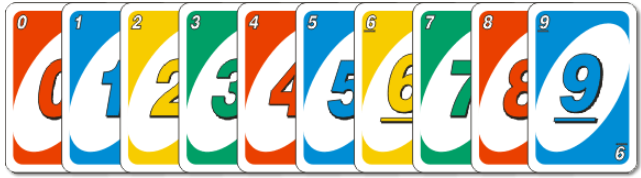
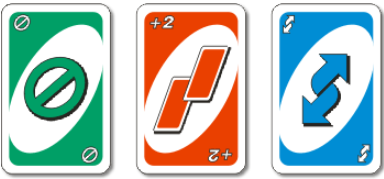
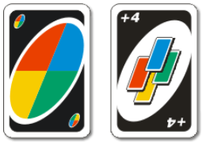

# Лабораторная работа №1: Разработка игрового ИИ для  игры UNO

Разработка и реализация алгоритма искусственного интеллекта для стратегической карточной игры UNO, обеспечивающего превосходство над базовыми реализациями ботов.

### Колода карт

Общий размер колоды: 108 карт
####  Числовые карты

- **Диапазон значений:** 0-9
- **Стоимость:** соответствует номиналу (0-9 очков)
- **Распределение:** 
  - Все цифры (кроме 0) представлены в двойном экземпляре для каждого из 4 цветов.
  - Карта "0" - одинарный экземпляр для каждого цвета.

#### Активные карты (цветные)

- **Типы:** "Пропуск хода", "Возьми две", "Смена направления"
- **Стоимость:** 20 очков каждая
- **Распределение:** по 2 экземпляра каждого типа для каждого из 4 цветов

#### Черные специальные карты

- **Типы:** "Заказ цвета", "Заказ цвета +4"
- **Стоимость:** 50 очков каждая
- **Распределение:** по 4 экземпляра каждого типа

### Инициализация игры

- **Начальная раздача:** 7 карт каждому игроку
- **Формирование колод:**
  - *Прикуп:* оставшиеся карты рубашкой вверх
  - *Сброс:* верхняя карта из прикупа переворачивается и становится стартовой

# Базовое задание

Разработать алгоритм искусственного интеллекта для карточной игры UNO, демонстрирующий статистически значимое превосходство над эталонными реализациями ботов.

- **Целевой показатель**: не менее 70% побед в сериях из 1000+ раундов
- **Эталонные боты**: `RandomBot`, `WildFirst`, `WildLast`

### Процесс выполнения

1. **Форк репозитория** https://github.com/savaleriy/uno-engine-py

2. **Реализация алгоритма**
   - Создать класс бота в директории `uno/bots/`
   - Наследовать от базового класса `Player`
   - Реализовать стратегию принятия решений

3. **Верификация результатов**
   - Провести серию тестовых игр (более 1000 раундов)
   - Зафиксировать статистику побед против каждого эталонного бота
   - Обеспечить воспроизводимость результатов

4. **Оформление Merge Request**
   - Описание алгоритмической стратегии
   - Статистические доказательства эффективности

# ⭐️ Задание повышенной сложности № 1

Реализовать расширенные правила UNO с модификацией игрового движка.

- Модификация файла `uno/engine/engine.py`
- Реализация одного из расширенных режимов игры
- Обеспечение обратной совместимости
### Доступные режимы реализации

####  **Intervention UNO**

**Механика**: Возможность перехвата хода при наличии идентичной карты
- **Условия**: совпадение цвета и номинала
- **Ограничение**: не применяется к карте "+4" и в начале игры
- **Реализация**: обработка внеочередных ходов

Игрок может пойти вне очереди, если у него есть точно такая же карта, которая лежит верхней в колоде «Сброс». Точно такая же карта – это значит одновременное соблюдение двух условий: тот же цвет, та же цифра/та же картинка/чёрная карта «Закажи цвет». Далее ход продолжается в текущем направлении, начиная от игрока, перехватившего ход. Внимание! Эти условия не распространяются на карту «Закажи цвет и возьми четыре» – она выкладывается только в свой ход. Примечание. Перехват хода не работает в начале игры, когда на центр выложена первая карта колоды «Сброс». В начале игры право хода имеет только игрок после раздающего.
####  **Double Card UNO**  

**Механика**: Последовательный выклад двух идентичных карт
- **Условия**: наличие двух одинаковых карт
- **Ограничение**: поочередный выклад с возможностью вмешательства
- **Реализация**: расширение системы ходов

Выкладывание двух одинаковых карт. Если у игрока есть две одинаковые карты (см. выше два обязательных условия), игрок в свой ход может выложить первую из одинаковых карт и сразу же сам выполнить вмешательство точно такой же картой. То есть две одинаковые карты нельзя выкладывать сразу одним движением руки, только поочерёдно: одну карту, потом другую карту. Соответственно, у следующего игрока будет возможность положить карту в свой ход, не дав игроку выполнить «Вмешательство».

####  **Seven-Zero UNO**

**Механика**: Специальные эффекты для карт "7" и "0"
- **Карта "0"**: циклическая передача карт между игроками
- **Карта "7"**: принудительный обман картами с выбранным игроком
- **Реализация**: обработка специальных состояний

Те же правила, что и в обычной игре УНО, со следующими добавлениями: каждый раз, когда выпадает «ноль», все участники передают свои карты соседним игрокам по направлению игры. Каждый раз, когда выпадает «семь», игрок, который положил «семь», обменивается картами с одним из игроков по своему выбору.
#### **Accumulation UNO**

**Механика**: Накопительный эффект штрафных карт
- **Цепочки "+2"**: суммарный штраф = 2 × количество карт в цепочке
- **Цепочки "+4"**: суммарный штраф = 4 × количество карт в цепочке
- **Реализация**: отслеживание последовательностей штрафов

Те же правила, что и в обычной игре УНО, со следующими добавлениями: когда игрок кладёт карту «Возьми две», следующий игрок тоже может положить карту «Возьми две», и тогда третий по счёту игрок должен взять четыре карты. Те же правила применяются к картам «Закажи цвет и возьми четыре»: когда один игрок кладёт карту «Закажи цвет и возьми четыре», следующий игрок тоже может положить карту «Закажи цвет и возьми четыре», и тогда третий по счёту игрок должен взять восемь карт. Последний из игроков, который положил очередную карту «Закажи цвет и возьми четыре», заказывает цвет. Если игрок положил карту «Закажи цвет и возьми четыре» не по правилам и его «поймали», применяются обычные правила, но сумма штрафа возрастает в зависимости от числа использованных карт. Играющие могут класть карты «Возьми две» или «Закажи цвет и возьми четыре» до тех пор, пока они у них не закончатся. Например, если 4 игрока подряд положили карты «Возьми две», следующий игрок (у которого нет карты «Возьми две») должен взять восемь карт. Игрок может положить за один ход только одну карту «Возьми две» или «Закажи цвет и возьми четыре», даже если у него на руках несколько таких карт.

#### **Card Exchange UNO**

**Механика**: Принудительный обман картами
- **Активация**: карта "5"
- **Механика**: взаимный выбор карт для обмена
- **Реализация**: расширение системы взаимодействий

Игрок, положивший «пятёрку», может (по своему желанию) поменяться одной картой с любым игроком. Причём каждый из меняющихся выбирает, какую карту отдать.

#### **Lazy Scoring UNO**

**Механика**: Упрощенная система подсчета очков
- **Победитель**: первый сбросивший карты
- **Проигравший**: максимальное количество очков на руках
- **Реализация**: модификация системы подсчета

Победителя и проигравшего вычисляют при каждом туре игры. Победителем считается тот, кто первым скинул свои карты, и он начинает ход в следующем туре. Проигравшим считается тот, у кого на руках остались карты на максимальное количество очков, он сдаёт карты для следующего тура.

#### **Circular Color UNO**

**Механика**: Автоматическая смена цвета
- **Активация**: черные карты
- **Алгоритм**: следующий цвет в циклическом порядке
- **Реализация**: модификация системы заказа цвета

При выкладывании чёрных карт («Закажи цвет» и «Закажи цвет и возьми четыре») смена цвета происходит автоматически на тот цвет, который нарисован на этих картах следующим по кругу после текущего. Например, игра идёт по часовой стрелке, текущий цвет красный. После выкладывания чёрной карты текущим цветом становится синий. Или, например, игра идёт против часовой стрелке, текущий цвет жёлтый. После выкладывания чёрной карты текущим цветом становится зелёный.
#### **+10 UNO**

**Механика**: Расширенная система штрафов
- **Специальные карты**: "Возьми 10"
- **Каскадный эффект**: цепочки штрафных карт
- **Реализация**: добавление новых типов карт

Запасным картам-пустышкам (которых в колоде 4 штуки) можно присвоить значение «Возьми 10 карт», соответственно, следующий игрок должен взять 10 карт. Подстава в этом случае в том, что человек берет 10 карт, а в них с высокой долей вероятности оказывается «+2», «+4» или такая же «+10». Этот человек заставляет уже другого взять много карт, и так по кругу. 
#### **Reverse UNO**

**Механика**: Отражение действий карт
- **Карта "Наоборот"**: реверс эффектов активных карт
- **Применение**: к "+2", "+4", другим активным картам
- **Реализация**: система отражения игровых эффектов

Карта «Наоборот» нужного цвета возвращает обратно действие активных карт и даже чёрной карты «Закажи цвет и возьми четыре»! Например, игрок 1 положил карту «Возьми две», игрок 2 картой «Наоборот» возвращает действие карты «Возьми две» на 1 игрока, и уже тот должен взять 2 карты (или «спастись» каким-нибудь способом).

#### **Last Man Standing UNO**

**Механика**: Продолжение игры после первого победителя
- **Критерий**: определение абсолютного проигравшего
- **Тактика**: комбинационные атаки в 2-х игроков
- **Реализация**: модификация условий завершения игры

После того как 1 игрок скинет все карты, игра не заканчивается, а продолжается до последнего игрока. Соответственно, выигрывает 1-й игрок, а проигрывает последний игрок. И когда в конце игры остаются два игрока, можно применять красивые комбинации (например, при помощи карт «Пропусти ход», «Возьми две» ходить дважды, трижды, ...).

#### **7 Rounds UNO**

**Механика**: Прогрессивная сложность
- **Этапы**: 7 -> 6 -> 5 -> ... -> 1 карта
- **Рестарт**: с уменьшающимся количеством карт
- **Реализация**: управление жизненным циклом игры

После того как какой-нибудь игрок избавился от своих первоначальных 7 карт, игра приостанавливается, он берёт в руку из колоды 6 новых карт и продолжает игру. В следующий раз, когда у него закончатся карты, он набирает в руку 5 карт... И так до тех пор, пока он не возьмёт всего одну карту и не избавится от нее.

# ⭐️ Задание повышенной сложности № 2

Ваш бот должен выиграть в турнире между ботами других участников!