# Вспомнить все

1. Что такое **Алгоритм**?
2. Что такое **Рекурсия**?
3. Что такое **Массивы**?  
4. Что такое **Связанные списки**?  
5. Что такое **Стек**?  
6. Что такое **Очередь**?  
7. Что такое **Граф**?
8. Что такое **Дерево**?  
9. Что такое **Бинарные деревья**?  
10. Что такое **Хеш-таблица**?  
11. Что такое **Хеш-функция**?  
12. Что такое **Коллизия**?
13. Что такое **Сортировка выбором**?  
14. Что такое **Быстрая сортировка**?
15. Что такое **О большое** ?
16. Что такое **Принцип "Разделяй и властвуй"**?  
17. Что такое **Динамическое программирование** ?  
18. Что такое **Жадный алгоритм** ?  
19. Что такое **Эвристический алгоритм** ?  
20. Что такое **Принцип "Ветвей и границ"** ?
21. Что такое **Алгоритм поиска в ширину (BFS)** ?  
22. Что такое **Алгоритм поиска в глубину (DFS)** ?

---

**Алгоритм:** это набор инструкций для выполнения некоторой задачи. В принципе любой фрагмент программного кода можно назвать алгоритмом. Например, **алгоритм Евклида** для нахождения наибольшего общего делителя (НОД) двух чисел — это четкий набор инструкций, который всегда приводит к правильному результату.

**Рекурсия:** это вызов функцией самой себя. Когда вы пишете рекурсивную функцию, в ней необходимо указать, в какой момент следует прервать рекурсию. Вот почему каждая рекурсивная функция состоит из двух частей: базового случая и рекурсивного случая. В рекурсивном случае функция вызывает сама себя. В базовом случае функция себя не вызывает, чтобы предотвратить зацикливание. Например **Вычисление факториала**. `n! = n * (n-1)!`, где базовый случай — `0! = 1`

**Массивы:** это структура данных, состоящая из фиксированного количества элементов одного типа, расположенных в непрерывной области памяти. Каждый элемент массива имеет уникальный индекс, который позволяет быстро получать доступ к элементам по их позиции.  Каждый элемент доступен за O(1) по его **индексу** (адресу).
**Пример:** Хранение пикселей изображения. Чтобы получить цвет пикселя в координатах (x, y), вы вычисляете его позицию в массиве: `index = y * width + x`.

**Связанные списки:** это структура данных, состоящая из узлов, где каждый узел содержит данные и ссылку (или указатель) на следующий узел в последовательности. В отличие от массивов, связанные списки не требуют непрерывного выделения памяти и могут динамически изменять свой размер.

**Стек:** вы не можете обращаться к произвольным элементам стека. Вместо этого поддерживаются всего две операции: добавить в стек и извлечение из стека. Стек принадлежит к числу структур данных LIFO: Last In, First Out («последним пришел, первым вышел»). Когда вы вызываете функцию из другой функции, вызывающая функция приостанавливается в частично завершенном состоянии. Все значения переменных этой функции остаются в памяти. **Пример:** Стэк вызовов функций в программе. Когда функция A вызывает функцию B, A помещается в стек. B выполняется, а когда завершается, из стека извлекается A для продолжения работы.

**Очередь:** Очередь относится к категории структур данных FIFO: First In, First Out («первым вошел, первым вышел»). Вы не можете обращаться к произвольным элементам очереди. Вместо этого поддерживаются всего две операции: постановка в очередь и извлечение из очереди. **Пример:** Очередь печати. Задачи на печать поступают в конец очереди и обрабатываются в порядке их поступления.

**Граф:** Графы моделируют набор связей и состоят из узлов и ребер. Это математическая структура, представляющая собой множество вершин (узлов) и ребер (связей) между ними. `G = (V, E)`, где V — вершины, E — ребра. **Пример:** Модель социальной сети, где пользователи — вершины, а дружба — ребра.

**Дерево:** это разновидность графа. Как и графы, деревья состоят из узлов и ребер. У узлов могут быть дочерние узлы, а у дочерних узлов может быть родительский узел. В дереве узлы имеют по крайней мере одного родителя. Существует только один узел без родителя — это корневой узел. Узлы, не имеющие дочерних узлов, называются листовыми узлами (листьями). Так как дерево является разновидностью графа, к нему можно применить алгоритм, работающий с графом. Это связный **граф** без циклов. Имеет корневой узел и иерархическую структуру. **Пример:** Файловая система. Корень — это диск `C:\`, папки — внутренние узлы, файлы — листья.

**Бинарные деревья:** Бинарное дерево представляет собой особую разновидность дерева, узлы которого могут иметь не более двух дочерних узлов (отсюда и название). Дочерние узлы традиционно называются левым и правым узлами. Важно то, что ни у одного узла не может быть больше двух дочерних узлов. Иногда встречаются термины «левое поддерево» и «правое поддерево». Это дерево, у каждого узла которого не более двух потомков: **левый** и **правый**. **Пример:** **Бинарное дерево поиска (BST)**, где для любого узла все значения в левом поддереве меньше, а в правом — больше, что позволяет выполнять поиск за O(log n) в среднем.

**Сортировка выбором**: Самый простой тип сортировки который исполняется за время `O(n*n)` или `O(n^2)`. Фактическая скорость выполнения данного алгоритма быстрее почти в 2 раза чем O(n^2) а именно `O((n(n+1))\2)`. Сам алгоритм прост. Последовательно проверяется каждый элемент массива и сравнивается со всеми остальными. Самый маленький элемент копируется в новый массив. Таким образом формируется новый массив из отсортированных значений по возрастанию из старого массива. Алгоритм, который на каждом шаге находит **минимальный элемент** в неотсортированной части массива и меняет его местами с первым элементом этой части.

- **Пример:** Отсортировать массив `[5, 2, 4, 1]`. Находим мин. 1, меняем с 5 → `[1, 2, 4, 5]`. В неотсортированной `[2,4,5]` мин. 2, меняем с самим собой → `[1,2,4,5]` и т.д.

**Быстрая сортировка**: Она работает намного быстрее сортировки выбором и часто применяется в реальных программах. Быстрая сортировка также основана на стратегии «разделяй и властвуй». Алгоритм быстрой сортировки работает так: сначала в массиве выбирается элемент, который называется опорным. Далее мы проверяем все элементы списка и разделяем их на два массива. В массив слева помещаются элементы меньше опорного, а в массив справа те что больше. Время выполнения алгоритма в лучшем случае `O(n * log n)` а в худшем `O(n*n)` или `O(n^2)`.  Алгоритм, основанный на стратегии **«Разделяй и властвуй»**. Он выбирает **опорный элемент** и перераспределяет другие элементы так, чтобы меньшие оказались слева, а большие — справа от него, затем рекурсивно применяется к подмассивам.

- **Пример:** Отсортировать `[3, 6, 8, 1, 2]`. Опорный — 3. После разделения: `[1, 2] 3 [6, 8]`. Рекурсивно сортируем `[1,2]` и `[6,8]`.

**Хеш-функция:** представляет собой функцию, которая получает строку и возвращает число. В научной терминологии говорят, что хеш-функция «отображает строки на числа». Проще говоря хеш-функция связывает строки с числами. Это детерминированная функция, которая преобразует входные данные произвольной длины (ключ) в выходные данные фиксированной длины (хеш-код, индекс). **Пример:** `hash(key) = key % table_size`. Для ключа 15 и размера таблицы 10, индекс будет равен 5.

**Хеш-таблица:** Сами по себе таблиц и реализованы на основе массива, таким образом доступ к определенному элементу таблиц и осуществляется, как и в массиве со скоростью O(1). При помощи хеш-функции текстовая строка приравнивается в рамках таблиц и с определенным индексом массива и через это строковое представление мгновенно получает доступ к значению. Они также известны под другими названиями: «ассоциативные массивы», «словари», «отображения», «хеш-карты» или просто «хеши». В Python это словарь. Это структура данных, реализующая интерфейс ассоциативного массива (ключ -> значение). Она использует **хеш-функцию** для преобразования ключа в индекс массива (адрес), где хранится значение. **Пример:** Хранение пар «логин-пароль». Хеш-функция от логина вычисляет ячейку, где лежит его пароль.

**Коллизия:** ситуация, когда два или более элемента данных (например, хеш-значения) совпадают, что может привести к ошибкам или неэффективности в обработке информации.  Если несколько ключей отображаются на один элемент, в этом элементе создается связанный список.  Это ситуация, когда две разные хеш-функции возвращают один и тот же **хеш-код** (индекс) для разных ключей. **Пример:** Для функции `hash(key) = key % 10` ключи 15 и 25 дают одинаковый индекс 5. Решается методами цепочек (создание списка в ячейке) или открытой адресации (поиск следующей свободной ячейки).

 **О-большое (Big O):** Это математическая нотация для описания **верхней асимптотической границы** роста времени выполнения или потребления памяти алгоритма в зависимости от объема входных данных (n). **Пример:** Алгоритм с O(n^2) будет работать существенно медленнее при больших n, чем алгоритм с O(n log n). Линейный поиск — O(n), бинарный — O(log n).

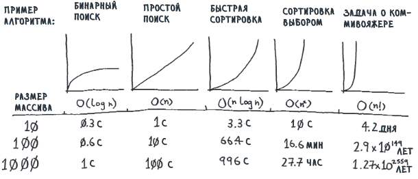


 **Принцип "Разделяй и властвуй":** Парадигма, в которой задача разбивается на более мелкие подзадачи того же типа, которые решаются рекурсивно, после чего решения подзадач **комбинируются** для получения итогового ответа. **Пример:** **Сортировка слиянием**. Массив делится пополам, каждую половину сортируем рекурсивно, затем два отсортированных подмассива сливаются в один.


**Динамическое программирование:** Метод решения сложных задач путем их разбиения на более простые **перекрывающиеся подзадачи**. Решения подзадач сохраняются в таблице (мемоизация), чтобы не вычислять их повторно. **Пример:** Вычисление чисел Фибоначчи. Вместо `F(n) = F(n-1) + F(n-2)` с экспоненциальным временем, мы сохраняем вычисленные значения в массиве и используем их для расчета следующих.

**Жадный алгоритм:** Алгоритм, который на каждом шаге делает **локально оптимальный выбор** в надежде, что итоговое решение будет глобально оптимальным. **Пример:** **Задача о рюкзаке** (непрерывная версия). Мы берем предметы в порядке убывания их стоимости на единицу веса, пока рюкзак не заполнится.

**Эвристический алгоритм:** Алгоритм, который жертвует **гарантией нахождения оптимального решения** ради значительного сокращения времени работы. Он дает «достаточно хорошее» решение. **Пример:** **Муравьиный алгоритм** для задачи коммивояжера. Муравьи оставляют феромоны на коротких путях, что в итоге приводит к нахождению близкого к оптимальному маршрута

**"Ветвей и границ":** Алгоритмическая парадигма для решения задач оптимизации, которая исследует пространство решений в виде дерева. Неперспективные подмножества решений **«отсекаются»** на основе оценки их границы (лучшего возможного результата в этой ветви). **Пример:** В задаче коммивояжера, если текущий частичный маршрут уже длиннее найденного полного маршрута, мы прекращаем его исследование.

**Алгоритм поиска в ширину (BFS):** Алгоритм обхода графа, который посещает все вершины на **расстоянии k** от начальной, прежде чем перейти к вершинам на расстоянии k+1. Использует **очередь**. Находит **кратчайшие пути** в невзвешенном графе.
**Пример:** Поиск кратчайшего пути между двумя страницами в Википедии по внутренним ссылкам.

**Что такое Алгоритм поиска в глубину (DFS):** Алгоритм обхода графа, который идет «вглубь», насколько это возможно, по одному пути, прежде чем вернуться и исследовать альтернативные пути. Использует **стек** (часто через рекурсию). **Пример:** Проверка связности графа, топологическая сортировка, поиск цикла.


# Алгоритм Хаффмана или Алгоритм сжатия

[Алгоритм Хаффмана](https://compression.ru/download/articles/huff/huffman_1952_minimum-redundancy-codes.pdf) — это жадный алгоритм оптимального префиксного кодирования алфавита с минимальной избыточностью. Он был разработан в 1952 году аспирантом Массачусетского технологического института Дэвидом Хаффманом при написании курсовой работы. В настоящее время алгоритм используется во многих программах сжатия данных.

В отличие от алгоритма Шеннона-Фано, алгоритм Хаффмана остаётся оптимальным для вторичных алфавитов $m_2$ с более чем двумя символами.

Метод кодирования состоит из двух основных этапов:

- Построение оптимального кодового дерева
- Построение отображения "код-символ" на основе построенного дерева

Код Хаффмана — отличный пример использования бинарных деревьев. Он также лежит в основе алгоритмов сжатия текста.

## Принцип работы сжатия

Чтобы понять, как работает сжатие, рассмотрим пример. Представим файл, содержащий всего одно слово: "tilt". Сколько места он занимает? Сохраните слово в файле с именем test.txt, а затем воспользуйтесь командой stat в Unix:

```bash
$ cat test.txt
tilt
$ stat -f%z test.txt
4
```

Файл занимает 4 байта: по 1 байту на символ. Если предположить, что используется кодировка ISO-8859-1, каждая буква занимает ровно 1 байт. Например, букве "a" в ISO-8859-1 соответствует код 97, который в двоичной системе записывается как 01100001 — итого 8 бит.

**Битом** называется двоичная цифра с возможными значениями 0 или 1. 8 бит образуют 1 байт. Коды ISO-8859-1 содержатся в интервале от 00000000 (нуль-символ) до 11111111 (латинская буква "y" с диерезисом). Всего существует 256 возможных 8-битных комбинаций из 0 и 1, поэтому кодировка ISO-8859-1 способна представить до 256 символов.

Существует много способов кодирования символов. Все началось с кодировки ASCII, созданной в 1960-х годах. ASCII является 7-битной кодировкой, но в ней отсутствуют многие символы, включая символы с диакритическими знаками и обозначения валют.

Затем была создана кодировка ISO-8859-1 — 8-битная кодировка, поддерживающая 256 символов. Однако этого оказалось недостаточно, и многие страны стали создавать собственные кодировки.

Стандартом кодирования символов, поддерживающим символы всех языков, стал Юникод. Юникод версии 15 включает 149 186 символов. Самой популярной кодировкой, соответствующей этому стандарту, является UTF-8 — кодировка с переменной длиной символов (от 1 до 4 байт).

Для слова **tilt** не нужны все 256 возможных символов — достаточно трех. Таким образом, для представления буквы не требуется 8 бит, можно обойтись двумя. Можно определить собственную 2-битную кодировку для этих трех букв:


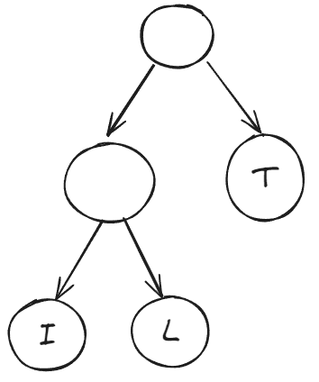


```
t = 00
i = 01
l = 10
```

В такой кодировке слово **tilt** записывается как: 00 01 10 00.

Именно так работает алгоритм Хаффмана: он находит повторяющиеся символы и использует для их представления менее 8 бит, что приводит к сжатию данных.

Идея алгоритма состоит в следующем: зная вероятности появления символов в сообщении, можно построить коды переменной длины. Символам с большей вероятностью ставятся в соответствие более короткие коды. Коды Хаффмана обладают свойством префиксности (ни одно кодовое слово не является префиксом другого), что позволяет однозначно их декодировать.

Классический алгоритм Хаффмана получает на вход таблицу частотностей символов в сообщении и строит дерево кодирования (H-дерево):

1. Символы входного алфавита образуют список свободных узлов
2. Выбираются два свободных узла дерева с наименьшими весами
3. Создается их родитель с весом, равным их суммарному весу
4. Родитель добавляется в список свободных узлов, а два его потомка удаляются из этого списка
5. Одной дуге, выходящей из родителя, ставится в соответствие бит 1, другой — бит 0
6. Шаги 2-5 повторяются, пока в списке свободных узлов не останется только один узел (корень дерева)


Декодирование происходит следующим образом:

1. Для восстановления содержимого сжатого сообщения декодер должен знать таблицу частотностей
2. Необходимость наличия полной частотной статистики требует двух проходов по сообщению
3. Избыточность кодирования обращается в ноль только когда вероятности символов являются обратными степенями числа 2
4. Для источника с энтропией, не превышающей 1, непосредственное применение кода Хаффмана бессмысленно


По дереву можно определить код каждой буквы. Начиная с корневого узла, находится путь вниз до нужной буквы. При выборе левой ветви к коду добавляется 0, правой 1.

В кодировке Хаффмана коды не обязательно имеют одинаковую длину. Буквы, встречающиеся чаще, имеют более короткие коды.

Коды Хаффмана обладают важными свойствами:
- Отсутствие наложения кодов (благодаря помещению символов только в листовые узлы)
- Отсутствие циклов в дереве
- Использование бинарного дерева (каждый узел имеет не более двух потомков)

Эти свойства гарантируют однозначность декодирования и эффективность алгоритма сжатия.

# Сбалансированные деревья 

## Балансировка

Помните бинарный поиск? С его помощью можно найти информацию намного быстрее, чем простым поиском — со сложностью O(log n) вместо O(n). Впрочем, есть одна проблема: вставка. Конечно, поиск занимает время O(log n), но массив должен быть отсортирован. Если требуется вставить новое число в отсортированный массив, это займет время O(n). Проблема в том, чтобы найти место для нового значения. Придется передвинуть несколько элементов, чтобы освободить для него место.

Вот если бы вставку можно было выполнять как в связанном списке, где достаточно поменять пару указателей... Но поиск в связанных списках выполняется за линейное время. Как использовать лучшие стороны обоих решений?

## Деревья повышают скорость вставки

Итак, по сути, нам нужны скорость поиска в отсортированном массиве и более быстрая вставка. Как известно, вставка выполняется быстрее в связанных списках. А значит, нам понадобится структура данных, объединяющая эти идеи.

```
Поиск: Отсортированный массив -> Быстрее
Вставка: Связанный список -> Быстрее
```

И такая структура существует — это **дерево**! Деревья бывают десятков разных видов, поэтому я специально отмечаю, что нам нужно сбалансированное бинарное дерево поиска (BST).

BST — это разновидность бинарного дерева. Пример BST:

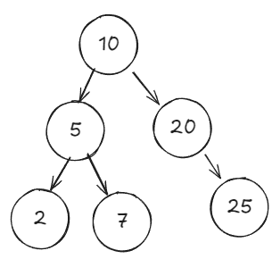

Как и в бинарном дереве, каждый узел имеет до двух дочерних узлов: левый и правый. Но у этого дерева есть одно свойство, относящее его к BST: значение левого дочернего узла всегда меньше, чем значение узла, а значение правого дочернего узла всегда больше. Таким образом, для узла 10 левый дочерний узел имеет меньшее значение (5), а правый дочерний узел — большее значение (20).

Более того, все числа в поддереве левого дочернего узла меньше самого узла!

```
ЭТИ значения меньше ЭТого → левое поддерево
ЭТИ значения больше ЭТого → правое поддерево
```

Это особое свойство означает, что поиск будет выполняться очень быстро.

Давайте посмотрим, содержится ли число 7 в этом дереве. Начнем с корневого узла.

Число 7 меньше 10, поэтому проверяется левое поддерево. Вспомните: все узлы с меньшими значениями находятся в левом поддереве, а все узлы с большими значениями — в правом. Следовательно, мы сразу понимаем, что проверять узлы справа не нужно, потому что 7 там не будет. Опускаясь по левому поддереву от 10, мы переходим к узлу 5.

Число 7 больше 5, поэтому на этот раз идем направо.

Нашли! Теперь поищем другое число — 8. Поиск проходит точно по такому же пути.

Только на этот раз его там нет! Если бы искомый узел присутствовал в дереве, он находился бы в месте, обозначенном пунктиром. Собственно, все наши рассуждения о деревьях обусловлены одной необходимостью: знать, работают ли они быстрее массивов и связанных списков. Итак, рассмотрим производительность деревьев, но для этого необходимо учитывать их высоту.

## Короткие деревья работают быстрее

Рассмотрим два дерева. Оба дерева состоят из 7 узлов, но сильно различаются по производительности.

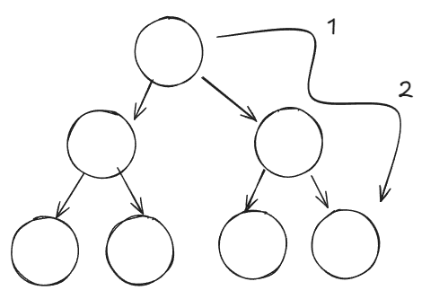

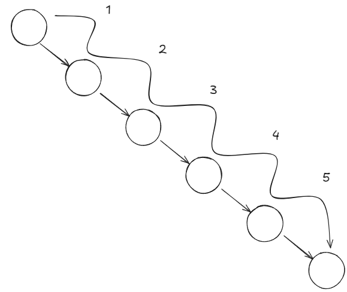

Высота дерева для лучшего случая равна 2. Это означает, что к любому узлу можно перейти от корневого узла максимум за 2 шага. Высота дерева для худшего случая равна 6. Это означает, что к любому узлу можно перейти от корневого узла максимум за 6 шагов. Сравним эти показатели с производительностью бинарного поиска в сравнении с простым поиском. На всякий случай напомним производительность бинарного и простого поиска:

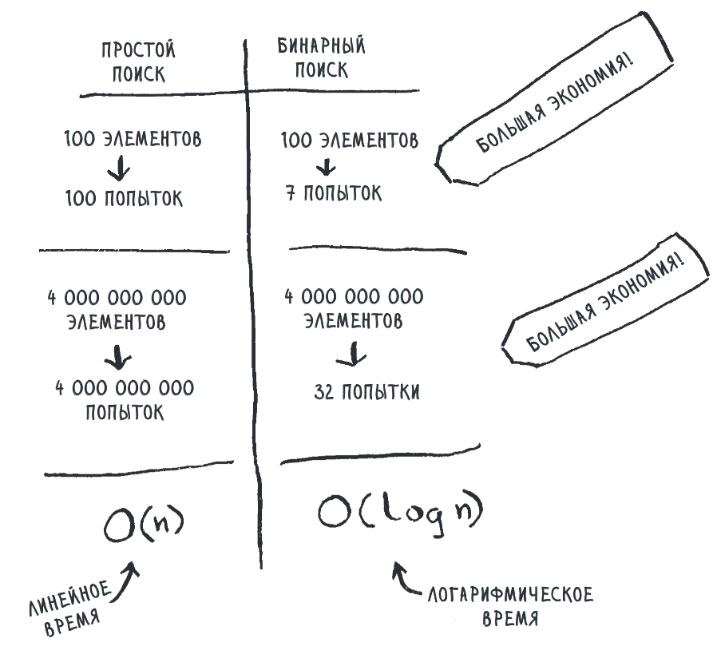

Помните игру с отгадыванием чисел? Чтобы угадать число из набора 100 чисел, бинарный поиск потребует 7 попыток, а простой — 100. Нечто похожее происходит и с деревьями.

Дерево для худшего случая выше, и у него хуже производительность. В нем все узлы выстроены в одну линию. Дерево имеет высоту O(n), так что поиск будет выполняться за время O(n). Это можно представить так: дерево в действительности напоминает связанный список, так как один узел содержит ссылку на другой и т. д. А поиск по связанному списку выполняется за время O(n).

Дерево для лучшего случая имеет высоту O(log n), а поиск по нему займет время O(log n).

Таким образом, ситуация очень похожа на сравнение бинарного поиска с простым! Если можно обеспечить высоту дерева в O(log n), то поиск по дереву будет выполняться за время O(log n) — именно то, что требовалось.

```
Поиск: Отсортированный массив → Быстрее
Вставка: Связанный список → Быстрее
```

Но как добиться, чтобы высота составляла O(log n)? В следующем примере мы построим дерево, которое оказывается деревом для худшего случая (а этого нам желательно избежать). Начнем с одного узла, затем добавим другой.

Получается дерево для худшего случая — его высота равна O(n)! Короткие деревья работают быстрее. Кратчайшее время для BST может составлять O(log n). Чтобы укоротить BST, необходимо сбалансировать его. Рассмотрим сбалансированное дерево BST.


АВЛ-деревья: разновидностьсбалансированных деревьевАВЛ1-деревья составляют разновидность самобалансируемых BST. Этоозначает, что АВЛ-деревья сохраняют высоту O(log n). Каждый раз, ко-гда дерево разбалансируется, то есть его высота становится отличнойот O(log n), оно корректирует себя. В последнем примере дерево можетперебалансироваться и принять следующий вид:

# АВЛ-деревья: разновидность сбалансированных деревьев

АВЛ-деревья (аббревиатура АВЛ образована от фамилий ученых, придумавших эту структуру: Адельсон-Вельский и Ландис) составляют разновидность самобалансируемых BST. Это означает, что АВЛ-деревья сохраняют высоту O(log n). Каждый раз, когда дерево разбалансируется, то есть его высота становится отличной от O(log n), оно корректирует себя. В последнем примере дерево может перебалансироваться и принять следующий вид:

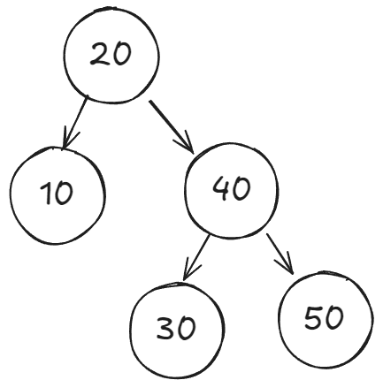

АВЛ-дерево обеспечивает нужную высоту O(log n), которая достигается самобалансировкой и поворотами.

## Повороты

Представьте, что имеется дерево с тремя узлами. Любой из них может быть корневым:

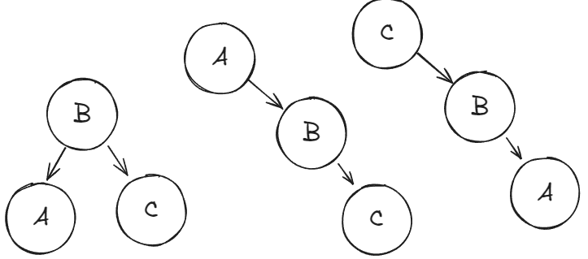

В результате поворота набор узлов смещается, образуя новую конфигурацию. Рассмотрим поворот в замедлении:

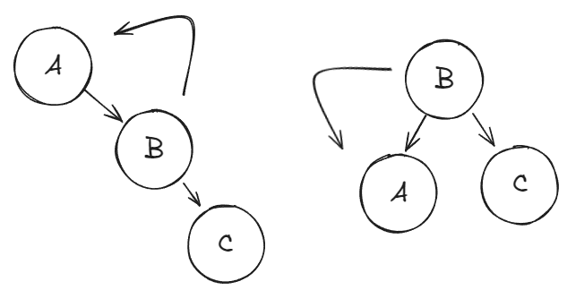

Мы выполняем поворот влево, начиная с несбалансированного дерева с корневым узлом A и заканчивая сбалансированным деревом с корневым узлом B.

Повороты — популярный метод балансировки деревьев. Снова начнем с одного узла. Пока все нормально. Высоты дочерних узлов не одинаковы; разность между ними не превышает 1. Однако разность 1 приемлема для АВЛ-деревьев.

Теперь добавим еще один узел.

Стоп! Дерево разбалансировалось. Пришло время поворотов!

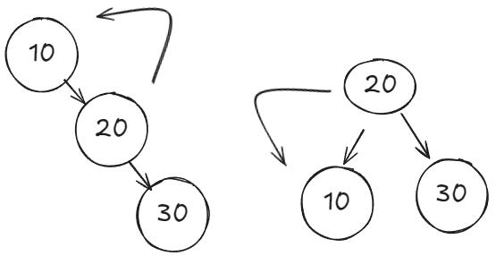

Мы выполнили поворот влево, теперь дерево снова сбалансировано.

Добавим еще один узел. И еще один. Снова нужен поворот!

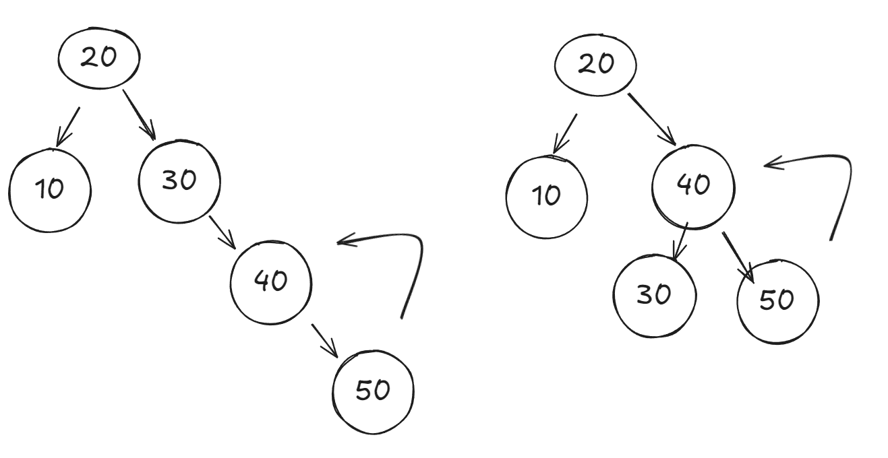

После поворота АВЛ-деревья сами перебалансируются. Напомним, что в последнем примере вместо узла 20 поворачивался узел 30. Следующий пример объясняет почему.

## Как АВЛ-дерево узнает, что требуется поворот?

Мы видим, что дерево не сбалансировано — одна сторона длиннее другой. Но как дерево узнает об этом?

Чтобы дерево знало, когда требуется самобалансировка, оно должно хранить дополнительную информацию. В каждом узле хранится один или два вида информации: значение высоты или значение, которое иногда называют коэффициентом балансировки. Этот коэффициент должен быть равен –1, 0 или 1.

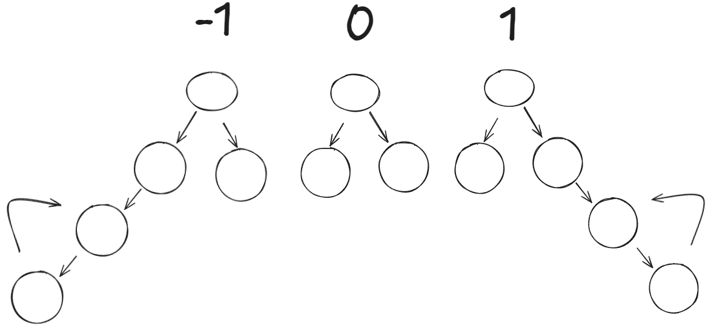

На рисунке приведены коэффициенты балансировки только для корневых узлов, но вам может понадобиться хранить коэффициент балансировки для каждого узла (пример такого рода будет приведен ниже).

Коэффициент балансировки сообщает, какой дочерний узел выше и насколько. По коэффициенту балансировки дерево может определить, когда следует проводить перебалансировку. Значение 0 означает, что дерево сбалансировано. Со значениями –1 или 1 тоже все нормально, потому что, напомним, АВЛ-деревья не обязаны быть идеально сбалансированы: разность 1 допустима.

Но если коэффициент балансировки падает ниже –1 или поднимается выше 1, дерево нуждается в перебалансировке. Ниже изображены два дерева, нуждающихся в перебалансировке.

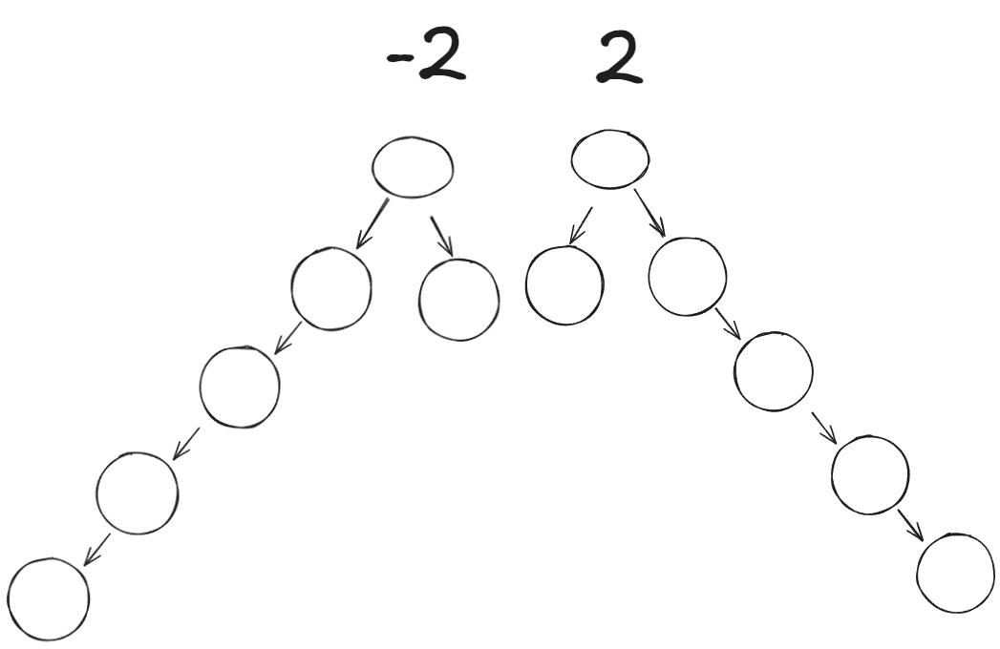

Как я уже говорил, в каждом узле должна храниться либо высота, либо коэффициент балансировки. В моем примере будет храниться и то и другое, чтобы вы видели, как они изменяются. Но если вам известны высоты каждого поддерева, вы легко вычислите коэффициент балансировки.

Рассмотрим пример. Представьте следующее дерево:

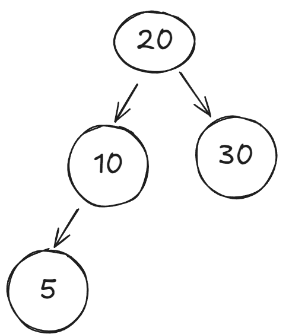

В него добавляется узел. Для начала запишем высоту и коэффициент балансировки для каждого узла. На этой схеме H — высота, а BF — коэффициент балансировки.

Еще раз: я храню оба значения, чтобы показать, как они изменяются, но на самом деле достаточно хранить только одно. Убедитесь, что эти числа вам понятны. Заметим, что у всех корневых узлов коэффициент балансировки равен 0: у них нет дочерних узлов, поэтому и поддерживать баланс не нужно.

Добавим в дерево новый узел.

После того как узел будет добавлен, необходимо задать для него высоту и коэффициент балансировки. Затем следует подняться вверх по дереву, обновляя высоты и коэффициенты балансировки для всех его предков.

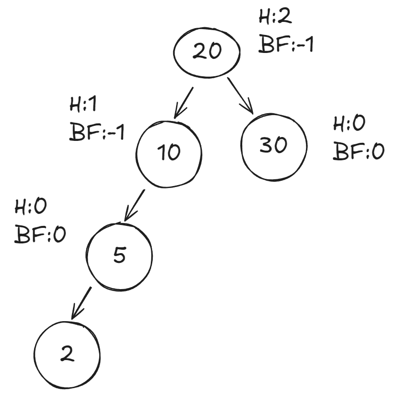

Ага! Мы только что присвоили коэффициент балансировки –2, а это значит, что пришло время поворота! Далее мы вернемся к примеру и разберем его до конца, но главный вывод таков: после вставки вы обновляете коэффициенты балансировки для предков этого узла. АВЛ-дерево проверяет коэффициент балансировки, чтобы узнать, когда выполнять перебалансировку.

В завершение повернем узел 10.

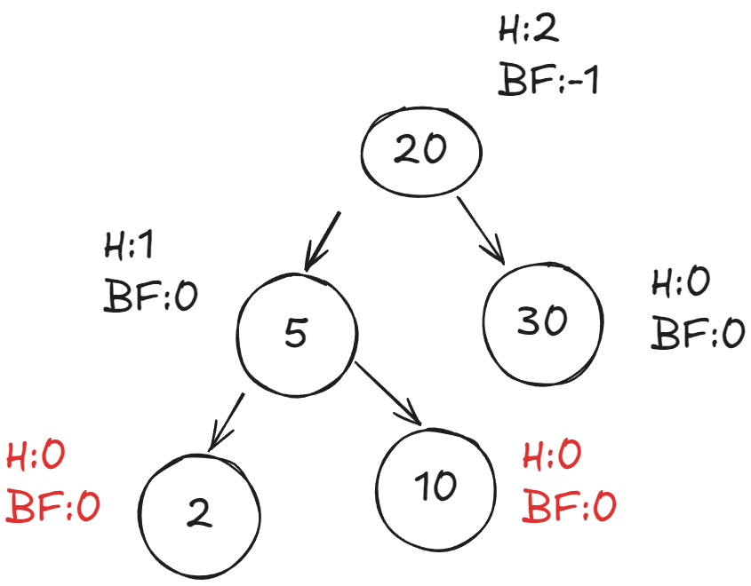

Теперь поддерево сбалансировано. Продолжим движение вверх по дереву.

Ничего обновлять не нужно. На самом деле двигаться вверх по дереву необязательно, потому что АВЛ-деревья требуют не более одной перебалансировки.

АВЛ-деревья хороши, если требуется сбалансированное дерево BST. Вспомним главное, что мы узнали:

- Бинарные деревья — это одна из разновидностей деревьев.
- В бинарных деревьях каждый узел имеет не более двух дочерних узлов.
- BST — это разновидность бинарного дерева, в которой все значения в левом поддереве меньше значения узла, а все значения в правом поддереве больше значения узла.
- BST может дать превосходную производительность, если получится обеспечить их высоту равной O(log n).
- АВЛ-деревья являются деревьями BST; это гарантирует, что их высота будет равна O(log n).
- АВЛ-деревья балансируют себя с помощью поворотов.

Впрочем, это еще не все. Мы рассмотрели один сценарий поворотов, но существуют и другие. Мы не будем останавливаться на них подробно, так как вам вряд ли придется реализовывать АВЛ-дерево самостоятельно.

Теперь вы знаете, что АВЛ-деревья обеспечивают производительность поиска O(log n). А что же вставка? Вставка сводится к поиску места для вставки узла и добавления указателя, как в связанном списке. Например, если вы захотели вставить 8 в это дерево, необходимо определить, где добавить указатель.

Таким образом, вставки тоже выполняются за время O(log n).

Мы искали структуру данных, обеспечивающую как быстрый поиск, так и быструю вставку. И такая волшебная структура данных есть: это сбалансированное дерево BST!

# Косые деревья

АВЛ-деревья — хорошие базовые сбалансированные деревья BST, обеспечивающие время O(log n) для некоторых операций.

Косые деревья (или Splay-деревья) представляют другой подход к сбалансированным деревьям BST. Их самое замечательное свойство в том, что если вы недавно искали какой-то элемент, то следующий его поиск будет быстрее. Это свойство интуитивно воспринимается положительно. Например, представьте, что вы работаете с программой, которая получает почтовый индекс и ищет по нему город.

Взаимодействие можно представить следующим образом:


Выглядит немного глупо. Программа только что проводила поиск этого индекса; почему бы ей не запомнить результат? На самом деле все должно быть так:


Косые деревья позволяют это сделать. Когда вы ищете узел в косом дереве, он становится новым корнем, так что при повторном поиске он будет найден сразу же. В общем случае узлы, которые вы недавно искали, группируются в начале и находятся быстрее. С другой стороны, дерево заведомо не будет сбалансировано, а значит, некоторые операции поиска будут занимать время, большее O(log n), и даже достигать линейного времени! Кроме того, при выполнении поиска вам, возможно, придется повернуть узел до корневой позиции, если он еще некорневой, а это тоже требует времени.

Но нас устраивает, что дерево не будет сбалансировано постоянно. Главное, что при проведении n операций поиска общее время O(n log n) гарантировано — то есть O(log n) на один поиск. Таким образом, хотя один поиск может занять время, превышающее O(log n), в среднем все операции поиска сходятся ко времени O(log n), а наша цель как раз и есть ускорение поиска.

# B-деревья

B-деревья представляют собой обобщенную форму бинарных деревьев. Они часто используются для построения баз данных. Ниже представлен пример B-дерева:

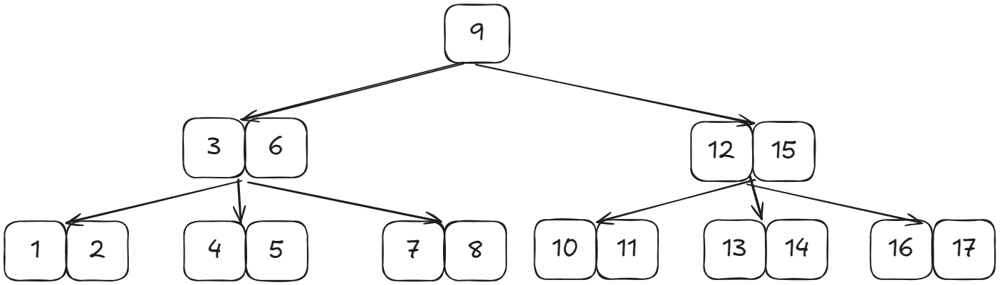

Выглядит необычно, правда? Можно заметить, что некоторые узлы имеют более двух дочерних узлов.

В отличие от бинарных деревьев, в B-деревьях узлы могут иметь много дочерних узлов.

Вероятно, вы уже заметили, что, в отличие от предыдущих деревьев, в B-дереве многие узлы имеют два ключа.

Итак, узлы в B-деревьях не только могут иметь более двух дочерних узлов — они также могут иметь несколько ключей! Именно поэтому я сказал, что B-деревья — это обобщенная форма BST.

## Какие преимущества есть у B-деревьев?

Для B-деревьев существует оптимизация, интересная тем, что применяется на физическом уровне. При поиске по дереву получение данных требует перемещения механических компонентов оборудования (например, читающей головки на HDD). Время получения данных называется временем поиска. Оно может быть важным фактором, определяющим, насколько быстро или медленно работает алгоритм.

Ситуацию можно сравнить с посещением магазина. Вы можете покупать продукты по одному. Представьте, что вы решаете купить молоко. Вернувшись домой, вы понимаете, что было бы неплохо купить хлеба, и возвращаетесь в магазин. По возвращении вы видите, что у вас закончился кофе, и снова идете в магазин... Как же это неэффективно! Намного лучше зайти в магазин один раз и купить все необходимое, находясь в нем. В этом примере время похода и возвращения в магазин представляет собой время поиска.

Фундаментальная концепция B-деревьев заключается в том, что после выполнения поиска можно прочитать дополнительные данные в память. Другими словами, находясь в магазине, вы можете купить все необходимое, вместо того чтобы возвращаться в него снова и снова.

В B-деревьях используются большие узлы; каждый узел может иметь больше ключей и дочерних узлов, чем бинарное дерево. Таким образом, чтение каждого узла занимает больше времени. С другой стороны, поиск ускоряется, потому что за один раз читается больший объем данных. Именно это обстоятельство обеспечивает высокую скорость работы B-деревьев.

Структура B-деревьев популярна в реализациях баз данных. И это не удивительно, так как в базах данных много времени занимает чтение данных с диска.

Обратите внимание на то, как упорядочены узлы B-дерева; это тоже довольно интересно. Вы начинаете с левого нижнего узла:

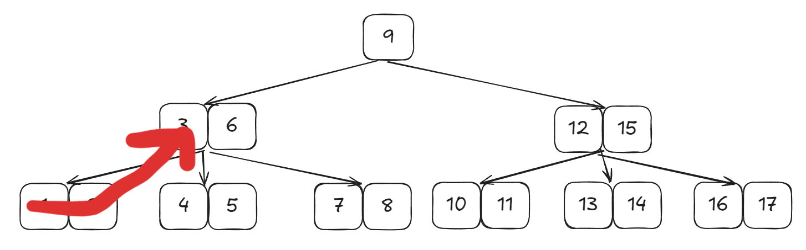

Куда вы пойдете дальше? А дальше вы змейкой обходите все дерево:

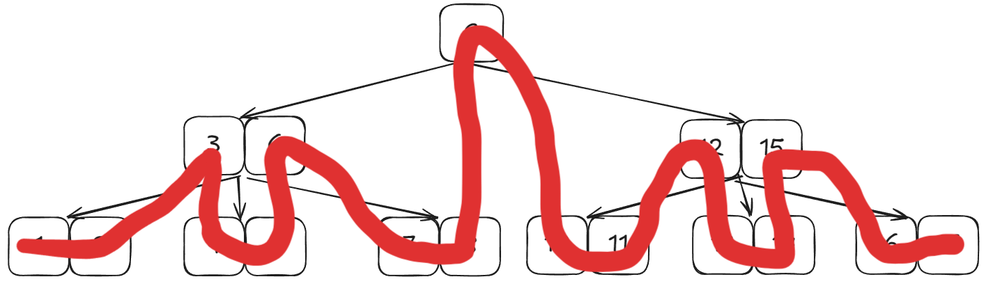

Обратите внимание: здесь все еще действует свойство деревьев BST, когда для каждого ключа значения ключей в левом поддереве меньше, а значения ключей в правом поддереве — больше него. Например, для ключа 3 левое поддерево состоит из ключей 1 и 2, а правое поддерево — из ключей 4 и 5.

Также обратите внимание, что количество дочерних узлов на 1 больше количества ключей. Таким образом, корневой узел имеет один ключ и два дочерних узла. Каждый из дочерних узлов имеет два ключа и три дочерних узла.

Вам вряд ли придется реализовывать дерево самостоятельно, но важно знать, что деревья — это разновидность графов и они обладают превосходной производительностью.

- Сбалансированные бинарные деревья поиска (BST) обеспечивают такую же производительность в нотации «О-большое», как массивы, и лучшую производительность вставки.
- Высота дерева влияет на его производительность.
- АВЛ-деревья — популярная разновидность сбалансированных деревьев BST. Как и большинство сбалансированных деревьев, АВЛ-деревья балансируются поворотом.
- B-деревья представляют собой обобщенные деревья BST, у которых каждый узел может иметь несколько ключей и несколько дочерних узлов.
- Время поиска можно сравнить со временем похода в магазин. B-деревья минимизируют время поиска за счет чтения большего объема данных за одну операцию.