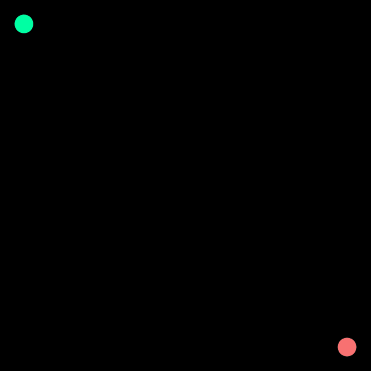
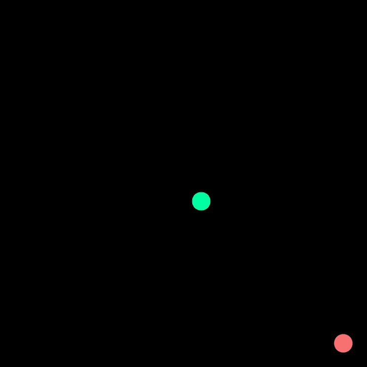

# Лабораторная работа: Алгоритмы поиска пути в лабиринтах

> "Плохой программист думает о коде. Хороший программист думает о структурах данных и их отношениях." - Линус Торвальдс

## Введение в задачу поиска пути

Поиск пути из точки А в точку Б - одна из фундаментальных задач в информатике и робототехнике. От навигации в GPS-системах до планирования движений в видеоиграх - алгоритмы поиска пути лежат в основе множества современных технологий.

В этой лабораторной работе вы реализуете три классических алгоритма поиска пути и сравните их эффективность на различных типах лабиринтов.

Используемые алгоритмы генерации лабиринта:

- **Binary Tree** — создаёт лабиринты с длинными прямыми коридорами, идеально для демонстрации BFS
- **Random Growth** — наиболее "естественные" лабиринты с тупиками и развилками
- **Spanning Tree** — сбалансированные лабиринты с равномерным распределением путей

Код [тут](https://github.com/savaleriy/maze-py)
## Что такое лабиринт с точки зрения алгоритмов?

Лабиринт - это **граф**, где:
- **Вершины (узлы)** - клетки лабиринта
- **Рёбра** - проходы между смежными клетками
- **Вес рёбер** - "стоимость" перемещения между клетками (в простейшем случае равна 1)

Задача: найти **оптимальный путь** от стартовой клетки к целевой, минимизируя суммарную стоимость рёбер.

### Старт в (0, 0) — верхний левый угол

| Алгоритм                 | Binary Tree                            | Random Growth                          | Spanning Tree                          |
| ------------------------ | -------------------------------------- | -------------------------------------- | -------------------------------------- |
| **BFS** (Поиск в ширину) |  |  |  |

### Старт в (5, 5) — центр лабиринта

| Алгоритм                 | Binary Tree                            | Random Growth                          | Spanning Tree                          |
| ------------------------ | -------------------------------------- | -------------------------------------- | -------------------------------------- |
| **BFS** (Поиск в ширину) |  |  |  |

## Поиск в ширину (BFS - Breadth-First Search)

### Основная идея
BFS исследует лабиринт **слоями**, как круги на воде от брошенного камня. Алгоритм сначала проверяет всех соседей начальной точки, потом соседей этих соседей, и так далее.

### Ключевые характеристики:
- **Структура данных**: **Очередь (FIFO)** - первым пришёл, первым ушёл
- **Стратегия**: Исследовать все клетки на расстоянии 1, затем все на расстоянии 2, и т.д.
- **Гарантии**: Находит **кратчайший путь по количеству шагов** в невзвешенном графе
- **Память**: Может потреблять много памяти на больших лабиринтах

### Визуальная аналогия:
Представьте, что вы стоите в центре поля и одновременно отправляете друзей во все четыре стороны. Каждый друг, достигнув новой точки, отправляет своих друзей дальше. Вы исследуете мир равномерно во всех направлениях.

### Когда использовать?
- Когда все перемещения имеют одинаковую стоимость
- Когда нужен гарантированно кратчайший путь (по количеству шагов)
- Когда лабиринт относительно небольшой

# ⭐️ Базовое задание  № 1
## Поиск в глубину (DFS - Depth-First Search)

### Основная идея
DFS идёт "вглубь", пока есть куда идти, и возвращается назад (backtracks), когда заходит в тупик. Это похоже на поведение человека в реальном лабиринте: идти прямо, пока можно, и поворачивать назад при тупике.

### Ключевые характеристики:
- **Структура данных**: **Стек (LIFO)** - последним пришёл, первым ушёл
- **Стратегия**: Идти как можно дальше по одной ветке, затем возвращаться
- **Гарантии**: **Не гарантирует** кратчайший путь, но всегда находит путь, если он существует
- **Память**: Эффективен по памяти (хранит только текущую ветку)

### Визуальная аналогия:
Как нить Ариадны в лабиринте Минотавра. Вы разматываете клубок, идя всё глубже, а когда заходите в тупик - наматываете нить обратно до последней развилки.

### Когда использовать?
- Когда важно найти любой путь, а не обязательно кратчайший
- Когда память ограничена
- Для исследования структуры лабиринта
- В комбинации с эвристиками (например, IDDFS)

# ⭐️ Задание повышенной сложности № 1

## Алгоритм Дейкстры (Dijkstra's Algorithm)

### Основная идея
Дейкстра находит путь с **минимальной общей стоимостью** в графе с **неотрицательными весами**. Алгоритм постоянно выбирает для исследования клетку с наименьшей известной стоимостью достижения от старта.

### Ключевые характеристики:
- **Структура данных**: **Приоритетная очередь** - всегда обрабатываем клетку с минимальной стоимостью
- **Стратегия**: Жадный алгоритм - всегда расширяет наиболее "дешёвую" границу
- **Гарантии**: Находит **оптимальный путь по суммарной стоимости** во взвешенном графе
- **Сложность**: Медленнее BFS на графах с одинаковыми весами

### Визуальная аналогия:
Представьте, что вы разливаете густую жидкость по лабиринту. Жидкость течёт быстрее по коротким/широким коридорам (низкая стоимость) и медленнее по длинным/узким (высокая стоимость). Первая капля, достигшая цели, показывает оптимальный маршрут.

### Когда использовать?
- Когда перемещения имеют разную "стоимость" (например, болото дороже, чем дорога)
- В навигационных системах (разные типы дорог)
- В играх с различной сложностью перемещения по разным типам местности

## Сравнительная таблица алгоритмов

| Характеристика       | BFS                         | DFS                            | Дейкстра                |
| -------------------- | --------------------------- | ------------------------------ | ----------------------- |
| **Тип пути**         | Кратчайший по шагам         | Любой (не обязательно краткий) | Кратчайший по стоимости |
| **Структура данных** | Очередь                     | Стек                           | Приоритетная очередь    |
| **Память**           | Высокая (хранит весь фронт) | Низкая (хранит только ветку)   | Средняя/высокая         |
| **Время**            | O(V+E)                      | O(V+E)                         | O((V+E)logV)            |
| **Взвешенные рёбра** | Не поддерживает             | Не поддерживает                | **Поддерживает**        |

## Что такое "веса рёбер" в контексте лабиринтов?

В нашей реализации:
- **Вес = 1**: обычный проход
- **Вес > 1**: "трудный" проход (например, болото, густой лес)
- **Вес < 1**: "лёгкий" проход (например, дорога, тропинка)

Генератор `random-growth` создаёт лабиринты с различными весами, что делает алгоритм Дейкстры особенно полезным.
# ! Советы по реализации

### Для DFS:
- Помните о возможности зацикливания - отмечайте посещённые вершины
- Stack в Python можно реализовать через `list` (`.append()` и `.pop()`)
- Рассмотрите как рекурсивную, так и итеративную реализации

### Для Дейкстры:
- Используйте `heapq` для приоритетной очереди
- Храните не только стоимость, но и путь (или родительские ссылки)
- Обратите внимание на обработку случаев, когда находим более короткий путь к уже посещённой вершине

### Для всех алгоритмов:
- Используйте общий интерфейс `MazeSolver` для единообразия
- Добавляйте поддержку анимации через `AnimationRecorder`
- Тестируйте на маленьких лабиринтах перед переходом к большим

