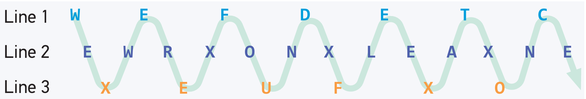
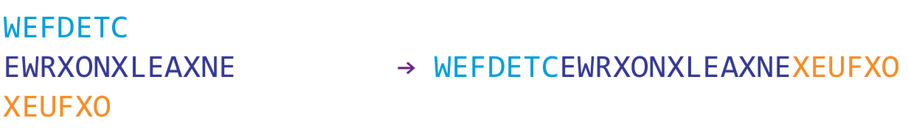
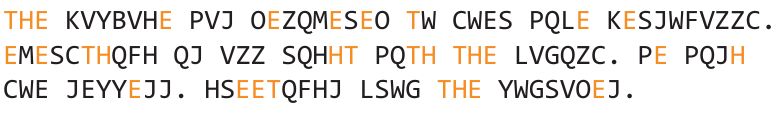
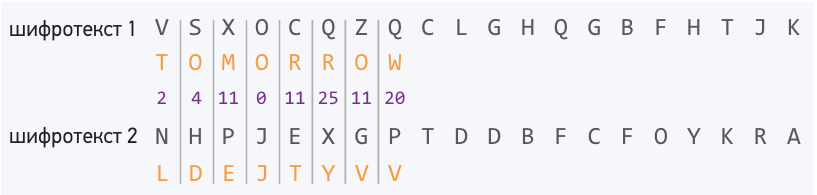
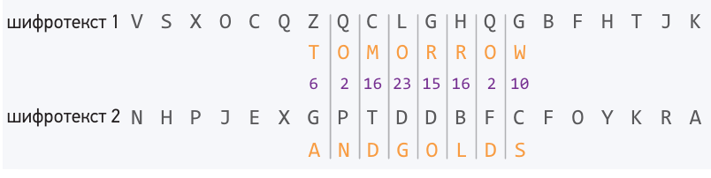
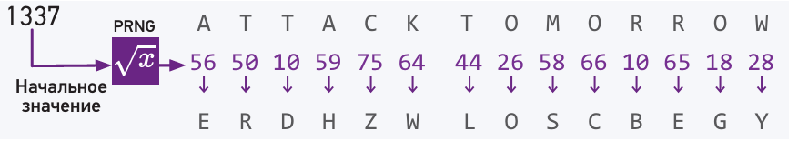
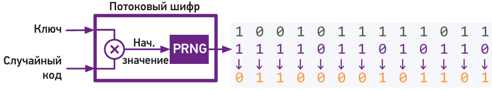
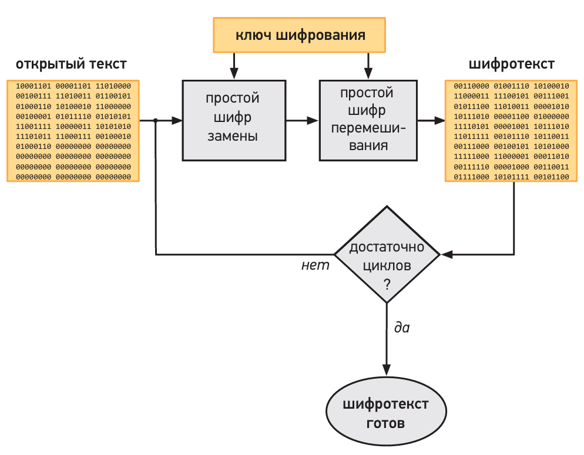
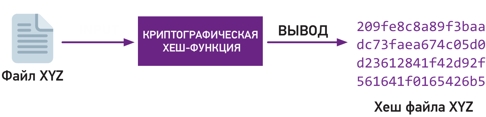

>[!tip] Со временем компьютерные системы не становятся более безопасными. Но я надеюсь, что успехи, которые мы делаем в криптографии, исправят плачевную ситуацию в области кибербезопасности.										 <br>Ади Шамир<br>

Перед разработчиками стоит задача защиты конфиденциальных данных, таких как личные сообщения, медицинские записи, финансовые транзакции и т.д. Ваша цель - обеспечить безопасность данных, передаваемых программам, от несанкционированного доступа. Необходимо удостовериться, что только авторизованные пользователи с валидными учетными данными могут получить доступ к системе, а конфиденциальные данные зашифрованы таким образом, что их невозможно прочитать при утечке.

Методы защиты данных от атак со стороны неавторизованных пользователей называются криптографией. Алгоритм, который преобразует исходные данные в нечитабельный вид, называется шифром. Современные системы безопасности полагаются на проверенные криптографические библиотеки для обеспечения конфиденциальности данных. В данной главе будут рассмотрены основные принципы шифрования и возможности, предоставляемые криптографическими библиотеками. Мы изучим следующие темы:

- устаревшие шифры и причины их ненадежности;
- эволюцию шифров до современных симметричных методов, обеспечивающих высокую степень безопасности;
- асимметричные шифры и их применение для защиты сообщений;
- использование хеширования для создания цифровых отпечатков данных;
- применение защищенных протоколов для безопасного взаимодействия в интернете;
- методы взлома, которые используют злоумышленники для обхода систем безопасности, и способы предотвращения проникновения в систему.

Если зашифрованные данные перехвачены, существует риск, что злоумышленники смогут расшифровать их и получить доступ к конфиденциальной информации. В этом случае считается, что шифр, применяемый для защиты данных, был взломан. Начнем с анализа шифров, которые были популярны ранее, но сейчас легко поддаются взлому, чтобы лучше понять, почему современные шифры обладают высокой стойкостью к атакам и считаются безопасными.

# Old but Gold

Одним из самых ранних шифров, известным как шифр Цезаря, пользовался Юлий Цезарь более двух тысяч лет назад для отправки секретных сообщений своим генералам. Пример шифротекста, зашифрованного таким методом, может выглядеть так:

```text
GR QRW EULQJ DQB ERGB RI PHQ ACROSS THE UKHINE
```

В случае перехвата шифрованного послания враги Цезаря не могли понять его содержания, тогда как его генералы могли легко прочитать сообщение. Для шифрования текста римляне заранее договаривались сдвигать каждую букву исходного сообщения на три позиции вперед по алфавиту, заменяя буквы следующим образом:

```text
A B C D E F G H I J K L M N O P Q R S T U V W X Y Z
↓ ↓ ↓ ↓ ↓ ↓ ↓ ↓ ↓ ↓ ↓ ↓ ↓ ↓ ↓ ↓ ↓ ↓ ↓ ↓ ↓ ↓ ↓ ↓ ↓ ↓
D E F G H I J K L M N O P Q R S T U V W X Y Z A B C
```

Затем сообщение расшифровывалось путем восстановления исходного положения букв. Этот метод известен как **шифр сдвига**. Поскольку враги Цезаря не знали принципа работы шифра, он обеспечивал достаточный уровень безопасности для своего времени. Однако, любой, знакомый с этим методом, может легко его взломать, даже если сдвиг составляет больше трех позиций. В латинском алфавите всего 25 возможных вариантов сдвига, и злоумышленник может их перебрать поочередно, пока сообщение не станет осмысленным.

Рассмотрим несколько полезных понятий. Зашифрованное сообщение называется **шифротекстом**. Для расшифровки **шифротекста** необходимо знать, какой **метод шифрования** использовался, а также **ключ шифрования**. В случае шифра сдвига ключом выступает число позиций, на которые буквы сдвигались. Зная **шифр** и **ключ**, мы можем обратить процесс шифрования и восстановить исходное сообщение, называемое **открытым текстом**.

Самый простой способ взлома шифра Цезаря — протестировать все возможные значения ключа на шифротексте и проверить, появляется ли осмысленный текст. Поскольку в латинском алфавите всего 25 возможных вариантов сдвига, это относительно простая задача.

## Зигзагообразный шифр

Существует метод шифрования текста, при котором замена букв не требуется — вместо этого выполняется их перестановка по заранее определённой схеме. Рассмотрим пример зашифровки сообщения:  

```
We were found. Flee at once.
```

В первую очередь устраним из текста всё ненужное форматирование, которое может подсказать структуру шифра. Обычной практикой является приведение всех букв к верхнему регистру, удаление знаков препинания и замена пробелов на символы-заполнители, такие как X: 

```text
WEXWEREXFOUNDXFLEEXATXONCE
```

Затем впишем последовательно каждую букву в строки по зигзагообразной схеме, сменяя строку после каждого символа. Например, можно следовать шаблону зигзага по трем строкам:



```text
Строка 1: W _ E _ F _ D _ E _ T _ C
Строка 2: _ E _ W _ R _ X _ O _ N _ X _ L _ E _ A _ X _ N _ E
Строка 3: _ _ _ X _ E _ U _ F _ X _ O
```

Финальный шифротекст получается объединением всех трёх строк: 



Этот метод называется **зигзагообразным шифром**, и его ключом шифрования является количество строк в используемом шаблоне. Однако данный шифр имеет недостаток, схожий с шифром сдвига: количество возможных ключей ограничено, и его можно взломать, последовательно применяя обратное преобразование для каждого возможного числа строк.

## Шифр подстановки

Вернемся к методам шифрования, где буквы открытого текста заменяются на другие. Шифры, в которых каждой букве соответствует уникальная замена, являются более защищенными по сравнению с простым шифром сдвига. Например, для шифрования текста можно согласовать со своим партнером следующую таблицу подстановок:

|Оригинал|A|B|C|D|E|F|G|H|I|J|K|L|M|N|O|P|Q|R|S|T|U|V|W|X|Y|Z|
|---|---|---|---|---|---|---|---|---|---|---|---|---|---|---|---|---|---|---|---|---|---|---|---|---|---|---|
|Шифр|V|H|I|E|R|P|X|N|D|J|F|T|G|L|B|W|O|Q|K|Z|M|U|C|S|Y|A|

Этот пример представляет собой простой шифр подстановки. Таким образом, слово **ENERGY** зашифруется как **RLRQXY**. Ключ шифрования в этом случае — это указанная таблица, определяющая, как именно заменяются буквы. Существует 26! возможных перестановок букв алфавита, что предоставляет огромное количество уникальных ключей — больше, чем атомов в океане, и попытки перебора всех ключей были бы чрезвычайно трудозатратны.

Тем не менее, даже такой шифр может оставлять определенные шаблоны в зашифрованном тексте, которые можно проанализировать. С помощью метода проб и ошибок, особенно с использованием компьютера для подсчета частот встречаемости букв и анализа часто встречающихся пар, такой шифр можно взломать. Например, в английском языке буква **E** наиболее часто встречается, поэтому если в зашифрованном тексте чаще всего встречается буква **R**, можно предположить, что **E → R** в ключе подстановки. Аналогично, пара **TH** является наиболее частой в английском языке; если, к примеру, **ZN** является самой распространенной парой символов в зашифрованном тексте, можно предположить, что **T → Z** и **H → N**.

Этот метод называется **частотным анализом**, и он является отличной отправной точкой для подбора ключей. Попробуйте использовать его для решения следующей задачи.

Задача может показаться сложной, но при наличии ручки, бумаги и терпения она вполне решаема. Поскольку исходный текст, вероятнее всего, на английском, начнем с поиска букв, которые могут означать **E** и **TH**. Постепенно, сравнивая частично дешифрованные слова с английскими, можно увидеть, как различные замены влияют на остальные части текста. 




## Продвинутые подстановки

Существуют более сложные шифры подстановки, в которых одна буква текста может заменяться разными символами. Например, буква **E** может быть заменена на **R**, **$** или `.` Увеличение числа вариантов затрудняет частотный анализ, но даже в этом случае часто встречающиеся слова и буквенные пары будут оставлять едва заметные шаблоны. Для усложнения анализа можно придумать дополнительные символы для замены частых пар и слов, однако полностью исключить возможность анализа частотных паттернов таким образом


## Продукционные шифры

Комбинация различных шифров называется продукционным шифром. Такие шифры более защищены, так как объединяют методы подстановок и перестановок букв. Например, текст может сначала пройти через зигзагообразное перемешивание, а затем — через шифр подстановки. Такой подход создает шифр, более стойкий, чем каждый из его компонентов в отдельности.

Пример использования такого метода известен со времен Первой мировой войны, когда немцы применяли продукционные шифры для радиосвязи, включая этапы подстановок и перестановок. Несмотря на уверенность немцев в его надежности, французам удалось взломать этот шифр и получать важные сведения о военных планах Германии.

### Шифр Виженера

В отличие от обычных шифров подстановки, шифр Виженера использует несколько ключей, что делает его более стойким. Процесс предполагает последовательное использование шифров сдвига, где каждая буква открытого текста заменяется разными символами в зависимости от позиции. Например, для ключа `2011064` буквы могут заменяться следующим образом:

```mathematica
Оригинал:  T H E R E F O R E T H E Y   L O A T H E D  T H E F T
Ключ:      2 0 1 1 0 6 4 2 0 1 1 0 6 4 2 0 1 1 0 6 4
Зашифр.:   V H F S E L S T E U I E E P Q A U I E J X J E G U
```

Каждая буква может шифроваться по-разному, поэтому частотный анализ затрудняется. Однако этот метод стал более уязвимым с развитием вычислительной техники, поскольку компьютеры могут искать повторяющиеся последовательности, чтобы угадать длину ключа. Например, повторяющийся шаблон **UIE** на расстоянии семи позиций может указывать на длину ключа, равную семи.

### Шифр Вернама

Максимальную стойкость шифр Виженера получает, когда длина ключа совпадает с длиной открытого текста, образуя так называемый шифр Вернама. Если ключ выбран случайно и используется один раз, этот шифр невозможно взломать. Однако, если ключ используется повторно, это позволяет применять метод crib-dragging (поиск совпадений с опорными словами) для взлома шифра.



**Если первая буква открытого текста 1 — это T, то первое число ключа должно быть 2, так что T → V В соответствии с этим предположением первая буква открытого текста 2 должна быть L, так что L → N**

Если бы слово tomorrow было в начале первого открытого текста, второй открытый текст должен был бы начинаться с **ldejtivv**. Если предположить, что ни один из открытых текстов не содержит тарабарщины, слово tomorrow не может быть в начале первого открытого текста. Поэтому мы продолжаем пробовать опорное слово в других позициях. И на седьмой позиции — успех



**Ура! Тестируя tomorrow в седьмой позиции первого открытого текста, мы получаем ключевой сегмент, который декодирует другой зашифрованный текст в понятный текст, а не в тарабарщину Это подтверждает правильность предположения**

По этой причине мы обычно называем ключ шифрования Вернама ключом **одноразового использования**.

**Во времена Второй мировой войны Красная армия использовала повторно одноразовые ключи, что позволило американской разведке взломать сообщения. Это показывает важность уникальности ключа в шифре Вернама.**

## Симметричные шифры

Сегодня подавляющее большинство шифровальных методов зависят от компьютеров. Поскольку компьютеры работают с двоичными данными, шифры разрабатываются для алфавита из двух символов — 0 и 1. Например, шифр Вернама может использовать двоичный алфавит так же эффективно, как и традиционный текстовый алфавит.

Пример двоичного шифрования с одноразовым ключом:

```mathematica
Открытый текст: 0 0 1 1 0 0 1 1 1 0 0 1 0 0 0 1 1 1 0 0
Ключ:           1 0 1 0 1 1 1 1 0 1 0 1 1 1 0 0 1 0 1 0
Шифротекст:     1 0 0 1 1 1 0 0 1 1 0 0 1 1 0 1 0 1 1 0
```

Здесь при наложении ключа на открытый текст каждый бит открытого текста изменяется в соответствии с соответствующим битом ключа, обеспечивая полную секретность. Однако для обеспечения безопасности шифра Вернама требуется, чтобы ключ одноразового использования был случайным и длинным, равным объему данных. Например, для шифрования одного гигабайта видео потребуется один гигабайт случайных чисел. Более того, каждый ключ должен быть уникальным и не может использоваться повторно, поскольку метод **crib-dragging** (поиск совпадений с опорными шаблонами) применим и к двоичным данным.

К счастью, существуют симметричные шифры, способные шифровать большие объемы данных с меньшим ключом, разделяемым между сторонами. Они обеспечивают высокую безопасность и удобство, не требуя огромного количества случайных чисел. Эти симметричные шифры подразделяются на два типа в зависимости от их основного принципа работы.


### Потоковые шифры

Основной подход, лежащий в основе потоковых шифров, заключается в избежании использования длинных одноразовых ключей, как в классических шифровальных машинах с вращающимися колесами. Вместо этого применяется компьютерная программа, которая генерирует бесконечный поток псевдослучайных чисел.

Пример такого потока можно создать, используя неквадратичное число, например $1337$. С его помощью вычисляется квадратный корень, который порождает последовательность чисел, выглядящих случайными:

$$\sqrt{1337} = 36,56 50 10 59 75 64 44 26 58 66 10 65 18 28…$$

Этот процесс представляет собой простой генератор псевдослучайных чисел (**P**seudorandom **N**umber **G**enerator, **PRNG**), который требует начальное значение, подобно тому как в старых шифровальных машинах требовалась начальная установка колес. В данном примере начальным значением является число $1337$.

Потоковые шифры используют **PRNG** для генерации потока ключевых данных. Например, числа после десятичной точки могут быть сгруппированы в пары, которые затем используются для создания ключей:



**Шифр Вернама, работающий на генераторе псевдослучайных чисел Общий ключ между сторонами — это всего лишь начальное значение**


Этот поток псевдослучайных чисел может быть использован для шифрования данных, как в шифре Вернама, где ключ генерируется на основе этого потока и применяется к открытым данным.

Однако безопасность потоковых шифров напрямую зависит от качества PRNG. Чтобы шифр был безопасным, его генератор должен создавать псевдослучайные числа, которые не поддаются предсказанию или нахождению шаблонов. Даже если известен используемый PRNG, без общего ключа должно быть невозможно отличить вывод PRNG от последовательности случайных чисел.

На сегодняшний день еще не существует идеального, неуязвимого PRNG, и многие предложенные ранее алгоритмы имели свои уязвимости. Поэтому перед выбором потокового шифра необходимо удостовериться в его безопасности и проверить, использовался ли проверенный PRNG. Создание хорошего PRNG — это сложная задача, и если вы не являетесь криптографом, рекомендуется использовать уже проверенные и существующие решения.

### Случайный код и потоковые шифры

Потоковые шифры, как и одноразовые ключи, требуют, чтобы ключи не использовались повторно. Это важно, потому что генератор псевдослучайных чисел (PRNG) всегда будет производить одинаковую последовательность ключевых бит при одном и том же начальном значении. Чтобы избежать повторного использования одинаковых ключей, криптографы разработали метод с использованием **случайного кода**.

**Как работает случайный код:**

1. Используется общий секретный ключ, который комбинируется с **случайным кодом**. Этот случайный код представляет собой одноразовое, несекретное число, которое добавляется к общему ключу, создавая начальное значение для PRNG.
2. Поток ключей, генерируемый с использованием PRNG, будет уникальным для каждого сеанса, поскольку случайный код изменяет начальное значение, препятствуя повторному использованию ключа.

На примере, показанном на рисунке, случайный код используется для модификации начального значения, создавая новый поток ключей:



**Потоковые шифры обычно требуют общего ключа и случайного кода В отличие от ключа, случайный код не обязательно должен быть секретным Если случайный код никогда не используется повторно, ключ может быть использован для шифрования нескольких открытых текстов**


Cлучайный код не обязательно должен быть секретным, но важно, чтобы его повторное использование было маловероятным. Например, если используется случайное 64-битное число, вероятность повторного выбора того же значения очень мала (порядка сотен миллиардов триллионов вариантов).

**Практическое использование случайного кода:**

- Перед шифрованием важно выбрать случайный код, чтобы минимизировать вероятность его повторного использования.
- Когда зашифрованное сообщение передается, оно может содержать как незашифрованное сообщение, так и зашифрованный текст. Получатель, зная общий ключ и случайный код, может восстановить исходное сообщение с помощью обратного сдвига.

**Проблемы, связанные с выбором ключа:** Если злоумышленник перехватывает зашифрованное сообщение, он может попытаться взломать его с помощью метода грубой силы, перебирая все возможные ключи. Чтобы избежать таких атак, ключ должен быть **длинным и случайным**. Например, 120-битный случайный ключ обеспечит защиту от взлома с помощью грубой силы.

**Податливость шифров:** В примере с банком злоумышленник (например, Чарльз), зная часть открытого текста (номер счета), может изменить зашифрованное сообщение, подставив свой номер счета вместо настоящего. Это явление называется **податливостью** шифра, что означает, что шифр позволяет злоумышленнику подделывать части зашифрованного сообщения, если он знает соответствующие части открытого текста. Разработка шифров, которые не поддаются таким атакам, требует особых подходов, и мы рассмотрим их в следующем разделе.

## Блочные шифры

Блочные шифры — это тип симметричных шифров, в которых открытый текст разбивается на блоки фиксированного размера (обычно 128 или 256 бит), и каждый блок шифруется отдельно с использованием того же ключа. Блочные шифры отличаются от потоковых тем, что их операции подстановки и перемешивания делают связь между открытым и зашифрованным текстом неочевидной, обеспечивая большую безопасность.

**Проблемы потоковых шифров:** В потоковых шифрах изменение одного бита открытого текста или ключа влияет только на соответствующий бит шифротекста, что может создать закономерности. Это может привести к податливости шифра — возможности злоумышленника изменять часть зашифрованного текста. Например, если злоумышленник знает, какой бит открытого текста изменился, он может точно изменить и зашифрованный текст.

**Как блочные шифры решают эту проблему:** Блочные шифры делают изменения в зашифрованном тексте гораздо более сложными. Если изменить один бит в блоке шифротекста, это приведет к искажению всего расшифрованного сообщения, поскольку при расшифровке каждый блок обрабатывается независимо. Таким образом, блочные шифры не создают прямой связи между зашифрованным и открытым текстом, что делает их более безопасными и предотвращает подделку данных.

**Работа с блоками:**

- **Размер блока:** Открытый текст разбивается на блоки фиксированного размера (обычно 128 или 256 бит). Если длина текста превышает размер блока, его разделяют на несколько блоков. Если текст короче, его дополняют (обычно нулями).
    
- **Режимы работы блочных шифров:** Один из распространенных способов — это режим **Electronic Codebook (ECB)**. В этом режиме каждый блок открытого текста шифруется отдельно. Несмотря на простоту, режим ECB имеет недостатки, поскольку одинаковые блоки открытого текста будут зашифрованы одинаково, что позволяет злоумышленнику увидеть закономерности в шифротексте, если блоки повторяются.



**Упрощенная схема блочного шифра Как правило, блочные шифры должны повторять свой основной продукционный шифр около десяти раз**

**Преимущества блочных шифров:**

1. **Изменение битов открытого текста влечет за собой значительные изменения в шифротексте.** Это предотвращает возможность манипуляций с сообщением.
2. **Нет податливости:** Из-за того, что блочные шифры расщепляют текст на блоки, изменения в одном блоке не влияют на другие блоки.
3. **Безопасность:** При правильной настройке блочные шифры могут обеспечить высокий уровень безопасности.

**Режимы блочных шифров и их безопасность**

Режим **Electronic Codebook (ECB)**, используемый для блочных шифров, имеет значительные уязвимости. В этом режиме каждый блок текста шифруется отдельно, и одинаковые блоки открытого текста приводят к одинаковым блокам шифротекста. Это создает риск для безопасности, так как злоумышленник, обнаружив одинаковые блоки, может получить важные сведения о содержании сообщения. Например, в случае передачи одинаковых транзакций, например, переводов средств, злоумышленник может дублировать блоки и повторять транзакции. При шифровании изображений с помощью режима ECB одинаковые блоки шифротекста сохранят закономерности, что делает изображение частично узнаваемым даже после шифрования.

**Режим сцепления блоков шифротекста (CBC)** — это улучшение ECB, которое решает проблему повторяющихся блоков, делая каждый зашифрованный блок уникальным. CBC использует начальный вектор (IV) — случайное значение, которое смешивается с первым блоком открытого текста перед шифрованием. Далее каждый блок открытого текста сначала XOR-ится с предыдущим блоком шифротекста, прежде чем быть зашифрованным. Таким образом, идентичные блоки открытого текста не создадут идентичных блоков шифротекста, поскольку ввод предыдущего блока влияет на текущий.

При работе с CBC можно воспользоваться готовыми функциями криптографических библиотек, которые поддерживают этот режим, избавляя от необходимости ручной настройки преобразований.


**Изображение, зашифрованное с помощью блочного шифра в режиме ECB Паттерны открытого текста (слева) повторяются, и расположение этих повторных блоков в шифротексте (справа) раскрывает суть его содержания**

**Сравнение блочных и потоковых шифров:**

1. **Безопасность:** Блочные шифры, такие как CBC, предоставляют высокую степень безопасности за счет усложнения закономерностей между открытым и шифротекстом.
2. **Производительность:** Потоковые шифры работают быстрее, чем блочные, так как не требуют разделения текста на блоки и позволяют побайтовое шифрование. Они подходят для динамического контента (например, для шифрования данных в реальном времени, как в телефонных звонках).
3. **Симметричность:** Оба типа требуют, чтобы стороны обменялись одним и тем же секретным ключом заранее.

Симметричные шифры, включающие как блочные, так и потоковые, подходят для случаев, где безопасность и скорость одинаково важны, а также существует возможность предварительного обмена секретными ключами между сторонами.


## Асимметричные шифры и метод обмена ключами Диффи — Хеллмана

Для безопасной коммуникации с помощью симметричного шифрования необходимо сначала поделиться секретным ключом. В случае физического общения это можно сделать при личной встрече или через доверенного посредника, но для удаленных пользователей нужна другая стратегия. Метод **Диффи — Хеллмана** предлагает решение: он позволяет двум сторонам (например, Аде и Чарльзу), которые ранее не обменивались ключами, установить общий секретный ключ даже по открытому каналу.

### Как работает метод Диффи — Хеллмана:

$mod$ — это операция нахождения остатка от целочисленного деления.

Когда вы делите одно целое число на другое, вы получаете:
- **Частное** (целая часть результата)
   - **Остаток** (то, что "не делится")
**Пример из жизни:** «Сейчас 17 часов». Какое время будет на 12-часовых часах? Вы отвечаете: «5 часов». Это и есть `17 mod 12 = 5`. Вы "сбрасываете" полные обороты (12 часов) и смотрите на остаток.

Для двух целых чисел **a** (делимое) и **b** (делитель, b ≠ 0) существует **единственная** пара целых чисел **q** (частное) и **r** (остаток), такая что:

$a = b * q + r$, где $0 \le r < |b|$

Тогда $a \space mod \space b = r$

**Важно:** Остаток **r** всегда неотрицательный и меньше делителя **b** по модулю.

**Примеры:**

- `10 mod 3 = 1`, потому что `10 = 3 * 3 + 1` (остаток 1)
- `7 mod 2 = 1`, потому что `7 = 2 * 3 + 1` (нечетное число)
- `8 mod 2 = 0`, потому что `8 = 2 * 4 + 0` (четное число)
- `15 mod 4 = 3`, потому что `15 = 4 * 3 + 3`
- `-5 mod 3 = 1`, потому что `-5 = 3 * (-2) + 1` (обратите внимание, остаток 1, а не -2)


1. **Выбор начальных значений:** Ада выбирает простое число $p$ и случайное число $g$ (основание), которые затем отправляет Чарльзу вместе с вычисленным значением $A = g^a \mod p$, где $a$ — ее секретное число.
2. **Ответное значение:** Чарльз выбирает свое секретное число c и отправляет значение $C = g^c \mod p$  Аде.
3. **Вычисление общего секрета:** Ада и Чарльз могут теперь вычислить общий секретный ключ:
    - Ада вычисляет $C^a \mod p$.
    - Чарльз вычисляет $A^c \mod p$. По математическим свойствам модулярной арифметики оба результата будут идентичны: $C^a \mod p = A^c \mod p$.

### Безопасность метода:

Числа $a$ и $c$ являются приватными для Ады и Чарльза соответственно, а вычисленный общий секретный ключ не может быть извлечен третьей стороной даже при знании всех публично переданных значений ($p$, $g$, $A$, и $C$).

### Уязвимость:

Хотя метод Диффи — Хеллмана защищает секретный ключ от перехвата, он подвержен **атаке посредника (Man-in-the-Middle)**. Если злоумышленник может перехватить сообщения Ады и Чарльза, он может провести свои вычисления и обмануть обе стороны, заставляя их думать, что они общаются друг с другом, хотя на самом деле общение происходит через посредника. Решение этой проблемы предлагает асимметричная криптография, которая используется для подтверждения личности сторон и защиты от таких атак.

## Асимметричные шифры и шифрование с открытым ключом

Асимметричное шифрование отличается от симметричного тем, что использует пару ключей: **открытый** и **закрытый**. Эти ключи связаны, но так, что знание одного из них (открытого) не позволяет легко вычислить другой (закрытый). Основные принципы асимметричного шифрования:

1. **Открытый ключ** доступен всем и может использоваться для шифрования сообщений, которые будут отправлены владельцу соответствующего закрытого ключа.
2. **Закрытый ключ** известен только владельцу и используется для расшифровки сообщений, зашифрованных с помощью его открытого ключа.

### Пример обмена с асимметричным шифром

- Если **Чарльз** хочет отправить секретное сообщение **Аде**, он шифрует его с использованием ее открытого ключа.
- Зашифрованное сообщение отправляется Аде, которая расшифровывает его с помощью своего закрытого ключа.
- Аналогично, если **Эндрю** хочет общаться с Адой, он может использовать тот же открытый ключ, но Ада всё равно сможет расшифровать сообщения обоих отправителей с помощью своего закрытого ключа.

### Преимущества и проблемы

Асимметричные шифры позволяют избежать необходимости делиться одним и тем же ключом между всеми участниками, что значительно повышает безопасность. Однако они создают новые вызовы, например:

- **Подтверждение подлинности**: Хотя любой может отправить зашифрованное сообщение, утверждая, что он Чарльз, нет способа подтвердить, что оно действительно от него. Поэтому помимо шифрования используется цифровая подпись.
- **Подлинность открытого ключа**: Получателю необходимо убедиться, что открытый ключ действительно принадлежит отправителю. Для этого часто применяют **сертификаты открытого ключа** — документы, подтверждающие подлинность ключа с помощью надежного стороннего источника (например, удостоверяющего центра).

Системы асимметричного шифрования, как правило, более вычислительно сложны, чем симметричные, поэтому их часто комбинируют: асимметричное шифрование используется для обмена симметричным ключом, который затем используется для дальнейшего шифрования сообщений.


## Цифровые подписи в асимметричной криптографии

Цифровые подписи — это инструмент, позволяющий подтвердить подлинность отправителя и целостность сообщения. В основе цифровых подписей лежат две операции:

1. **Создание подписи**: используется закрытый ключ отправителя.
2. **Проверка подписи**: проводится с открытым ключом отправителя.

### Как это работает?

- **Создание подписи**: отправитель (например, Ада) использует свой закрытый ключ для генерации цифровой подписи, которая является уникальной для конкретного сообщения. Даже небольшие изменения в сообщении вызовут совершенно другую цифровую подпись.
- **Проверка подписи**: получатель (например, Чарльз) применяет открытый ключ Ады, чтобы убедиться, что подпись действительно была создана Адином закрытым ключом. Если подпись подлинная, это подтверждает, что сообщение не было изменено и действительно пришло от Ады.

### Преимущества цифровых подписей

Цифровые подписи позволяют:

- **Проверить подлинность отправителя**: поскольку только владелец закрытого ключа может создать соответствующую подпись.
- **Обеспечить целостность данных**: даже малейшие изменения в сообщении приведут к недействительной подписи.
- **Защититься от подделок**: физические подписи легко подделать, тогда как поддельные цифровые подписи невозможно создать без закрытого ключа владельца.

### RSA и ECDSA

- **RSA**: универсальная криптографическая схема, которая позволяет как шифровать сообщения, так и подписывать их. RSA требует значительных вычислительных ресурсов, но предлагает надежность и гибкость.
- **ECDSA** (Elliptic Curve Digital Signature Algorithm): более эффективная по производительности схема, основанная на эллиптических кривых. ECDSA применяется только для подписей и проверок, что делает её оптимальным выбором для устройств с ограниченными ресурсами.

**Важное замечание для ECDSA**: при использовании этой схемы для подписи необходимо применять случайный код. Повторное использование кода приведет к уязвимости закрытого ключа, что может поставить безопасность под угрозу.

Цифровые подписи, сопровождающие обмен ключами Диффи — Хеллмана, делают процесс защищенным от вмешательства. Если злоумышленник попытается подменить сообщение, подпись перестанет совпадать, и подмена будет обнаружена до обмена конфиденциальной информацией.

## Хеширование и криптографические хеш-функции

**Хеш-функции** — это алгоритмы, которые преобразуют любые данные в число фиксированной длины, называемое хешем. Даже небольшие изменения в исходных данных приводят к совершенно другому хешу, что позволяет обнаруживать любые изменения в данных.

### Зачем нужны криптографические хеш-функции?

Криптографические хеш-функции обладают особыми свойствами:

1. **Односторонность**: невозможно восстановить исходные данные, зная только хеш.
2. **Устойчивость к коллизиям**: практически невозможно найти два разных набора данных, дающих одинаковый хеш.

Эти свойства делают хеш-функции незаменимыми для различных криптографических целей, таких как проверка целостности данных и облегчение использования цифровых подписей.



**Хеширование простого файла Эта хеш-функция выдает двузначное число с 256 битами в качестве выходных данных, представленное в шестнадцатеричном формате Невозможно найти другие входные данные, которые произведут тот же результат**

Для определения того, происходили ли случайные изменения в данном блоке данных‚ используются простые контрольные суммы. Но их нельзя использовать для обнаружения вредоносных изменений: когда злоумыш ленник пытается изменить файл, не будучи обнаруженным. Ценой неко торых усилий злоумышленник может собрать воедино поддельные дан ные, которые имеют ту же контрольную суммы, что и исходные данные.

### Проверка целостности данных

Для отслеживания изменений в важных данных (например, астрономических наблюдений) можно использовать хеши:

1. Вычислите хеши всех файлов и сохраните их на защищенном устройстве, например на флешке.
2. Если появится подозрение, что данные были изменены, пересчитайте хеши и сравните их с оригинальными.

Такой метод позволит быстро выявить любые изменения.

### Применение хеширования для доказательства существования и защиты данных

Криптографические хеш-функции могут использоваться для доказательства того, что информация существует, не раскрывая ее содержания.

**Пример 1: Доказательство авторства (Скрытная рок-звезда)** Вы написали песню и хотите доказать, что это ваш оригинальный труд, но не хотите раскрывать ее содержание. В этом случае можно:

1. Записать песню в файл и вычислить его хеш.
2. Нотариус заверяет хеш, но не видит саму песню.
3. В случае необходимости можно представить заверенный хеш и файл для подтверждения авторства. Только владелец исходного файла мог предоставить нотариусу тот же самый хеш.

**Пример 2: Проверка честности в играх** Казино может использовать хеши для доказательства честности игр. Например:

1. Казино генерирует результат игры (например, подбрасывание монеты) и вычисляет его хеш с добавлением своих и пользовательских данных (соль).
2. Казино публикует хеш до начала игры, чтобы игрок мог проверить результат позже.
3. Когда игра завершена, казино раскрывает соль, чтобы игрок мог убедиться, что результат не был изменен.

### Доказательство работы

**Доказательство работы (Proof of Work)** используется для предотвращения злоупотреблений и улучшения безопасности. Суть доказательства работы заключается в вычислении хешей, соответствующих определенному шаблону (например, начинающихся с определенного количества нулей). Пример:

1. Если вам нужно найти хеш с четырьмя нулями, это может занять несколько попыток.
2. Если хеш начинается с восьми или более нулей, это свидетельствует о значительном объеме проделанной работы.

**Применение в криптовалютах** Доказательство работы используется для защиты от атак и создания новых блоков в блокчейне, предотвращая возможность легкого внесения изменений. Это также помогает распределить ответственность за обработку данных между участниками сети.

### Влияние на будущее: Блокчейн и новейшие криптографические инструменты

Блокчейн основан на доказательстве работы, цифровых подписях и хешировании, что обеспечивает прозрачность и устойчивость к фальсификациям. В будущем такие технологии могут повысить экономическую независимость и защитить приватность данных, развивая новые криптографические методы, такие как доказательство с нулевым разглашением и гомоморфное шифрование.

# Хакинг

**Хакер** (изначально — кто-либо, делающий мебель при помощи [топора](https://ru.wikipedia.org/wiki/%D0%A2%D0%BE%D0%BF%D0%BE%D1%80 "Топор")):
1. Человек, увлекающийся исследованием подробностей (деталей) программируемых систем, изучением вопроса повышения их возможностей в противоположность большинству пользователей, которые предпочитают ограничиваться изучением необходимого минимума. [RFC 1983](https://tools.ietf.org/html/rfc1983) усиливает это определение следующим образом: «Человек, наслаждающийся доскональным пониманием внутреннего устройства систем, [компьютеров](https://ru.wikipedia.org/wiki/%D0%9A%D0%BE%D0%BC%D0%BF%D1%8C%D1%8E%D1%82%D0%B5%D1%80 "Компьютер") и [компьютерных сетей](https://ru.wikipedia.org/wiki/%D0%9A%D0%BE%D0%BC%D0%BF%D1%8C%D1%8E%D1%82%D0%B5%D1%80%D0%BD%D0%B0%D1%8F_%D1%81%D0%B5%D1%82%D1%8C "Компьютерная сеть") в частности».
2. Кто-либо, программирующий с энтузиазмом (даже одержимо) или любящий программировать, а не просто теоретизировать о программировании.
3. Человек, способный ценить и понимать [хакерские ценности](https://ru.wikipedia.org/w/index.php?title=%D0%A5%D0%B0%D0%BA%D0%B5%D1%80%D1%81%D0%BA%D0%B8%D0%B5_%D1%86%D0%B5%D0%BD%D0%BD%D0%BE%D1%81%D1%82%D0%B8&action=edit&redlink=1 "Хакерские ценности (страница отсутствует)").
4. Человек, который силён в быстром программировании.
5. [Эксперт](https://ru.wikipedia.org/wiki/%D0%AD%D0%BA%D1%81%D0%BF%D0%B5%D1%80%D1%82 "Эксперт") по отношению к определённой компьютерной программе или кто-либо часто работающий с ней; пример: «хакер [Unix](https://ru.wikipedia.org/wiki/Unix "Unix")». (Определения 1—5 взаимосвязаны, так что один человек может попадать под несколько из них.)
6. [Эксперт](https://ru.wikipedia.org/wiki/%D0%AD%D0%BA%D1%81%D0%BF%D0%B5%D1%80%D1%82 "Эксперт") или энтузиаст любого рода. Кто-либо может считаться «хакером [астрономии](https://ru.wikipedia.org/wiki/%D0%90%D1%81%D1%82%D1%80%D0%BE%D0%BD%D0%BE%D0%BC%D0%B8%D1%8F "Астрономия")», например.
7. Кто-либо любящий интеллектуальные испытания, заключающиеся в творческом преодолении или обходе ограничений.
8. (неодобрительно) Злоумышленник, добывающий конфиденциальную информацию в обход систем защиты (например, «хакер паролей», «сетевой хакер»). Правильный термин — взломщик, [крэкер](https://ru.wikipedia.org/wiki/%D0%9A%D1%80%D1%8D%D0%BA%D0%B5%D1%80 "Крэкер") ([англ.](https://ru.wikipedia.org/wiki/%D0%90%D0%BD%D0%B3%D0%BB%D0%B8%D0%B9%D1%81%D0%BA%D0%B8%D0%B9_%D1%8F%D0%B7%D1%8B%D0%BA "Английский язык") cracker).
9. Эксперт в компьютерной безопасности, ищущий слабые места в системе, который либо их исправляет, либо использует в своих корыстных целях.([Крэкер](https://ru.wikipedia.org/wiki/%D0%9A%D1%80%D1%8D%D0%BA%D0%B5%D1%80 "Крэкер"))

**Типы хакеров:**
1. **«Белые шляпы»** — легальные специалисты по безопасности, работающие для защиты систем, выявляя и устраняя уязвимости, прежде чем их смогут использовать злоумышленники.
2. **«Черные шляпы»** — нелегальные хакеры, эксплуатирующие уязвимости для личной выгоды, причиняя вред владельцам взломанных систем.

**Особенности работы хакеров:**

- Многие хакеры изучают низкоуровневые аспекты функционирования компьютеров, такие как сетевые протоколы и управление отдельными битами в данных.
- Часто хакеры обходят защиту системы, вместо того чтобы пытаться взломать криптографию напрямую. В этом смысле защита системы напоминает защиту средневекового замка, где важно предвидеть все возможные типы атак и построить контрмеры для каждой.

## Наиболее частые методы взлома

Удивительно, но многие распространенные методы взлома не требуют особых технических знаний. Это может быть, например, использование уязвимостей, которые появились из-за человеческих ошибок, недостаточного внимания к безопасности или из-за простых атак, таких как фишинг.


## Социальная инженерия: манипуляции и типы атак

Социальная инженерия представляет собой набор приемов, используемых злоумышленниками для получения доступа к конфиденциальной информации через манипуляцию людьми, а не взлом системы. Такой подход может включать обман пользователей через электронную почту, звонки или поддельные сайты. Некоторые злоумышленники даже появляются лично, представляясь сотрудниками, чтобы проникнуть на охраняемые объекты. Этот метод требует доверия к атакующему и напоминает мошенничество: хакеры разрабатывают сложные схемы для обмана людей, которым доверяют доступ к системе.


#### Основные виды атак социальной инженерии:

1. **Фишинг** — самый распространенный вид атак. Фишинговые письма могут:
    
    - Выглядеть как сообщения от надежного источника.
    - Содержать ссылки на поддельные сайты, запрашивающие конфиденциальные данные (например, пароли или данные банковских карт).
    - Включать вредоносное ПО в виде вложений.
    
    Пример: В 2016 году фишинг использовался для получения доступа к электронной почте Демократического национального комитета США, что привело к утечке тысяч конфиденциальных писем и вызвало политический скандал.
    
2. **Вишинг** — вариация фишинга, при которой хакеры выдают себя за кого-то важного по телефону. Злоумышленники стремятся получить информацию или доступ, убеждая жертву предоставить конфиденциальные данные.
    
    Пример: В 2015 году 15-летний британский хакер позвонил в Verizon, представившись сотрудником, и получил доступ к аккаунту директора ЦРУ. После этого хакер смог изменить пароль электронной почты директора и получить доступ к секретной информации.
    

### Защита от социальной инженерии

Основными методами защиты являются:

- **Обучение пользователей** — важно проверять подлинность писем и сайтов перед вводом личных данных.
- **Строгая проверка подлинности** — особенно при изменении паролей или других настроек безопасности.

Однако в случае сложных атак одного клика на подозрительную ссылку или открытия вложения может быть достаточно для того, чтобы хакер получил контроль над системой жертвы.


## Уязвимости программного обеспечения: типы и методы защиты

В процессе разработки программного обеспечения часто возникают ситуации, когда код работает не так, как задумано. Чем сложнее программа, тем больше вероятность, что определенная комбинация входных данных может привести систему к нежелательному поведению, называемому уязвимостью. Вот несколько распространенных типов уязвимостей:

1. **Недостаточный контроль доступа**  
    Этот тип уязвимости возникает, когда система выполняет действия без проверки полномочий пользователя. Такие ошибки часто случаются из-за недостаточных проверок или неверных настроек в приложении или его внешних библиотеках. Примером является утечка данных 154 миллионов избирателей США в 2016 году из-за неправильной настройки базы данных.
    
    **Защита**: Используйте надлежащее управление доступом, четко соблюдайте документацию и настраивайте системы для ограничения несанкционированного доступа.
    
2. **SQL-инъекция**  
    SQL-инъекции позволяют злоумышленникам исполнять произвольные команды в базе данных, что может привести к утечке или удалению данных. SQL-инъекции остаются одной из самых распространенных уязвимостей.

Директор садится за школьный компьютер и вводит имя нового ученика. ПО управления школой использует имя, введенное директором, для отправки в свою базу данных SQL-запроса, подобного этому:

```SQL
INSERT INTO Students (name)
VALUES ('■');
```

Здесь ■ заменяется именем, которое директор вводит в систему. Что произойдет, если он попытается зарегистрировать имя‚ представленное ниже?

```SQL
Robert'); DROP TABLE Students;--
```

Если ПО школы уязвимо для внедрения SQL-кода, оно будет бездумно копировать все, что было введено в запрос. В итоге системой будет вы полнен такой запрос:

```SQl
INSERT INTO Students (name) 
VALUES('Robert'); DROP TABLE Students;--');
```

**Защита**: Фильтруйте и проверяйте вводимые данные, заменяйте опасные символы, такие как кавычки, чтобы предотвратить выполнение стороннего кода.
    
3. **Переполнение буфера**  
    В этой уязвимости злоумышленник посылает слишком большой объем данных в буфер, что приводит к записи данных в нежелательные участки памяти. В результате система может начать исполнять вредоносный код.
        
    **Защита**: Программисты должны проверять размеры входных данных, особенно из непроверенных источников, и ограничивать размер буферов.
    
4. **Уязвимости нулевого дня (0-day)**  
    Это уязвимости, которые еще не были официально обнаружены или исправлены разработчиками. Такие уязвимости часто используются хакерами или разведывательными службами для проведения скрытых атак на высокоприоритетные цели.
    
    **Защита**: Многие компании предлагают награды за ответственное сообщение о найденных уязвимостях. Установление частых обновлений безопасности также помогает снизить вероятность атак.

## Эксплойты и защита от киберугроз

Эксплойты — это программные коды, написанные для автоматизации атак на уязвимые системы. Они могут вызвать сбой системы, раскрыть личную информацию или, в худшем случае, позволить хакеру выполнить вредоносный код на целевом устройстве. Ниже рассмотрены различные виды эксплойтов и методы противодействия им.

1. **Эксплойты и их распространение**  
    Когда становится известна новая уязвимость, хакеры разрабатывают эксплойты для автоматизации атак. Программы вроде Metasploit упрощают поиск уязвимостей и применение эксплойтов, что может быть полезно и для тестирования безопасности.
    **Защита**: Проводите регулярные обновления безопасности, чтобы своевременно устранять обнаруженные уязвимости.
2. **Руткиты и кейлоггеры**  
    Это типы «полезной нагрузки» (вредоносного кода), внедряемого в систему через эксплойты. Руткиты позволяют злоумышленнику получить доступ к системе, а кейлоггеры фиксируют ввод с клавиатуры для получения паролей и другой конфиденциальной информации. Обычно такие программы работают скрытно.
    **Защита**: Используйте антивирусные программы и регулярно сканируйте систему на наличие вредоносного ПО. Обновляйте антивирусные базы для эффективного обнаружения новых угроз.
3. **Антивирусное ПО**  
    Антивирусы анализируют файлы и исполняемые программы на наличие руткитов, кейлоггеров и других вредоносных программ, стараясь предотвратить их запуск.
    **Недостатки**: Антивирусное ПО может не распознавать новые, недавно модифицированные угрозы.
4. **Патчи и обновления безопасности**  
    При обнаружении уязвимости разработчики выпускают обновления (патчи), устраняющие её. Пользователям важно регулярно обновлять ПО, чтобы оставаться защищёнными от известных уязвимостей.
5. **Список CVE (Common Vulnerabilities and Exposures)**  
    Этот список включает известные уязвимости и их идентификаторы. Разработчики и администраторы могут использовать CVE для проверки уязвимостей в используемом ПО.
6. **Ботнеты**  
    Некоторые хакеры создают ботнеты — сети из зараженных компьютеров, управляемых удалённо для проведения атак или других действий. Они часто используются для запуска распределенных атак или арендованы для других целей.
    **Защита**: Настраивайте брандмауэры и проводите регулярные проверки безопасности.
7. **Брандмауэры (файерволы)**  
    Брандмауэры блокируют нежелательные сетевые подключения, предотвращая проникновение вредоносных программ в систему.
8. **Бэкдоры**  
    Иногда уязвимости создаются намеренно — такие уязвимости называются бэкдорами. Их могут внедрять разработчики по запросу властей или для облегчения доступа к системе, однако это несёт риски: злонамеренные хакеры также могут обнаружить и использовать такие бэкдоры.
    **Защита**: Используйте проверенные алгоритмы шифрования, выбирая те, которые одобрены независимыми экспертами.
    

Эффективная киберзащита включает использование актуального антивирусного ПО, регулярное обновление программ и библиотек, настройку брандмауэров и осведомленность о существующих уязвимостях.


# Чек-лист защиты от атак

Хакеры могут использовать различные методы для атаки на системы. Вот несколько распространённых шагов, которые они могут предпринять при первом контакте с уязвимой системой:

1. **Фишинг**: Создание поддельной версии вашего сервиса с целью отправки пользователям электронных писем и побуждения их ввести пароли или другие конфиденциальные данные на фальшивом сайте.
2. **Социальная инженерия**: Хакеры могут позвонить пользователям, представившись технической поддержкой, и попытаться выудить учетные данные или другую конфиденциальную информацию.
3. **SQL-инъекции**: Хакеры могут отправить специально подготовленные команды SQL через форму ввода, которые могут повредить вашу базу данных или позволить получить несанкционированный доступ.
4. **Неавторизованные привилегии**: Попытки выполнить действия, требующие прав администратора (например, создание нового пользователя), без соответствующих разрешений.
5. **Переполнение буфера**: Введение очень длинных строк в поля ввода, что может вызвать переполнение буфера и привести к сбою системы или к удалённому выполнению кода.
6. **Атаки грубой силы**: Создание сценариев для автоматического взлома паролей путём перебора всех возможных комбинаций.
7. **Сканирование на уязвимости**: Использование специализированных инструментов для сканирования системы на наличие известных уязвимостей.
**Защита от этих атак**:

- Обучение пользователей о рисках фишинга и социальной инженерии.
- Использование проверенных и безопасных инструментов для защиты от SQL-инъекций.
- Регулярное обновление программного обеспечения для устранения известных уязвимостей.
- Применение многофакторной аутентификации для повышения безопасности.
- Настройка эффективных систем обнаружения и предотвращения вторжений (IDS/IPS).

