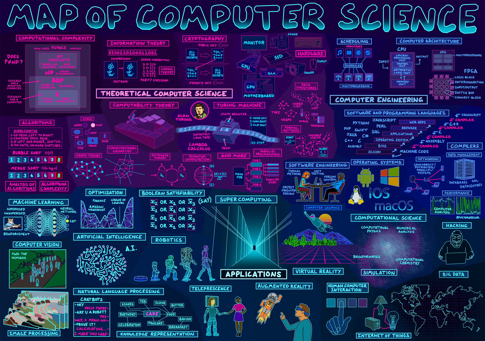
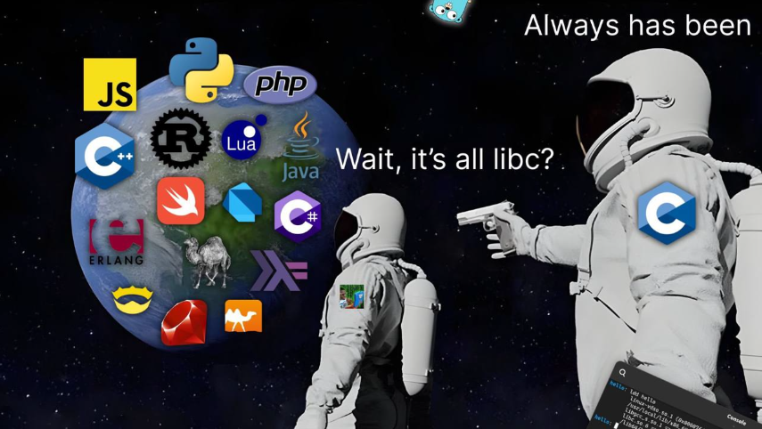
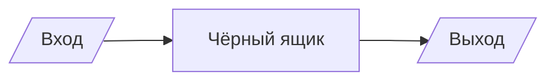
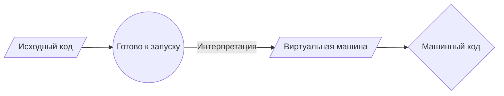
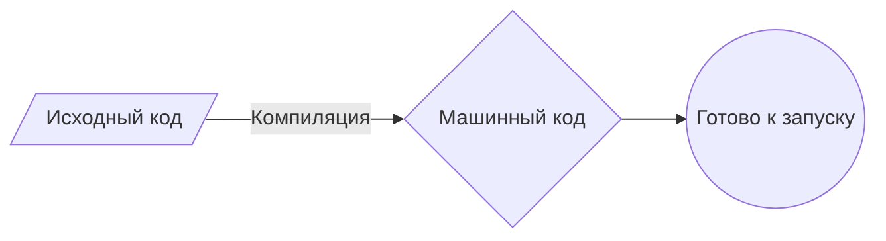

# Введение

<figure class="epigraph">
  <blockquote>
    <p>Фундаментальная задача связи состоит в том, чтобы воспроизвести в одной точке сообщение, выбранное в другой точке.</p>
  </blockquote>
  <figcaption>
    Клод Шеннон
  </figcaption>
</figure>

Информатика - это не наука о компьютерах. Компьютер здесь такой же инструмент, как телескоп у астронома: без него неудобно, но изучаем мы не его. Мы изучаем **как решать задачи так, чтобы решение можно было выполнить механически** - шаг за шагом, без озарений, без интуиции, без "ну ты понял".

Темы, которыми занимается информатика, представлены на этой карте:



Карта большая, и за один семестр её всю не пройти. Мы возьмём фундамент: как информация представляется в машине, что такое алгоритм, как оценивать его качество и как записать его так, чтобы компьютер понял.

---

## Почему в этом курсе Python

Авторы индекса TIOBE регулярно [публикуют](https://www.tiobe.com/tiobe-index/) рейтинг популярных языков программирования, и последние годы верхнюю строчку занимает [Python](https://www.python.org/).



Но популярность - не аргумент. Аргументы такие.

**Python не мешает.** Наша задача - научиться думать об алгоритмах. Любая строчка, потраченная на объявление типов, ручное управление памятью и заголовочные файлы, - это строчка, отнятая у сути задачи. Сравните:

```text
Псевдокод:   для каждой рыбы в списке: напечатать рыбу
Python:      for fish in fishes: print(fish)
```

Расстояние между псевдокодом и Python настолько мало, что вы будете писать почти то, что думаете. Это ровно то, что нужно на первом курсе.

**Батарейки в комплекте.** В стандартной библиотеке есть всё нужное для наших задач - работа с файлами, случайные числа, комбинаторика, хеширование. А на [PyPI](https://pypi.org/) лежат сотни тысяч сторонних модулей.

**Он читается вслух.** Код на Python можно почти буквально прочитать голосом и понять. Это важно, когда вы разбираете чужое решение или объясняете своё преподавателю на защите.

Есть и обратная сторона, о которой нужно знать честно: Python **медленный**. Программа на C может работать в десятки раз быстрее. Но, как мы уже говорили, выбор алгоритма влияет на скорость сильнее, чем выбор языка. Плохой алгоритм на C проиграет хорошему алгоритму на Python - и не в разы, а на порядки. Этому курсу важнее второе.

> **Итак: весь курс мы пишем на Python.** Всё, что нужно знать о самом языке, вы найдёте в файле `python` каждого занятия - материал там подобран ровно под задачи этого занятия и накапливается от раздела к разделу.


---

## Вычислительное мышление

По сути, программирование - это получение входных данных и создание выходных, то есть решение задачи. То, что происходит между входом и выходом - то, что мы можем назвать "чёрным ящиком", - и является основной темой данного курса.



Наполнить этот ящик - ваша работа. И прежде чем наполнять, нужно договориться о самой скучной и самой важной вещи: **в каком виде вход и выход вообще существуют внутри машины**.

> **Как устроено это занятие.** По ходу конспекта вам встретятся шестнадцать задач с меткой 📝 - это **обязательные задания**, разминка на базовый синтаксис. Решайте их сразу, как дочитаете до них, и не копите на конец.
>
> Весь нужный Python разобран в [Python-конспекте](python.md) этого занятия. Балльные задачи - в [файле задач](task.md).

---

# Часть 1. Как машина хранит информацию

## Бит

Например, нам необходимо вести учёт посещаемости занятий. Для подсчёта мы можем использовать систему, называемую унарной: по одному пальцу за раз. Сегодня компьютеры считают с помощью системы, называемой двоичной. Именно от термина "двоичная цифра" (**bi**nary dig**it**) мы получили знакомое нам понятие **бит**. Бит - это ноль или единица.

Компьютеры говорят только в терминах нулей и единиц. Ноль обозначает выключено, единица - включено. Компьютер - это миллионы, а может быть, и миллиарды транзисторов, которые включаются и выключаются.

Почему именно два состояния, а не десять? Потому что "есть напряжение / нет напряжения" различить легко и надёжно, а вот десять уровней напряжения на одном проводе различать при помехах - мучение. Двоичная система - это компромисс в пользу надёжности.

Если представить себе лампочку, то одна лампочка может считать только от нуля до единицы. Однако если у вас будет три лампочки, то возможностей станет больше.

При использовании трёх лампочек ноль может быть представлен так:

```
0 0 0
```

Единица:

```
0 0 1
```

По этой логике можно предположить, что следующее число равно двум:

```
0 1 0
```

Расширяя эту логику, три:

```
0 1 1
```

Четыре:

```
1 0 0
```

Фактически, используя только три лампочки, мы можем досчитать до семи:

```
1 1 1
```

Каждая позиция здесь - это степень двойки:

```
  2^2 2^1 2^0
   4   2   1
```

Поэтому можно сказать, что для представления числа семь требуется три бита (разряд четвёрок, разряд двоек и разряд единиц).

В компьютерах для представления числа обычно используется восемь разрядов - **байт**. Например, `00000101` - это число 5 в двоичном виде.

> **Сколько чисел помещается в `n` бит?** Ровно $2^n$: от $0$ до $2^n - 1$. В байте - 256 значений, от 0 до 255. Запомните эту формулу, она встретится ещё много раз.

---

## Системы счисления

**Система счисления** - символический метод записи чисел, представление чисел с помощью письменных знаков.

- **Число** - некоторая абстрактная сущность, мера для описания количества чего-либо.
- **Цифры** - знаки, используемые для записи чисел.

Разница принципиальна. Число "двадцать пять" существует само по себе. А `25`, `31` в восьмеричной, `11001` в двоичной и `XXV` - это четыре разные *записи* одного и того же числа.

Цифры бывают разные: самыми распространёнными являются арабские цифры, представляемые знаками от нуля (0) до девяти (9); менее распространены римские цифры, их можно встретить на циферблате часов или в обозначении века (XIX век).

Поскольку чисел гораздо больше, чем цифр, для записи числа обычно используется набор (комбинация) цифр. Существует много способов записи чисел с помощью цифр, называемых системой счисления. Величина числа может зависеть от порядка цифр в записи, а может и не зависеть. Это свойство позволяет разделить все системы счисления на группы:

- унарные;
- непозиционные;
- смешанные;
- позиционные.

### Унарные

Палочки на полях, зарубки на дереве, черта за каждого пришедшего студента. Одна палочка - одна единица. Записать миллион - удачи.

### Непозиционные

В непозиционных системах счисления величина числа не зависит от положения цифр в записи. Если к каждой цифре приписать знак номинала, то такие составные знаки (цифра + номинал) уже можно перемешивать.

Примером "рафинированной" непозиционной системы счисления является [римская система](https://ru.wikibooks.org/wiki/Римская_система_счисления). `XVI` и `IXV` - если бы римская система была строго непозиционной, обе записи означали бы 16. На практике римляне всё-таки подсматривали на позицию (`IV` = 4, а `VI` = 6), поэтому система получилась смешанной.

### Смешанные

Денежные знаки - пример смешанной системы счисления.

Сейчас в России используются монеты и купюры следующих номиналов: по 5, 10, 50 копеек и по 1, 2, 5, 10, 50, 100, 200, 500, 1000, 2000, 5000 рублей. Чтобы получить некоторую сумму в рублях, нужно использовать некоторое количество денежных знаков различного достоинства.

Предположим, что пылесос стоит 6379 рублей. Для покупки можно использовать шесть купюр по тысяче рублей, три купюры по сто рублей, одну пятидесятирублёвую купюру, две десятки, одну пятирублёвую монету и две монеты по два рубля. Если записать количество купюр или монет начиная с 1000 руб. и заканчивая пятью копейками, заменяя нулями неиспользуемые номиналы, то получится число 600312120000.

Если перемешать цифры в числе 600312120000, оно представит совсем другую цену. Следовательно, позиция здесь важна.

### Позиционные системы счисления

Позиционные системы счисления - это системы счисления, в которых значение цифры напрямую зависит от её положения в числе. Например, запись `01` обозначает единицу, а `10` - десять.

Позиционные системы счисления позволяют легко производить арифметические расчёты.

Представление чисел с помощью арабских цифр - самая распространённая позиционная система счисления, она называется десятичной. Десятичной она называется потому, что использует десять цифр: 0, 1, 2, 3, 4, 5, 6, 7, 8 и 9. Заметьте: максимальная цифра (9) на единицу меньше количества цифр (10).

Для составления машинных кодов удобно использовать не десятичную, а двоичную систему счисления, содержащую только две цифры, 0 и 1. Обратите внимание, что в двоичной системе максимальная цифра - 1.

Программисты для вычислений также пользуются восьмеричной и шестнадцатеричной системами счисления.

Количество цифр, используемых в системе счисления, называется её **основанием**. В десятичной системе основание равно десяти, в двоичной - двум, в восьмеричной и шестнадцатеричной - соответственно восьми и шестнадцати. В системе с основанием $f$ используются цифры от $0$ до $f - 1$.

---

## Как устроена позиционная запись

В общем случае число в позиционной системе счисления с основанием $f$ записывается набором цифр

$$(a_{n-1} \, a_{n-2} \, \ldots \, a_1 \, a_0)_f$$

где каждая $a_i$ - цифра, а $f$ - основание. Если система десятичная, индекс $f$ обычно опускают.

Примеры записи одного и того же числа:

1. $25_{10}$ - в десятичной системе: $a_1 = 2,\; a_0 = 5$
2. $31_{8}$ - в восьмеричной: $a_1 = 3,\; a_0 = 1$
3. $221_{3}$ - в троичной: $a_2 = 2,\; a_1 = 2,\; a_0 = 1$
4. $11001_{2}$ - в двоичной: $a_4 = 1,\; a_3 = 1,\; a_2 = 0,\; a_1 = 0,\; a_0 = 1$

### Из любой системы в десятичную

Такая запись обозначает вот такое число:

$$a_{n-1} f^{\,n-1} + a_{n-2} f^{\,n-2} + \ldots + a_1 f^{\,1} + a_0 f^{\,0}$$

Следовательно, мы можем разложить числа из приведённого выше примера:

1. $25_{10} = 2 \cdot 10^1 + 5 \cdot 10^0 = 20 + 5 = 25$
2. $31_{8} = 3 \cdot 8^1 + 1 \cdot 8^0 = 24 + 1 = 25$
3. $221_{3} = 2 \cdot 3^2 + 2 \cdot 3^1 + 1 \cdot 3^0 = 18 + 6 + 1 = 25$
4. $11001_{2} = 1 \cdot 2^4 + 1 \cdot 2^3 + 0 \cdot 2^2 + 0 \cdot 2^1 + 1 \cdot 2^0 = 16 + 8 + 1 = 25$

Правило простое: **умножь каждую цифру на основание в степени её позиции и сложи**. Позиции нумеруются справа налево, начиная с нуля.

### Из десятичной в любую другую

Мы разобрали, как узнать, чему равно число в любой системе счисления. Но как нам получить эту запись? Пусть у нас есть число $A$, и мы хотим получить его представление в системе по основанию $f$.

Что будет, если мы поделим $A$ на $f$? Распишем:

$$\frac{a_{n-1} f^{\,n-1} + \ldots + a_2 f^{\,2} + a_1 f^{\,1} + a_0 f^{\,0}}{f} = a_{n-1} f^{\,n-2} + \ldots + a_2 f^{\,1} + a_1 f^{\,0}$$

и остаток от деления $a_0$.

Почему именно $a_0$? Все члены суммы, кроме последнего, делятся на $f$ без остатка, а последний член $a_0$ в результате деления даёт $0$ и $a_0$ в остатке - ведь максимальное значение цифры всегда на единицу меньше основания системы, значит $a_0 < f$.

Итак, мы получили самую правую цифру $a_0$ как остаток, а всё остальное число сдвинулось на разряд вправо. Если продолжать делить, то получим все цифры $a_1, a_2, \ldots, a_{n-1}$. **Цифры получаются в обратном порядке** - от младшей к старшей, поэтому в конце результат нужно перевернуть.

Возьмём для примера полюбившееся нам число $25$ и получим его представление в двоичной системе счисления:

| Деление | Частное | Остаток |
| - | - | - |
| $25 / 2$ | 12 | **1** |
| $12 / 2$ | 6 | **0** |
| $6 / 2$ | 3 | **0** |
| $3 / 2$ | 1 | **1** |
| $1 / 2$ | 0 | **1** |

Читаем остатки снизу вверх: $11001_2$.

Представим число $25$ в троичной системе счисления:

- $25 / 3 = 8$, остаток $1$
- $8 / 3 = 2$, остаток $2$
- $2 / 3 = 0$, остаток $2$

Получаем $221_3$.

Представим число $25$ в восьмеричной системе счисления:

- $25 / 8 = 3$, остаток $1$
- $3 / 8 = 0$, остаток $3$

Получаем $31_8$.

Представим число $25$ в десятичной системе счисления:

- $25 / 10 = 2$, остаток $5$
- $2 / 10 = 0$, остаток $2$

Получаем $25_{10}$ - метод работает и здесь, что неудивительно.

---

### 📝 Задача 1. Метры в сантиметры


> **Файл:** `task_01.py` | **Функция:** `meters_to_centimeters(meters)`

Дано расстояние в метрах. Переведите метры в сантиметры.

Функция возвращает число. При запуске файла напрямую программа должна спросить расстояние у пользователя и напечатать результат в формате:

```
Distance in centimeters: 500
```

```python
meters_to_centimeters(5)     # 500
meters_to_centimeters(0.5)   # 50.0
```

### 📝 Задача 2. Байты и килобайты


> **Файл:** `task_02.py` | **Функции:** `bytes_to_kilobytes(value)`, `kilobytes_to_bytes(value)`

Переведите введённое пользователем число в байты или килобайты в зависимости от выбора пользователя. В этом задании нужно создать **две функции** - по одной на каждое направление перевода.

В одном килобайте 1024 байта.

```python
bytes_to_kilobytes(2048)   # 2.0
kilobytes_to_bytes(2)      # 2048
```

При запуске файла напрямую программа спрашивает у пользователя число и направление перевода, а затем печатает результат.

---

## Двоичная арифметика

В компьютерной технике очень часто используется двоичная система счисления. Такую систему легко реализовать в электронике (полупроводниковые транзисторы и микросхемы), так как для неё требуется всего два устойчивых состояния. В реальном устройстве это может быть реализовано присутствием какого-либо физического явления или его отсутствием: есть электрический заряд или нет, есть напряжение или нет, есть ток или нет, отражает свет или нет, намагничено или не намагничено, есть отверстие или нет.

Переведём число из двоичной системы счисления в десятичную:

$$10101010_2 = 1 \cdot 2^7 + 0 \cdot 2^6 + 1 \cdot 2^5 + 0 \cdot 2^4 + 1 \cdot 2^3 + 0 \cdot 2^2 + 1 \cdot 2^1 + 0 \cdot 2^0 = 128 + 32 + 8 + 2 = 170$$

Арифметика в двоичной системе работает ровно так же, как в десятичной, - только переполнение разряда наступает не после 9, а после 1.

**Сложение:**

```
  1001
+ 1010
--
 10011
```

**Вычитание:**

```
  1110
- 0101
--
  1001
```

**Умножение** (это просто сложение сдвинутых копий - заметьте, умножать в двоичной системе легче, чем в десятичной: таблица умножения состоит из $0 \cdot 0$, $0 \cdot 1$ и $1 \cdot 1$):

```
     1110
   * 0101
   --
     1110
    0000
   1110
  0000
  ---
  1000110
```

**Деление** столбиком:

```
1000110 | 101
 101    ---
 -     0001110
  111
  101
  -
   101
   101
   -
     0
```

---

### 📝 Задача 3. Делитель


> **Файл:** `task_03.py` | **Функция:** `is_divisor(a, b)`

Определите, является ли число `a` делителем числа `b`. Функция возвращает `True` или `False`.

Подумайте отдельно, что должно происходить при `a = 0`: на ноль делить нельзя, поэтому нулевой делитель не подходит никогда.

```python
is_divisor(3, 12)   # True
is_divisor(5, 12)   # False
is_divisor(0, 12)   # False
is_divisor(7, 0)    # True
```

### 📝 Задача 4. Обмен значениями


> **Файл:** `task_04.py` | **Функция:** `swap(a, b)`

Пользователь вводит два числа. Необходимо поменять значения местами: значение первого должно оказаться во втором, а второго - в первом.

Попробуйте сделать это и на Python: **без создания третьей переменной и без записи `a, b = b, a`**.

---

## Восьмеричная и шестнадцатеричная системы

Компьютерам очень удобно оперировать двоичными числами, но люди не привыкли работать с большим количеством цифр. Например, чтобы представить в двоичном виде число 1234, потребуется 11 двоичных цифр (`10011010010`). Поэтому были придуманы восьмеричная и шестнадцатеричная системы счисления. Они удобны тем, что для представления числа требуется меньшее количество разрядов, а перевод в двоичное представление тривиален: мы как будто разбили двоичное число на группы по три или четыре разряда и каждой двоичной комбинации придумали значок.

Таблица для восьмеричных цифр:

| Двоичная комбинация | Символ |
| - | - |
| 000 | 0 |
| 001 | 1 |
| 010 | 2 |
| 011 | 3 |
| 100 | 4 |
| 101 | 5 |
| 110 | 6 |
| 111 | 7 |

Таблица для шестнадцатеричных цифр:

| Двоичная комбинация | Символ | Двоичная комбинация | Символ |
| - | - | - | - |
| 0000 | 0 | 1000 | 8 |
| 0001 | 1 | 1001 | 9 |
| 0010 | 2 | 1010 | A |
| 0011 | 3 | 1011 | B |
| 0100 | 4 | 1100 | C |
| 0101 | 5 | 1101 | D |
| 0110 | 6 | 1110 | E |
| 0111 | 7 | 1111 | F |

Перевод произвести очень просто. Посмотрим на примере числа `010011010010`.

Разбиваем его на группы по три цифры (справа налево!): `010 011 010 010`. По таблице переводим: $2322_8$.

Чтобы перевести число в шестнадцатеричное представление, разбиваем двоичное число на группы по четыре цифры: `0100 1101 0010`. По таблице переводим: $4D2_{16}$.

> Если цифр не хватает на полную группу - дописывайте нули слева. Число `1101101` в восьмеричной: `001 101 101` = $155_8$.

В программистских кругах шестнадцатеричные числа принято предварять значком `0x` (например, `0x4D2`) - такое написание пошло от языка программирования C. Иногда используется значок `$` (например, `$4D2`) - эта нотация произошла от Pascal. В литературе встречаются буквы "h" (от англ. *hexadecimal*) и "b" (от англ. *binary*) для обозначения соответственно шестнадцатеричных и двоичных чисел (например, `FFh` или `1011b`).

### Шестидесятеричная система

Способ, которым мы представляем время на часах, - пример шестидесятеричной позиционной системы счисления. В представлении времени используется три позиции: для часов, минут и секунд. Так как для каждой позиции требуется 60 цифр, а у нас только десять, для каждой шестидесятеричной позиции используются две десятичные цифры (00, 01, 02, ..., 59), а позиции разделяются двоеточием:

```
h:m:s
```

Чтобы получить время в секундах, мы считаем по знакомой формуле позиционной записи:

$$h \cdot 60^2 + m \cdot 60^1 + s \cdot 60^0 = 3600h + 60m + s$$

Эта система досталась нам от шумеров и вавилонян и держится уже четыре тысячи лет. Хороший повод задуматься о том, что технические решения живут дольше, чем цивилизации, которые их приняли.

---

# Часть 2. Как машина хранит всё остальное

Всё, что вы видите на экране, - числа. Все числа - биты. Разница между текстом, картинкой и звуком - только в **договорённости о том, как эти биты читать**. Такая договорённость называется кодировкой или форматом.

## Текст

Подобно тому, как числа представляют собой двоичную комбинацию единиц и нулей, буквы также представляются с помощью единиц и нулей. Поскольку сами единицы и нули, обозначающие цифры и буквы, ничем не отличаются, был создан стандарт **ASCII**, позволяющий сопоставить определённые буквы определённым числам.

Например, букве `A` было решено сопоставить число 65.

Если вы получили текстовое сообщение, то в двоичном виде оно может представлять собой числа `72`, `73` и `33`. Если перевести их по таблице ASCII, то сообщение будет выглядеть так:

```
 H   I   !
72  73  33
```

Небольшой фрагмент таблицы ASCII, который стоит запомнить:

| Символ | Код | Символ | Код | Символ | Код |
| - | - | - | - | - | - |
| `space` | 32 | `A` | 65 | `a` | 97 |
| `!` | 33 | `B` | 66 | `b` | 98 |
| `0` | 48 | `Z` | 90 | `z` | 122 |
| `9` | 57 | | | | |

Заметьте два полезных факта: цифры идут подряд (поэтому `код символа - 48` даёт саму цифру), а строчные буквы отстоят от заглавных ровно на 32. Мы будем этим пользоваться в разделе о криптографии.

Полная таблица - в [статье про ASCII](https://ru.wikipedia.org/wiki/ASCII).

## Unicode и эмодзи

Семи бит ASCII хватает на 128 символов - английский алфавит, цифры и знаки препинания. Русского алфавита там уже нет, не говоря о китайском.

Поскольку в такой схеме не хватало номеров для всех символов, которые придумало человечество, стандарт **Unicode** расширил диапазон: сейчас в нём больше 149 тысяч символов, включая эмодзи.

Информатики столкнулись с интересной проблемой, когда захотели присвоить эмодзи разные оттенки кожи. Решение оказалось элегантным: базовый символ ("человек") и модификатор тона кожи - это два отдельных кодовых пункта, которые при отображении склеиваются в один значок. Именно поэтому длина строки с эмодзи в программе может неприятно вас удивить: то, что выглядит как один символ, внутри может состоять из нескольких.

При желании можно узнать больше о [Unicode](https://ru.wikipedia.org/wiki/Юникод) и [эмодзи](https://ru.wikipedia.org/wiki/Эмодзи).

## Цвет

Красный, зелёный и синий (так называемый `RGB`) - это комбинация трёх чисел, по одному байту на канал. Каждый канал - яркость соответствующего света от 0 до 255.

| Цвет | R | G | B |
| - | - | - | - |
| Чёрный | 0 | 0 | 0 |
| Белый | 255 | 255 | 255 |
| Красный | 255 | 0 | 0 |
| Жёлтый | 255 | 255 | 0 |
| Наш пример `HI!` | 72 | 73 | 33 |

Используемые нами ранее значения 72, 73 и 33, обозначающие в тексте `HI!`, будут интерпретированы программой просмотра изображений как тёмный болотно-жёлтый цвет.

**Одни и те же три байта** - это либо строка `HI!`, либо один пиксель. Разницу делает не содержимое памяти, а то, какая программа её читает.

## Изображения, видео и звук

- **Изображения** - это наборы RGB-значений: прямоугольная сетка пикселей.
- **Видео** - последовательность из множества изображений, которые показывают одно за другим, подобно перекидному блокноту.
- **Звук** - последовательность чисел, каждое из которых показывает положение мембраны динамика в конкретный момент времени. Музыку можно хранить и иначе, например в виде MIDI-данных: не сам звук, а инструкции "нота ля, громкость такая-то, длительность такая-то".

Прикиньте объём: секунда несжатого стереозвука CD-качества - это $44100 \times 2 \times 2 = 176\,400$ байт. Полтора часа фильма в разрешении $1920 \times 1080$ при 24 кадрах в секунду без сжатия - около 800 гигабайт. Именно поэтому существуют алгоритмы сжатия, к одному из которых (алгоритм Хаффмана) мы вернёмся в разделе про деревья.

---

### 📝 Задача 5. Приветствие


> **Файл:** `task_05.py` | **Функция:** `greet(username)`

Программа запрашивает у пользователя имя и приветствует его.

```python
greet("Валерий")   # 'Hello, Валерий'
```

### 📝 Задача 6. Эхо числа


> **Файл:** `task_06.py` | **Функция:** `echo_number(number)`

Программа принимает число и возвращает сообщение о нём.

```python
echo_number(42)   # 'Thats the number you entered 42'
```

### 📝 Задача 7. Сравнение двух чисел


> **Файл:** `task_07.py` | **Функция:** `compare(m, n)`

Если `m` больше `n` - вернуть `"Number m > n"`. Если `m` меньше `n` - `"Number m < n"`. Иначе - `"The numbers are equal"`.

```python
compare(5, 3)   # 'Number m > n'
compare(3, 5)   # 'Number m < n'
compare(4, 4)   # 'The numbers are equal'
```

### 📝 Задача 8. Год столетия


> **Файл:** `task_08.py` | **Функция:** `century_message(name, age, current_year)`

Программа просит пользователя ввести своё имя и возраст и печатает адресованное ему послание с указанием года, в котором ему исполнится 100 лет.

```python
century_message("Аня", 20, 2025)   # 'Аня, тебе исполнится 100 лет в 2105 году'
```

Год берётся параметром, а не из системного времени, - так функцию можно проверить. В блоке `if __name__ == "__main__":` возьмите текущий год так:

```python
from datetime import date
current_year = date.today().year
```

---

# Часть 3. Алгоритмы

Решение задач занимает центральное место в информатике и программировании.

Представьте себе базовую задачу - найти в телефонном справочнике одно имя. Как можно решить эту задачу?

1. **Читать подряд.** Открыть первую страницу, потом следующую, и так до конца.
2. **Читать через одну.** Открывать сразу по две страницы за раз - вдвое быстрее.
3. **Делить пополам.** Открыть справочник посередине и спросить: имя, которое я ищу, слева или справа? Затем повторить этот процесс с нужной половиной, разрезая задачу пополам и ещё раз пополам.

Каждый из этих подходов - алгоритм. Скорость их работы принято описывать в так называемой нотации **"большого O"**:

| Алгоритм | Сложность | Шагов для книги на 1000 страниц |
| - | - | - |
| Читать подряд | $O(n)$ | до 1000 |
| Читать через одну | $O(n/2) = O(n)$ | до 500 |
| Делить пополам | $O(\log n)$ | до 10 |

Обратите внимание на две вещи.

Первое: второй алгоритм всё равно $O(n)$. Нотация "большого O" игнорирует постоянные множители - она отвечает не на вопрос "сколько именно шагов", а на вопрос **"как быстро растёт число шагов, когда задача растёт"**. Вдвое быстрее - это всё равно "пропорционально размеру".

Второе: разница между $O(n)$ и $O(\log n)$ не просто "заметная". Удвойте книгу - первому алгоритму понадобится вдвое больше шагов, а третьему - всего на один шаг больше. На миллиарде записей это разница между одиннадцатью днями и тридцатью миллисекундами.

Подробно нотацией "большого O" мы займёмся на третьем занятии. Пока запомните главное: **выбор алгоритма влияет на скорость сильнее, чем выбор языка, компилятора или процессора**.

---

### 📝 Задача 9. Наибольшее из трёх


> **Файл:** `task_09.py` | **Функция:** `max_of_three(a, b, c)`

Пусть `a`, `b`, `c` - три введённых числа. Верните наибольшее из них.
 

```python
max_of_three(1, 2, 3)     # 3
max_of_three(10, 2, 3)    # 10
max_of_three(1, 1, 1)     # 1
max_of_three(-5, -2, -9)  # -2
```

### 📝 Задача 10. Номер минимального элемента


> **Файл:** `task_10.py` | **Функция:** `index_of_min(values)`

Найдите **индекс** минимального элемента списка. Если минимум встречается несколько раз - верните индекс первого вхождения. Для пустого списка верните `-1`.

```python
index_of_min([10, -3, -5, 2, 5])   # 2
index_of_min([1, 2, 3])            # 0
index_of_min([4, 1, 1, 9])         # 1
index_of_min([])                   # -1
```


---

## Псевдокод

Умение писать *псевдокод* - ключевой навык как в этом курсе, так и в программировании вообще.

Псевдокод - это человекочитаемая версия вашего кода. Например, третий алгоритм из предыдущего раздела можно записать так:

```text
 1  Взять телефонный справочник
 2  Открыть на середине
 3  Посмотреть на страницу
 4  Если человек на этой странице
 5      Позвонить человеку
 6  Иначе если человек раньше в книге
 7      Открыть середину левой половины
 8      Вернуться к строке 3
 9  Иначе если человек дальше в книге
10      Открыть середину правой половины
11      Вернуться к строке 3
12  Иначе
13      Закончить: человека в книге нет
```

Псевдокодирование - очень важный навык по крайней мере по двум причинам. Во-первых, оно позволяет заранее продумать логику решения задачи, не отвлекаясь на синтаксис. Во-вторых, псевдокод можно показать другому человеку, и он поймёт вашу идею, даже если не знает вашего языка программирования.

Обратите внимание, что язык нашего псевдокода имеет несколько узнаваемых особенностей:

- Некоторые строки начинаются с глаголов: *взять*, *открыть*, *посмотреть*. Дальше мы будем называть их **функциями**.
- Некоторые строки содержат выражения вида `если` / `иначе если`. Они называются **условиями**.
- Есть выражения, которые могут быть либо истинны, либо ложны: "человек раньше в книге". Мы называем их **булевыми выражениями**.
- Есть указания вида "вернуться к строке 3". Это **циклы**.

Четыре конструкции - функции, условия, булевы выражения и циклы - составляют почти всё, из чего строятся программы. Всё остальное - удобства.

> Строка 13 - самая важная в этом псевдокоде. Она отвечает на вопрос "а что, если человека в книге нет". Алгоритм, который не описывает, что делать в неудачном случае, - это не алгоритм, а половина алгоритма. Привыкайте задавать себе этот вопрос сразу.

---

### 📝 Задача 11. Гости и места


> **Файл:** `task_11.py` | **Функция:** `guests_by_seat(seats)`

На мероприятие приглашены $n$ гостей. Им предлагают занять места с номерами от $1$ до $n$ в зале. Гости занимают эти места в произвольном порядке. Известно, на какое место сел очередной гость.

Выпишите для каждого места номер гостя, который на него сел.

**Вход:** список `seats` длины $n$, где `seats[k]` - номер места (от 1 до $n$), на которое сел $(k+1)$-й гость.

**Выход:** список длины $n$, где элемент с индексом $k$ - номер гостя, севшего на место $k+1$.

$n$ не превосходит $20000$.

```python
guests_by_seat([1, 2, 3, 5, 4])
# [1, 2, 3, 5, 4]

guests_by_seat([11, 6, 8, 2, 10, 9, 4, 7, 3, 1, 5])
# [10, 4, 9, 7, 11, 2, 8, 3, 6, 5, 1]
```

Разберите второй пример руками, прежде чем писать код. Первый гость сел на место 11 - значит, на месте 11 сидит гость номер 1. Второй сел на место 6 - на месте 6 сидит гость 2. И так далее.

> Решение в лоб - для каждого места пробежать весь список гостей - работает за $n^2$ операций. При $n = 20000$ это 400 миллионов проверок. Существует решение за $n$ операций. Найдите его: заведите список нужного размера заранее и заполняйте его напрямую по индексу.


---

### 📝 Задача 12. Наименьшее расстояние


> **Файл:** `task_12.py` | **Функция:** `shortest_distance(kilometers, meters)`

Известны два расстояния: одно задано в километрах, другое - в метрах. С помощью условной конструкции определите наименьшее из них.

Функция возвращает наименьшее расстояние **в метрах**.

```python
shortest_distance(1, 500)    # 500   (1 км = 1000 м, значит 500 м меньше)
shortest_distance(0.2, 900)  # 200
shortest_distance(1, 1000)   # 1000  (равны - возвращаем это значение)
```

---

# Часть 4. На чём мы будем писать

За время существования вычислительной техники было придумано множество языков программирования. По данным [Википедии](https://en.wikipedia.org/wiki/List_of_programming_languages), официально зарегистрировано около **700** языков; согласно другим тематическим источникам, их количество достигает **9000**.

Представьте, что вы хотите объяснить кому-то, **как приготовить бутерброд**. Вы используете слова, жесты - ваш общий язык. Так вот, **язык программирования - это такой же набор правил, только для общения с железной коробкой, полной транзисторов**.

## Насколько близко мы говорим с машиной

Есть языки, которые общаются с процессором почти на его родном языке. Это **низкоуровневые** языки.

- **Машинный код** - это самые базовые инструкции, которые процессор выполняет без всяких раздумий. По сути, это команды в виде единичек и ноликов.
- **Ассемблер** - уже немного проще. Он использует мнемоники, короткие словечки, которые соответствуют этим командам. Специальная программа-переводчик берёт этот код и превращает обратно в единички и нолики для процессора.

Чтобы использовать такие языки, нужно действительно понимать, как работает процессор изнутри. Это мощно, но сложно. Так пишут, например, операционные системы или драйверы.

А есть языки **высокоуровневые**. Они гораздо больше похожи на человеческий язык, часто на английский. Они говорят не с процессором, а с *программистом*. Вы пишете "напечатай это" или "посчитай то", а компилятор или интерпретатор сам разберётся, как объяснить это процессору. `C`, `C++`, `Python`, `Java` - все они из этой компании. Они создают новый, более удобный слой абстракции между вами и железом.

## Как компьютер выполняет то, что вы написали

Тут два главных пути.

**Интерпретация.** Представьте, что у вас есть друг-переводчик. Вы читаете ему фразу на непонятном языке, а он тут же её переводит и выполняет. Потом следующую, и так далее. `Python`, `Ruby` - такие. Это гибко: можно быстро что-то поменять и сразу посмотреть, что вышло.



**Компиляция.** Тут вы сначала отдаёте весь свой текст профессиональному переводчику (компилятору), он уходит в кабинет, думает и выдаёт готовую книжку на машинном языке. Потом вы просто отдаёте эту книжку кому угодно, и он её читает. `C`, `C++`, `Go` - компилируемые. Такие программы обычно работают быстрее, потому что вся работа по переводу уже сделана заранее. Но чтобы исправить опечатку, придётся снова идти к переводчику и переводить всю книгу заново.



Раньше разница в скорости была очень заметна, но сейчас придумали хитрые штуки вроде `JIT`-компиляции, которая старается взять лучшее от обоих подходов.

## Типизация

Как язык следит за тем, чтобы вы не пытались сложить число и слово "бутерброд"?

- **Статическая типизация** (как в `Java`, `C#`, `C++`). Это как строгий бухгалтер. Вы говорите: "Это переменная `a`, и она всегда будет целым числом". И потом, если вы попытаетесь записать в неё тот самый "бутерброд", бухгалтер возмутится ещё до того, как программа запустится. Это помогает ловить глупые ошибки на самом раннем этапе.
- **Динамическая типизация** (как в `Python`, `JavaScript`). Тут попроще. Вы можете сказать: "сегодня это число", а завтра - "а теперь это строка". Язык разберётся с этим уже во время выполнения. Это даёт кучу свободы, но иногда можно так запутаться, что сам чёрт ногу сломит.

## Языки, придуманые не для работы

Есть языки, придуманные чисто для веселья и чтобы почесать мозги. Их называют эзотерическими. Например, `Brainfuck`, где всего 8 команд. Или `Whitespace`, где весь код состоит из пробелов, табуляций и переносов строки - представьте, как выглядит программа. Или `LOLCODE`, который пародирует интернет-мемы про котов: `HAI`, `KTHXBYE`. Это полноценные языки, но попробуйте написать на них что-то серьёзное.

Есть и специальные языки для очень конкретных задач: для написания музыки, для описания ДНК, для запросов к базам данных. Они как специальные инструменты: попробуйте забить гвоздь микроскопом.

И, наконец, как мы вообще записываем программы:

- **Текстовые языки** - классика. Вы открываете редактор и пишете символы, слова, конструкции. Почти всё, что мы знаем, относится сюда.
- **Визуальные языки** - вы не пишете код, а собираете его из кубиков, как Lego, или рисуете схемы. Scratch для детей или LabVIEW для инженеров - отличные примеры.

Это целый зоопарк идей о том, как мы можем общаться с машинами. И самое прекрасное - нет одного правильного способа. Есть разные инструменты для разных задач и для разных людей.

---

### 📝 Задача 13. Таблица умножения


> **Файл:** `task_13.py` | **Функция:** `multiplication_table(n)`

Используя цикл `for`, постройте таблицу умножения для числа $n$ - от n $\times$ 1 до n $\times$ 10`.

Функция возвращает **список из 10 строк** вида `"7 x 3 = 21"`.

```python
multiplication_table(7)
# ['7 x 1 = 7',
#  '7 x 2 = 14',
#  ...
#  '7 x 10 = 70']
```

### 📝 Задача 14. Диаметр и сумма ряда


> **Файл:** `task_14.py` | **Функции:** `circle_diameter(radius)`, `sum_range(start, end)`

Две независимые функции в одном файле.

`circle_diameter(radius)` - по радиусу окружности возвращает её диаметр.

`sum_range(start, end)` - возвращает сумму всех целых чисел от `start` до `end` **включительно**.

```python
circle_diameter(5)        # 10
sum_range(100, 500)       # 120300
sum_range(1, 10)          # 55
sum_range(500, 500)       # 500
```

> Решите сначала циклом. А потом вспомните формулу Гаусса из конспекта второго занятия и подумайте, как обойтись вообще без цикла. Второй вариант - не обязателен, но полезен.

### 📝 Задача 15. Дней в месяце


> **Файл:** `task_15.py` | **Функция:** `days_in_month(month, year)`

Верните количество дней в заданном месяце заданного года.

**Входные данные:** номер месяца (от 1 до 12) и четырёхзначный год.

Не забудьте про високосные годы. Год високосный, если он делится на 4, **но** не делится на 100, **или** делится на 400. Именно поэтому 2000 год был високосным, а 1900 - нет.

```python
days_in_month(1, 2001)    # 31
days_in_month(2, 2001)    # 28
days_in_month(2, 2000)    # 29
days_in_month(2, 1900)    # 28
days_in_month(11, 2025)   # 30
```

> Модулем `calendar` пользоваться нельзя - он решает задачу за вас.

### 📝 Задача 16. Календарь месяца


> **Файл:** `task_16.py` | **Функция:** `month_calendar(start_weekday, days)`


Напечатайте месяц из календаря по заданному начальному дню недели и количеству дней.

- `start_weekday` - день недели, на который приходится 1-е число: `0` - понедельник, ..., `6` - воскресенье.
- `days` - количество дней в месяце.

Функция возвращает **одну строку**, в которой строки календаря разделены символом переноса `\n`.

Правила форматирования:

- в неделе 7 колонок, ширина каждой - 2 символа, колонки разделены одним пробелом;
- числа выравниваются по правому краю (`f"{day:2}"`);
- пустые клетки в начале первой недели заполняются пробелами;
- **хвостовых пробелов в конце строк быть не должно**.

Для месяца, начинающегося в воскресенье и содержащего 31 день:

```python
print(month_calendar(6, 31))
```

```
                   1
 2  3  4  5  6  7  8
 9 10 11 12 13 14 15
16 17 18 19 20 21 22
23 24 25 26 27 28 29
30 31
```

---

# Что дальше

Шестнадцать обязательных задач позади - это была разминка: вы научились вводить и выводить данные, считать, ветвиться, повторять и раскладывать задачу на функции. Балльные задачи ждут в [файле задач](task.md).

Если что-то из синтаксиса осталось непонятным - вернитесь к [Python-конспекту](python.md), там всё разобрано подробно. Настроить рабочее окружение поможет [приложение](../00-appendix/simple-ide.md).

## Источники

- Shannon C. A Mathematical Theory of Communication. Bell System Technical Journal, 1948.
- CS50: Introduction to Computer Science, Harvard University - лекция про представление информации.
- Петцольд Ч. Код: тайный язык информатики. Манн, Иванов и Фербер, 2019 - от азбуки Морзе до процессора.
