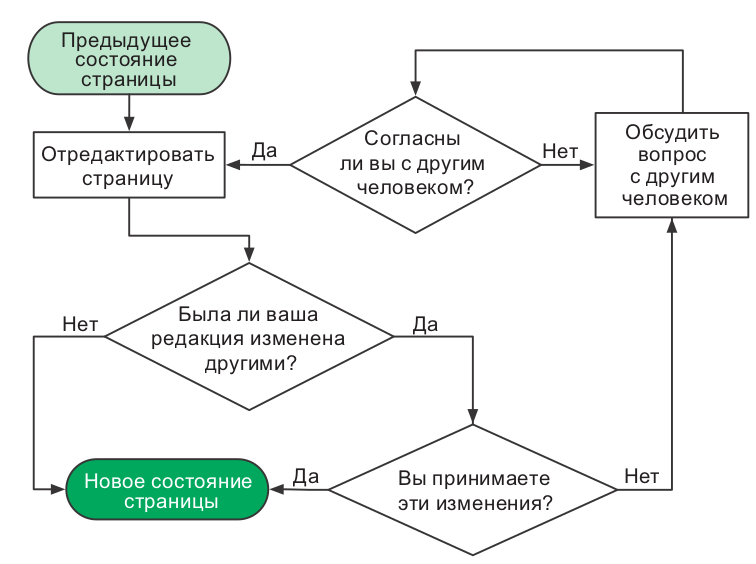
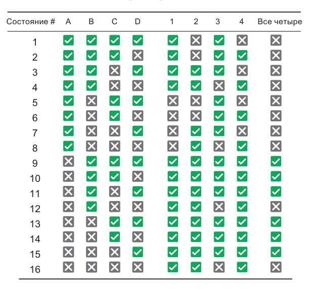
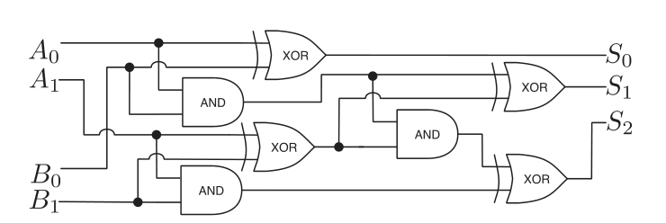
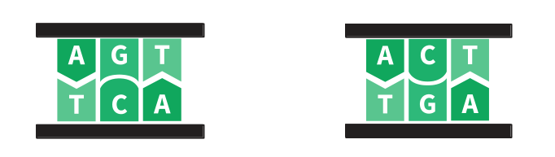

# Логика и комбинаторика

<figure class="epigraph">
  <blockquote>
    <p>Информатика не более наука о компьютерах, чем астрономия - наука о телескопах. Информатика неразрывно связана с математикой.</p>
  </blockquote>
  <figcaption>
    Эдсгер Дейкстра
  </figcaption>
</figure>

На прошлом занятии мы разобрались, как машина хранит информацию. Сегодня - как она с этой информацией рассуждает и считает варианты.

Занятие математическое, и это не случайность. Три навыка, которые мы разберём - записать процесс, рассуждать логически и посчитать количество вариантов - нужны программисту раньше, чем любой синтаксис. Оперативная память человеческого мозга легко переполняется фактами и идеями; всё, что здесь будет - это способы разгрузить голову, переложив часть работы на бумагу и на формулы.

> **Как устроено это занятие.** По ходу конспекта вам встретятся пять задач с меткой 📝 - это **обязательные задания**. Решайте их сразу, как дочитаете до них: каждая отрабатывает ровно тот кусок теории, который стоит выше. Не копите их на конец.
>
> Всё, что нужно из Python, лежит в [Python-конспекте](python.md) этого занятия. Балльные задачи - в [файле задач](task.md).

---

# Часть 1. Как записать процесс

Оказавшись перед сложной задачей, поднимитесь над её хитросплетениями и изложите самое важное на бумаге. Есть три способа это сделать, и мы разберём все три.

## Блок-схемы

Когда разработчики Википедии обсуждали, как организовать коллективную работу, они нарисовали блок-схему дискуссии. Договариваться проще, когда все инициативы перед глазами и объединены в общую картину.



Компьютерный код, как и процесс редактирования вики-страницы, по существу является процессом. Чтобы другие могли читать ваши блок-схемы, соблюдайте несколько правил:

- состояния и инструкции - в прямоугольниках;
- принятие решений, где процесс может пойти разными путями - в ромбах;
- никогда не смешивайте инструкцию и решение в одном блоке;
- каждый шаг соединён стрелкой с предыдущим;
- начало и конец процесса отмечены явно.

Посмотрим на задаче поиска наибольшего из трёх чисел:


Обратите внимание на две вещи. Во-первых, из каждого ромба выходит ровно две стрелки, "да" и "нет", и обе куда-то ведут. Ветка, которая никуда не ведёт - это забытый случай, будущая ошибка в программе. Во-вторых, присваивание `max <- C` встречается дважды. Это нормально: два разных пути рассуждения приводят к одному и тому же выводу.

## Псевдокод

Псевдокод выражает тот же процесс, но текстом. Это код, удобный для нашего восприятия и непонятный для машины. Вот та же задача:

```text
функция maximum(A, B, C)
    если A > B
        если A > C
            max <- A
        иначе
            max <- C
    иначе
        если B > C
            max <- B
        иначе
            max <- C
    вывести max
```

Блок-схема нагляднее, когда путей мало и хочется увидеть их все сразу. Псевдокод компактнее и лучше масштабируется. Пользуйтесь тем, что удобнее в конкретной задаче: оба способа делают одно и то же, вынимают структуру решения из головы наружу, где её можно рассмотреть и покритиковать.

## Математические модели

**Модель** - это набор идей, которые описывают задачу и её свойства. Модель помогает рассуждать и принимать решения.

У математических моделей есть большое преимущество: их можно приспособить для компьютера при помощи готовых, давно отлаженных методов. Если ваша модель основана на графах - берите теорию графов. Если она сводится к уравнениям - берите алгебру. Встаньте на плечи гигантов, которые эти инструменты сделали.

> **Загон для скота.**
> На ферме держат два вида животных. У вас есть **100 метров проволоки** на прямоугольный загон и перегородку внутри него, отделяющую одних животных от других. Как поставить забор, чтобы площадь пастбища была максимальной?

Начнём с того, что именно требуется определить. Пусть $w$ и $l$ - размеры пастбища, тогда $w \cdot l$ - его площадь.


Сделать площадь максимальной означает использовать всю проволоку, поэтому мы связываем $w$ и $l$ со стометровым запасом:

$$A = w \cdot l, \qquad 2w + 3l = 100$$

Подставим $l = \dfrac{100 - 2w}{3}$ из второго уравнения в первое:

$$A = \frac{100}{3}\,w - \frac{2}{3}\,w^2$$

Да это же квадратное уравнение! Его максимум находится по формуле, которую проходят в школе. Квадратные уравнения так же важны программисту, как хороший нож повару: они экономят время.

**Главное в этом примере не ответ, а порядок действий.** Сначала мы назвали неизвестные, потом записали то, что требуется максимизировать, потом записали ограничение, а потом свели две переменные к одной. Ровно так вы будете действовать в каждой оптимизационной задаче до конца курса.

### 📝 Задача 1. Загон для скота

> **Файл:** `pasture.py` | **Функции:** `pasture_area(wire, w)`, `best_pasture(wire)`

Доведите разобранную модель до кода.

**`pasture_area(wire, w)`** возвращает площадь загона, если на всё есть `wire` метров проволоки, а ширина равна `w`. Это прямая запись модели: выразите $l$ через `wire` и `w`, потом верните произведение.

**`best_pasture(wire)`** возвращает кортеж `(w, l, area)` с оптимальными размерами и максимальной площадью.

```python
pasture_area(100, 25)     # 416.666...
pasture_area(100, 10)     # 266.666...
pasture_area(100, 50)     # 0.0    вся проволока ушла на ширину

best_pasture(100)         # (25.0, 16.666..., 416.666...)
best_pasture(60)          # (15.0, 10.0, 150.0)
best_pasture(12)          # (3.0, 2.0, 6.0)
```

Решить `best_pasture` можно двумя способами, и полезно сделать обоими:

1. **Аналитически.** Найдите вершину параболы $A(w)$. Для $A = aw^2 + bw$ максимум достигается при $w = -\dfrac{b}{2a}$.
2. **Перебором.** Пройдите по значениям `w` с мелким шагом и возьмите лучшее. Способ грубый, зато работает и там, где формулы нет.

Сравните ответы. Если они разошлись - ошибка в модели, а не в коде.

> **Проверьте себя:** какое соотношение получается между $w$ и $l$ в оптимуме? Оно не зависит от длины проволоки - убедитесь на трёх примерах выше.

---

# Часть 2. Логика

Программистам приходится иметь дело с логическими задачами так часто, что от этого заходит ум за разум. При этом формальную логику мало кто изучал, ей пользуются интуитивно. Давайте сделаем это знание явным.

## Высказывания и переменные

В арифметике переменные обозначают числа, а операторы ($+$, $-$, $\cdot$) комбинируют их в выражения. В логике всё то же самое, только переменные обозначают не числа, а **истинность**: `True` или `False`.

Возьмём высказывание "если вода в бассейне тёплая, то я буду плавать". Оно опирается на два факта, каждый из которых либо верен, либо нет:

- $A$ - вода в бассейне тёплая;
- $B$ - я плаваю.

Переменная $B$ не может быть истинной наполовину: нельзя плавать отчасти. Именно в этом суть - **логика работает только там, где ответ строго да или нет.**

## Операторы

**Отрицание** $\lnot A$ (в Python `not A`) переворачивает значение:

- $\lnot A$ - вода в бассейне холодная;
- $\lnot B$ - я не плаваю.

**Импликация** $A \to B$ выражает зависимость: "если $A$, то $B$". Наше высказывание про бассейн - это ровно $A \to B$.

**Конъюнкция, дизъюнкция и исключающее ИЛИ** - AND, OR, XOR - самые известные, потому что чаще всего встречаются в коде в явном виде. Представим вечеринку, где подают вино и водку:

- $A$ - вы пили вино;
- $B$ - вы пили водку;
- $A \lor B$ - вы пили;
- $A \land B$ - вы пили и то и другое;
- $A \oplus B$ - вы пили, но не смешивали.


Проверьте себя по таблице. В ней перечислены все возможные комбинации двух переменных, а их, как мы сейчас увидим, всегда ровно $2^n$:

| $A$ | $B$ | $\lnot A$ | $A \to B$ | $A \leftrightarrow B$ | $A \land B$ | $A \lor B$ | $A \oplus B$ |
| - | - | - | - | - | - | - | - |
| 1 | 1 | 0 | 1 | 1 | 1 | 1 | 0 |
| 1 | 0 | 0 | 0 | 0 | 0 | 1 | 1 |
| 0 | 1 | 1 | 1 | 0 | 0 | 1 | 1 |
| 0 | 0 | 1 | 1 | 1 | 0 | 0 | 0 |

Две строки в этой таблице стоит рассмотреть отдельно.

**Импликация истинна, когда посылка ложна.** Строки 3 и 4: вода холодная ($A = 0$), а $A \to B$ всё равно истинно. Это не ошибка. Высказывание "если вода тёплая, то я плаваю" ничего не обещает про холодную воду, значит при холодной воде его невозможно нарушить, что бы вы ни делали. Обещание, которое нельзя нарушить, считается выполненным.

**Импликация выражается через дизъюнкцию:** $A \to B$ - это то же самое, что $\lnot A \lor B$. Сравните два столбца в таблице, они совпадают. Точно так же $A \oplus B$ - это $\lnot (A \leftrightarrow B)$.

## Контрапозиция

Пусть дано $A \to B$, и я при этом не плаваю. Что можно сказать про воду?

Тёплая вода влечёт плавание. Раз плавания нет - вода не могла быть тёплой. Это правило работает всегда:

> Для любых $A$ и $B$ высказывание $A \to B$ **тождественно** $\lnot B \to \lnot A$.

Обратите внимание, чего здесь **нет**. Из $A \to B$ не следует $B \to A$: то, что я плаваю, ещё не доказывает, что вода тёплая - может, я просто морж. Путать импликацию с её обращением - самая частая логическая ошибка, и не только у первокурсников.

## Булева алгебра

Булева алгебра позволяет упрощать логические выражения так же, как обычная алгебра упрощает числовые.

**Ассоциативность.** В цепочке из одних только AND (или из одних только OR) скобки не значат ничего, как в сумме или произведении чисел:

$$A \land (B \land C) = (A \land B) \land C, \qquad A \lor (B \lor C) = (A \lor B) \lor C$$

**Дистрибутивность.** В обычной алгебре мы раскрываем скобки: $a \cdot (b + c) = ab + ac$. В логике работает то же правило, причём в обе стороны:

$$A \land (B \lor C) = (A \land B) \lor (A \land C)$$

$$A \lor (B \land C) = (A \lor B) \land (A \lor C)$$

**Правило де Моргана.** Одновременно лета и зимы не бывает, значит у нас либо не лето, либо не зима. Формально:

$$\lnot(A \land B) = \lnot A \lor \lnot B, \qquad \lnot(A \lor B) = \lnot A \land \lnot B$$

Запомнить просто: **отрицание проходит внутрь скобок и переворачивает оператор.**

### Зачем это в коде

Это не отвлечённая математика, а инструмент, которым вы будете пользоваться каждый день. Вот условие, которое пишут первокурсники:

```python
if not (age >= 18 and has_passport):
    print("Отказано")
```

Читать его тяжело: чтобы понять, кому откажут, нужно мысленно раскрыть отрицание. Применим де Моргана:

```python
if age < 18 or not has_passport:
    print("Отказано")
```

Теперь условие читается вслух: "моложе восемнадцати или без паспорта". Тот же смысл, но понятно с первого раза. Умение переписать условие в читаемый вид - ровно то, что отличает поддерживаемый код от кода, который через месяц боятся трогать.

## Таблицы истинности

Ещё один способ разобраться в логической модели - перебрать все возможные сочетания её переменных. Каждой переменной соответствует столбец, каждой комбинации значений - строка.


Одна переменная требует двух строк. Чтобы добавить переменную, нужно **удвоить** число строк: старая таблица переписывается дважды, а новая переменная получает $0$ в первой копии и $1$ во второй.

Отсюда главный факт: **$n$ переменных дают $2^n$ строк.** Для трёх переменных 8 строк, для десяти уже 1024, для двадцати миллион. Поэтому таблицы истинности хороши, пока переменных немного; дальше нужны другие методы.

### 📝 Задача 2. Таблица истинности

> **Файл:** `truth_table.py` | **Функция:** `truth_table(n)`

Постройте все строки таблицы истинности для `n` логических переменных.

Функция возвращает **список кортежей** из нулей и единиц: все $2^n$ комбинаций в порядке возрастания двоичного числа.

```python
truth_table(1)
# [(0,), (1,)]

truth_table(2)
# [(0, 0), (0, 1), (1, 0), (1, 1)]

truth_table(3)
# [(0, 0, 0), (0, 0, 1), (0, 1, 0), (0, 1, 1),
#  (1, 0, 0), (1, 0, 1), (1, 1, 0), (1, 1, 1)]

truth_table(0)
# [()]
```

Обратите внимание на последний пример: у нуля переменных ровно одна комбинация, пустая. Это согласуется с формулой $2^0 = 1$.

> Не пишите `n` вложенных циклов: их количество заранее неизвестно.

## Хрупкая система

Посмотрим, как таблица истинности решает настоящую задачу.

> Нужно спроектировать СУБД, удовлетворяющую четырём требованиям:
>
> 1. если база данных заблокирована, то мы можем сохранить данные;
> 2. база данных не должна блокироваться при заполненной очереди запросов на запись;
> 3. либо очередь запросов на запись полна, либо полон кэш;
> 4. если кэш полон, то база данных не может быть заблокирована.
>
> Возможно ли это? При каких условиях такая система заработает?

Сначала переводим каждое требование в логику. Нужны четыре переменные:

| Переменная | Смысл | Требование |
| - | - | - |
| $A$ | база данных заблокирована | 1: $A \to B$ |
| $B$ | есть возможность сохранить данные | 2: $\lnot (A \land C)$ |
| $C$ | очередь запросов на запись полна | 3: $C \lor D$ |
| $D$ | кэш полон | 4: $D \to \lnot A$ |

Дальше строим таблицу истинности на все 16 комбинаций и добавляем столбцы-проверки для каждого требования:



Все четыре требования выполняются в состояниях 9-11 и 13-15. Во всех этих состояниях $A$ ложно, а значит вывод такой: **база данных не может быть заблокирована никогда.** Требования, которые казались независимыми, вместе запретили целую функцию системы, и мы узнали об этом до того, как написали первую строчку кода.

Запомните этот приём. Всегда, когда вы имеете дело с ситуациями "или так, или эдак", их можно смоделировать логическими переменными, а дальше упростить выражение и сделать выводы.

### 📝 Задача 3. Проверка законов логики

> **Файл:** `equivalence.py` | **Функция:** `are_equivalent(f, g, n)`

Два логических выражения **эквивалентны**, если дают одинаковый результат на всех возможных наборах значений переменных. Проверить это можно перебором: наборов всего $2^n$, а строить их вы уже умеете.

Функция принимает две функции `f` и `g` от `n` логических аргументов и возвращает `True`, если они эквивалентны.

```python
def de_morgan_left(a, b):
    return not (a and b)

def de_morgan_right(a, b):
    return (not a) or (not b)

def wrong(a, b):
    return (not a) and (not b)

are_equivalent(de_morgan_left, de_morgan_right, 2)   # True
are_equivalent(de_morgan_left, wrong, 2)             # False
```

Функцию можно вызвать, передав ей аргументы из кортежа, это делается звёздочкой:

```python
row = (0, 1)
f(*row)          # то же самое, что f(0, 1)
```

Дальше, в блоке `if __name__ == "__main__":`, проверьте своей функцией четыре утверждения из конспекта:

1. закон де Моргана: $\lnot(A \land B) = \lnot A \lor \lnot B$;
2. второй закон де Моргана: $\lnot(A \lor B) = \lnot A \land \lnot B$;
3. импликация через дизъюнкцию: $A \to B = \lnot A \lor B$;
4. контрапозиция: $A \to B = \lnot B \to \lnot A$.

Для импликации понадобится своя функция, в Python нет такого оператора:

```python
def implies(a, b):
    return (not a) or b
```

> **Со звёздочкой.** Дистрибутивность из конспекта записана для трёх переменных. Проверьте и её тоже - функция должна работать при любом `n`, а не только при двух.

## От логики к железу

Группы логических переменных могут представлять числа в двоичной форме, мы видели это на прошлом занятии. А логические операции над этими числами можно объединять в вычисления.

**Логический вентиль** - это электрическая схема, которая выполняет одну логическую операцию. Значения `True` и `False` представлены высоким и низким напряжением. Вентиль получает значения через входные контакты, делает работу и выдаёт результат через выходной.

Соберём из вентилей сумматор. Начнём с самого простого случая: сложить два бита.

| $A$ | $B$ | Сумма | Перенос |
| - | - | - | - |
| 0 | 0 | 0 | 0 |
| 0 | 1 | 1 | 0 |
| 1 | 0 | 1 | 0 |
| 1 | 1 | 0 | **1** |

Последняя строка - это $1 + 1 = 10_2$: в разряде остаётся ноль, а единица переносится в следующий разряд.

Посмотрите на столбец "Сумма" - это в точности $A \oplus B$. А столбец "Перенос" - это в точности $A \land B$. Значит, схема собирается из двух вентилей:


Эта схема называется **полусумматором**. Приставка "полу" означает, что она умеет складывать два бита, но не умеет принимать перенос из предыдущего разряда. Соединив два полусумматора, получают **полный сумматор**, а выстроив 64 полных сумматора в цепочку - устройство, складывающее 64-битные числа.



Проследите за ходом операций на схеме, не поленитесь. Здесь происходит важная вещь: **арифметика оказалась частным случаем логики.** Мы не учили схему складывать, мы записали таблицу истинности и собрали её из вентилей.

Именно поэтому вся эта часть - не отвлечённая математика. Современный центральный процессор представляет собой схему из миллиардов микроскопических вентилей, а булева алгебра - инструмент, которым эту схему упрощают. Меньше вентилей значит меньше транзисторов, меньше тепла и выше частота.

---

# Часть 3. Комбинаторика

Считать количество вариантов приходится постоянно: сколько паролей придётся перебрать, сколько маршрутов проверить, сколько состояний может принять программа. Умение оценить это число до того, как вы запустили программу, спасает часы, а иногда и годы машинного времени.

Разберём четыре инструмента: правило умножения, перестановки, сочетания и суммы.

## Правило умножения

> Если одно событие может произойти $n$ способами, а другое $m$ способами, то оба события вместе могут произойти $n \cdot m$ способами.


Дерево на рисунке объясняет, почему так: каждый из трёх вариантов футболки разветвляется на два варианта низа, а $3 + 3 = 3 \cdot 2$.

> **Взлом кода.**
> PIN-код состоит из двух цифр и одной латинской буквы. На ввод одного кода уходит секунда. Сколько времени в худшем случае займёт подбор?

Две цифры набираются $10 \cdot 10 = 100$ способами, буква 26 способами. Всего $100 \cdot 26 = 2600$ кодов. В худшем случае придётся перебрать все: 2600 секунд, то есть **43 минуты**. Такой замок не защищает ни от чего.

> **Формирование команды.**
> 23 человека хотят вступить в вашу команду. По каждому кандидату вы подбрасываете монету и берёте его только при выпадении орла. Сколько может получиться разных составов?

До начала набора состав один, вы сами. Каждый бросок монеты **удваивает** число возможных составов, и так 23 раза:

$$2 \cdot 2 \cdot \ldots \cdot 2 = 2^{23} = 8\,388\,608$$

Если вам это напомнило таблицу истинности - вы всё поняли правильно. Это одна и та же формула: $n$ независимых двоичных выборов дают $2^n$ исходов.

## Перестановки и факториал

Сколькими способами можно упорядочить $n$ различных элементов?

Первый элемент выбираем $n$ способами. После этого остаётся $n-1$ кандидат на второе место, потом $n-2$ на третье, и так далее. По правилу умножения:

$$n! = n \cdot (n-1) \cdot (n-2) \cdot \ldots \cdot 2 \cdot 1$$

Факториал растёт **взрывообразно**. Это не фигура речи, а рабочее наблюдение:

| $n$ | $n!$ |
| - | - |
| 5 | 120 |
| 10 | 3 628 800 |
| 15 | около $1{,}3 \cdot 10^{12}$ |
| 20 | около $2{,}4 \cdot 10^{18}$ |
| 25 | около $1{,}6 \cdot 10^{25}$ |

> **Коммивояжёр.**
> Ваша транспортная компания возит грузы в 15 городов. В каком порядке их объезжать, чтобы потратить меньше топлива? Если вычисление длины одного маршрута занимает микросекунду, сколько времени займёт проверка всех?

Каждая перестановка 15 городов - это новый маршрут, всего $15!$, то есть около $1{,}3 \cdot 10^{12}$. По микросекунде на маршрут выходит примерно **15 дней**. Добавьте пять городов, и понадобится **77 тысяч лет**.

Это первая задача в курсе, где перебор проигрывает не немного, а безнадёжно. К ней мы вернёмся в разделе про стратегии.

## Размещения

Часто нужно выбрать не все элементы, а только несколько, и порядок при этом важен.

> **Совершенная мелодия.**
> Девушка разучивает гамму из 13 нот и хочет прослушать все мелодии из 6 нот, где каждая нота встречается не больше раза. Каждая мелодия звучит секунду. Сколько времени это займёт?

Первую ноту выбираем 13 способами, вторую 12, и так шесть раз: $13 \cdot 12 \cdot 11 \cdot 10 \cdot 9 \cdot 8$. Этот обрубленный факториал записывают так:

$$A_n^k = \frac{n!}{(n-k)!}$$

Деление на $(n-k)!$ - это способ остановить факториал после $k$-го множителя. В нашем случае:

$$\frac{13!}{(13-6)!} = 1\,235\,520$$

Это **343 часа** непрерывного прослушивания. Лучше поискать идеальную мелодию другим способом.

## Перестановки с повторениями

Факториал $n!$ даёт **завышенное** число, если некоторые элементы одинаковы: перестановки, отличающиеся только местами одинаковых элементов - это одна и та же последовательность.

Если среди $n$ элементов есть $r$ одинаковых, то они между собой переставляются $r!$ способами, и каждая настоящая комбинация посчитана $r!$ раз. Значит, лишнее надо поделить:

$$\frac{n!}{r!}$$

Например, число различных перестановок букв в слове ENERGY, где буква E встречается дважды, равно $\dfrac{6!}{2!} = 360$.

> **Игры с ДНК.**
> Биолог изучает сегмент ДНК из 23 пар нуклеотидов, где 9 пар это A-T, а 14 это G-C. Сколько существует различных таких сегментов?

Сначала считаем все перестановки 23 пар и делим на повторы обоих видов:

$$\frac{23!}{9! \cdot 14!} = 817\,190$$

Но это ещё не всё. Нужно учесть **ориентацию** каждой пары: A-T и T-A это разные вещи.



Для каждой последовательности из 23 пар существует $2^{23}$ вариантов ориентации, поэтому итого:

$$817\,190 \cdot 2^{23} \approx 7 \cdot 10^{12}$$

Семь триллионов, и это для крошечного участка в 23 пары. Для сравнения: ДНК человека содержит около 3 миллиардов пар, продублированных в каждой из примерно 30 триллионов клеток тела.

## Сочетания

А если порядок **не** важен?


Логика та же, что с повторениями: каждый набор из $k$ элементов посчитан ровно $k!$ раз, по одному разу на каждый порядок. Делим на этот излишек и получаем **биномиальный коэффициент**:

$$\binom{n}{k} = \frac{n!}{k!\,(n-k)!}$$

Читается "из $n$ по $k$". Это, пожалуй, самая полезная формула комбинаторики: она встретится вам в теории вероятностей, в анализе алгоритмов и в задачах этого занятия.

> **Раздача карт.** Сколькими способами раздать 6 карт из 13 карт пиковой масти?
> 
> $$\binom{13}{6} = \frac{13!}{6! \cdot 7!} = 1716$$

> **Шахматные ферзи.** Сколькими способами расставить 8 ферзей на пустой доске 8 на 8, если ставить можно куда угодно?
> Выбираем 8 клеток из 64: $\binom{64}{8} \approx 4{,}4$ миллиарда.

### 📝 Задача 4. Комбинаторика вручную

> **Файл:** `counting.py` | **Функции:** `factorial(n)`, `arrangements(n, k)`, `combinations(n, k)`

Реализуйте три формулы, которые мы только что вывели.

**`factorial(n)`** - произведение всех целых от 1 до `n`. По определению $0! = 1$. Для отрицательного `n` верните `None`.

**`arrangements(n, k)`** - число размещений $A_n^k$: сколькими способами выбрать `k` элементов из `n`, **если порядок важен**.

**`combinations(n, k)`** - число сочетаний $\binom{n}{k}$: то же самое, но **порядок не важен**.

Для обеих: если `k > n` или любой аргумент отрицательный, верните `0`.

```python
factorial(0)          # 1
factorial(5)          # 120
factorial(-1)         # None

arrangements(13, 6)   # 1235520
arrangements(4, 2)    # 12
arrangements(5, 5)    # 120
arrangements(3, 5)    # 0

combinations(13, 6)   # 1716
combinations(4, 2)    # 6
combinations(64, 8)   # 4426165368
combinations(5, 0)    # 1
```

Сравните `arrangements(4, 2)` и `combinations(4, 2)` с рисунком выше: 12 и 6.

> **Подумайте:** вычисляя `combinations(64, 8)` через факториалы, вы посчитаете $64!$ - число из 90 цифр, чтобы получить ответ из 10 цифр. Как избежать этого? Подсказка: $\binom{n}{k} = \dfrac{A_n^k}{k!}$, а $A_n^k$ считается коротким произведением.

## Правило суммирования

Суммы последовательностей возникают в комбинаторике постоянно. Записываются они прописной греческой буквой сигма:

$$\sum_{i=1}^{n} \text{(выражение с участием } i)$$

Например, сумма первых пяти нечётных чисел:

$$\sum_{i=0}^{4}(2i+1) = 1 + 3 + 5 + 7 + 9 = 25$$

Отдельно стоит запомнить сумму первых $n$ натуральных чисел:

$$\sum_{i=1}^{n} i = 1 + 2 + \ldots + n = \frac{n(n+1)}{2}$$

Когда Гауссу было десять лет, учитель задал классу сложить числа от 1 до 100, рассчитывая на полчаса тишины. Гаусс ответил через минуту. Вот его приём: сложим последовательность саму с собой, записав её второй раз в обратном порядке.

```text
  1  +   2  +   3  + ... +  98  +  99  + 100
100  +  99  +  98  + ... +   3  +   2  +   1
---------------------------------------------
101  + 101  + 101  + ... + 101  + 101  + 101
```

Получилось $n$ пар, каждая по $n+1$. Это удвоенная сумма, значит сама сумма равна $\dfrac{n(n+1)}{2}$.

> **Недорогой перелёт.**
> Вы должны слетать в Нью-Йорк и обратно в течение ближайших 30 дней. Цены меняются непредсказуемо. Сколько пар дней придётся проверить?

Годится любая пара дней, где возвращение не раньше отъезда. С первого дня начинается 30 пар, со второго 29, с третьего 28, и так до одной пары с последнего дня:

$$\sum_{i=1}^{30} i = \frac{30 \cdot 31}{2} = 465$$

Ту же задачу можно решить через сочетания, выбрав 2 дня из 30: $\binom{30}{2} = 435$. Разница в 30 - это случаи, когда прилёт и отлёт в один день; сочетания их не учитывают, потому что требуют два **разных** элемента. Складываем: $435 + 30 = 465$, сошлось.

**Два способа сосчитать одно и то же и сверить ответы - лучшая проверка в комбинаторике.** Пользуйтесь ею: ошибиться в подсчёте вариантов очень легко, а заметить ошибку без второго способа почти невозможно.

---

# Часть 4. Вероятность

Принципы случайности нужны, чтобы разбираться в азартных играх, прогнозах погоды и проектировании систем хранения с низким риском отказа. Принципы эти просты, и всё же большинство людей понимают их неправильно.

## Подсчёт вариантов

Бросок кубика имеет шесть исходов. Шанс получить 4 равен $\frac{1}{6}$. А вероятность выпадения нечётного числа? Это может случиться в трёх случаях, при 1, 3 или 5, поэтому шансы равны $\frac{3}{6} = \frac{1}{2}$.

$$P(\text{событие}) = \frac{\text{число способов наступления события}}{\text{число всех возможных исходов}}$$

Формула работает, **пока все исходы равновероятны**: кубик правильный, а бросающий не жульничает. Это условие нарушается чаще, чем кажется, и именно на нём ломаются интуитивные рассуждения о вероятностях.

Заметьте: считать вероятности значит считать варианты. Вся комбинаторика из третьей части здесь работает напрямую.

> **Ещё одно формирование команды.**
> Снова 23 кандидата и монета на каждого. Какова вероятность, что вы не возьмёте никого?

Мы уже посчитали: составов $2^{23} = 8\,388\,608$. Пустая команда получается ровно в одном случае, если 23 раза подряд выпадет решка. Значит:

$$P(\text{никого}) = \frac{1}{8\,388\,608}$$

Для масштаба: вероятность того, что конкретный коммерческий авиарейс потерпит крушение, порядка 1 из 5 миллионов, то есть заметно выше.

## Независимые события

Если вы одновременно бросаете монету и кубик, шанс получить орла **и** шестёрку равен $\frac{1}{2} \cdot \frac{1}{6} \approx 0{,}08$, то есть 8 процентов.

> Когда исход одного события не влияет на исход другого, события называются **независимыми**, и вероятности **перемножаются**.

> **Выбор диска.**
> Нужно хранить данные в течение года. Один диск имеет вероятность сбоя 1 на миллиард. Другой стоит 20 процентов от цены первого, но вероятность сбоя у него 1 на 2000. Какой купить?

Задача с подвохом: правильный ответ зависит от того, что вы делаете с диском. Если он один, разница в надёжности огромна. Но два дешёвых диска в зеркале откажут одновременно с вероятностью $\left(\frac{1}{2000}\right)^2 = \frac{1}{4\,000\,000}$, и это уже сравнимо, а стоят они 40 процентов от цены дорогого. Именно так рассуждают, когда проектируют дисковые массивы.

## Несовместные события

Бросок кубика не может одновременно дать 4 и нечётное число. Вероятность получить **либо** 4, **либо** нечётное равна $\frac{1}{6} + \frac{1}{2} = \frac{2}{3}$.


> Когда два события не могут произойти одновременно, они **несовместны**, и вероятности **складываются**.

Если события совместны, простое сложение даёт завышенный результат: общие исходы посчитаны дважды. Их приходится вычесть, это видно на правой картинке.

> **Выбор подписки.**
> Сервис предлагает три тарифа: бесплатный, основной и профессиональный. Случайный посетитель выбирает бесплатный с вероятностью 70 процентов, основной 20, профессиональный 10. Каковы шансы, что человек оформит платный тариф?

Тарифы несовместны, нельзя выбрать одновременно основной и профессиональный. Значит, вероятности складываются: $0{,}2 + 0{,}1 = 0{,}3$.

## Противоположное событие

Последний приём, самый полезный на практике. Вероятности всех исходов в сумме дают единицу, поэтому:

$$P(\lnot A) = 1 - P(A)$$

Часто посчитать "хотя бы одно" напрямую тяжело, а "ни одного" легко.

> **Совпадение дней рождения.** Какова вероятность, что среди 23 человек есть хотя бы двое с одинаковым днём рождения?

Считать "хотя бы двое" в лоб означает перебирать все пары, тройки и так далее. А вот противоположное событие, "все дни рождения разные", считается правилом умножения сразу. Первому человеку годится любой день из 365. Второму - любой из оставшихся 364. Третьему 363, и так далее:

$$P(\text{все разные}) = \frac{365}{365} \cdot \frac{364}{365} \cdot \ldots \cdot \frac{343}{365} \approx 0{,}49$$

Значит, $P(\text{есть совпадение}) \approx 0{,}51$, чуть больше половины. Для 23 человек! Этот результат кажется невозможным почти всем, кто слышит его впервые, и он же лежит в основе целого класса атак на хеш-функции, о которых мы поговорим в разделе про криптографию.

### 📝 Задача 5. Парадокс дней рождения

> **Файл:** `birthday.py` | **Функции:** `birthday_probability(people)`, `simulate_birthday(people, trials)`

Посчитайте вероятность совпадения двумя способами и сравните результаты.

**`birthday_probability(people)`** считает вероятность **точно**, по формуле выше. Год считаем равным 365 дням, високосные не рассматриваем. Если людей больше 365, ответ равен `1.0` - по принципу Дирихле совпадение неизбежно.

**`simulate_birthday(people, trials)`** оценивает ту же вероятность **экспериментом**: `trials` раз раздаёт случайные дни рождения и считает долю случаев, где было совпадение. Это метод Монте-Карло, он описан в [Python-конспекте](python.md).

```python
birthday_probability(1)     # 0.0
birthday_probability(23)    # 0.5072972343...
birthday_probability(50)    # 0.9703735796...
birthday_probability(366)   # 1.0

simulate_birthday(23, 100000)   # около 0.507, каждый раз чуть по-разному
```

В блоке `if __name__ == "__main__":` напечатайте таблицу: для `people` от 5 до 60 с шагом 5 - точное значение и результат симуляции рядом. Найдите наименьшее число людей, при котором вероятность превышает половину.

> **Проверьте себя:** насколько результат симуляции отличается от точного при 1000 экспериментов? А при 100000? Во сколько раз надо увеличить число экспериментов, чтобы точность выросла вдвое? Ответ на этот вопрос объясняет, почему метод Монте-Карло удобен, но дорог.

---

# Что дальше

Пять обязательных задач вы уже решили по ходу конспекта. Балльные задачи ждут в [файле задач](task.md) - пять штук, отсортированных по возрастанию сложности.

Всё, что нужно из Python, собрано в [Python-конспекте](python.md): коллекции, множества, словари, модули `math`, `itertools` и `random`, чтение файлов.

## Источники

- Ferreira Filho W. Computer Science Distilled. Code Energy, 2017 - разделы про логику, комбинаторику и вероятность.
- Кнут Д. Искусство программирования, том 4A: комбинаторные алгоритмы.
- [Учебник по математике](https://education.yandex.ru/handbook/math), разделы про комбинаторику и теорию вероятностей.
