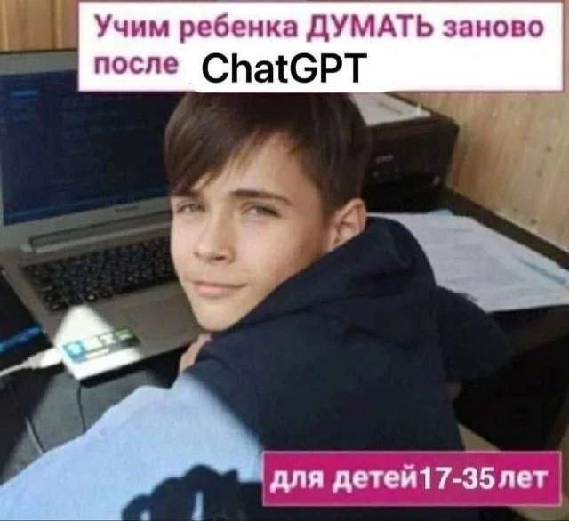

# Про нейросети и учёбу

Начнём с честного признания: языковые модели - отличный инструмент. Я пользуюсь ими каждый день. Запрещать вам их трогать было бы и глупо, и лицемерно.

Но у этого инструмента есть свойство, которое делает его опасным именно **во время учёбы**, и об этом стоит поговорить прямо.

---

## Что происходит, когда за вас думает машина

Вы получаете задачу. Открываете чат, вставляете условие, получаете код. Код работает. Вы сдали.

Что произошло за эти две минуты? Модель прочитала условие, узнала в нём знакомый шаблон и выдала решение. Вся работа - понять задачу, вспомнить похожую, выбрать подход, ошибиться, найти ошибку - произошла не у вас в голове. Её вообще не произошло: модель не рассуждала, она узнала.

А ваш мозг за эти две минуты не изменился. Ни одной новой связи. Вы прошли мимо задачи, не задев её.

Это не морализаторство, а измеримый эффект. В 2025 году исследователи из MIT Media Lab посадили три группы писать эссе: с ChatGPT, с поиском и без всего. У группы с ChatGPT электроэнцефалография показала самую слабую нейронную активность, участники хуже всех запоминали собственный текст и почти не чувствовали его своим. Работа называется [Your Brain on ChatGPT](https://www.media.mit.edu/publications/your-brain-on-chatgpt/), и её стоит хотя бы пролистать.

---

## Почему в этом курсе это особенно дорого

Три причины, все практические.

**Первая: экзамен вы пишете от руки.** Без автодополнения, без подсветки синтаксиса, без интернета. Если весь семестр код за вас писала модель, в январе вы окажетесь перед листом бумаги с нулевым навыком.

**Вторая: вы учитесь не Python, а мышлению.** Синтаксис - это две недели. Всё остальное в курсе - про то, как подступаться к задаче, которую видишь впервые. Именно этот навык нельзя получить, читая чужие решения, ровно как нельзя научиться плавать, глядя на пловцов.

**Третья: модель уверенно врёт.** Она выдаёт правдоподобный текст, а не правильный. На простых задачах это незаметно, на нетипичных - постоянно. Проверить её может только тот, кто и сам умеет решать. Пока вы не умеете, вы не пользуетесь инструментом - вы ему доверяете вслепую.

> Разработчик, который не может отличить хороший ответ модели от плохого, полезен ровно настолько, насколько полезна сама модель. То есть он не нужен.

---

## Простое правило

Граница проходит не по инструменту, а по тому, **кто выполняет работу мышления**.

| Так можно и нужно | Так вы обкрадываете себя |
| - | - |
| "Объясни, как работает срез в Python" | "Реши задачу 5" |
| "Почему мой код падает с этой ошибкой?" | "Напиши функцию, которая..." |
| "Приведи ещё три примера на эту тему" | "Как это решить?" - до того, как думали сами |
| "Проверь моё рассуждение, вот оно" | "Перепиши, чтобы работало" |
| "Что почитать про хеш-таблицы?" | Вставить условие целиком и скопировать вывод |

Левая колонка - вопросы человека, который решает задачу и хочет разобраться. Правая - просьбы того, кто хочет закрыть задачу и уйти.

Ещё один способ себя проверить, критерий [Виктора Мараховского](https://ru.ruwiki.ru/wiki/Мараховский,_Виктор_Григорьевич):

> Грань между полезным использованием робота и деградацией с его помощью определяется одним простым критерием: увеличивается от взаимодействия с роботом наше ядро знаний, памяти, навыков и вопросов - или тает. Если тает, мы с его помощью деградируем.

---

## Что вы теряете на самом деле

Есть момент, ради которого вообще стоит заниматься наукой. Вы бьётесь над задачей час, два, откладываете, возвращаетесь - и вдруг в голове щёлкает, и всё складывается в ясную картину.

Это не просто приятно. Это и есть акт обучения: в этот момент кусок знания **становится вашим навсегда**. Ни один пересказанный ответ так не работает.

Студент, который час рисовал схемы и рассуждал вслух, *получает решение и понимание*. Студент, который скопировал ответ, *получает только решение* - и оно исчезнет из его головы через день.

---

## Как договоримся

Я не проверяю ваши решения детектором нейросетей и не собираюсь этого делать - такие детекторы всё равно не работают. Вместо этого:

1. **Задачи вы защищаете устно.** Я спрошу, почему выбран этот подход, что будет при пустом вводе и как изменится сложность, если поменять структуру данных. Если решение не ваше, это выяснится за минуту.
2. **Контрольные точки и экзамен - на бумаге.** Там будет видно всё.
3. **Пользоваться моделью для объяснений - можно и полезно.** Приходите с вопросом "я не понимаю, почему тут $O(n^2)$" - это отличный вопрос и к модели, и ко мне.

И последнее. Если вы попробовали решить сами, застряли и пришли за подсказкой - это нормальная учёба, а не жульничество. 

**Плохо не спрашивать.** 
**Плохо не пытаться.**

Перед тем как открыть чат, откройте [текст про то, как решать задачи](00-appendix/HowToSolve.md) и честно пройдите шесть приёмов из второго шага. Если после этого всё ещё нужна помощь - спрашивайте, вы её заслужили.
